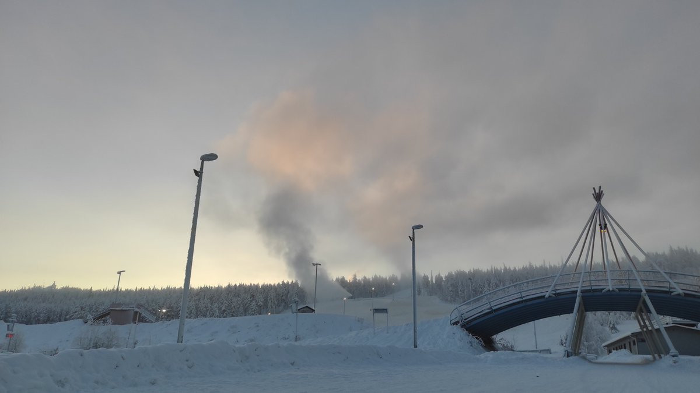
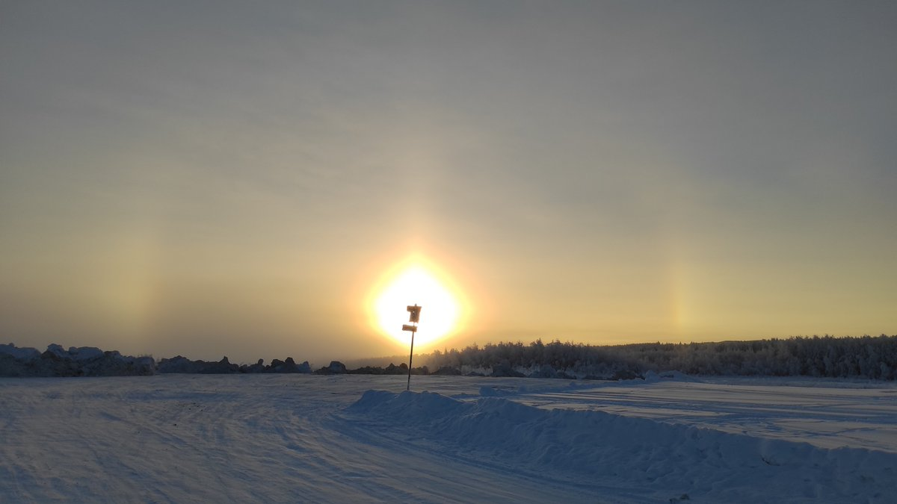

# Thread - 2026-01-28

**Original:** https://x.com/RiikonenMarko/status/2016464107516408115

---

### 1/1 - 2026-01-28 10:51 UTC

28 Jan 2026, Rovaniemi. Last evening I watched how a cloud layer slowly descended to become fog. As temps were at the threshold of great displays, made a round. But the gun that was running in the Sierijärvi area the previous night had fallen silent. However, now Ounasvaara is back in business! But fog conditions result into crappy halos because it's below -20 C.

---

