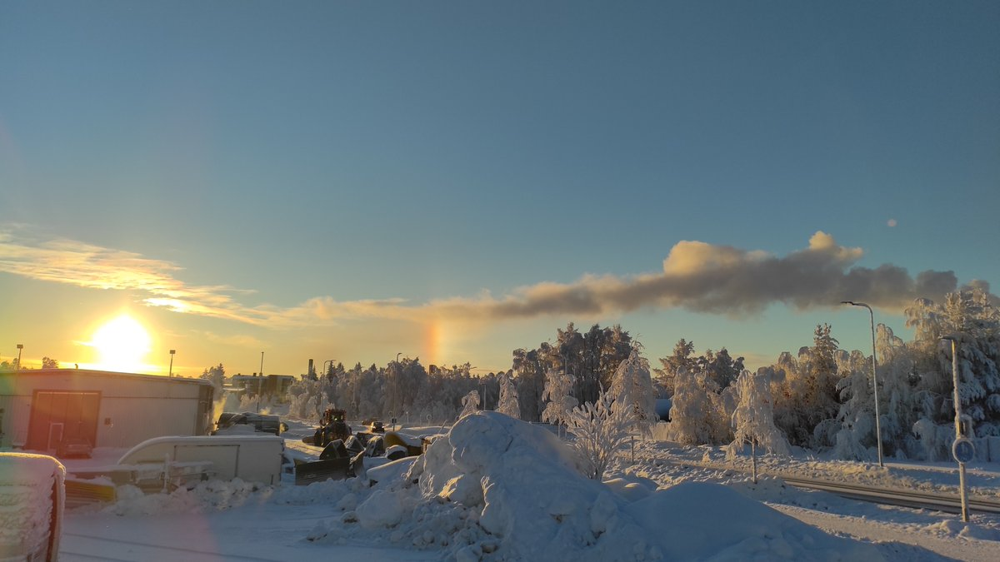
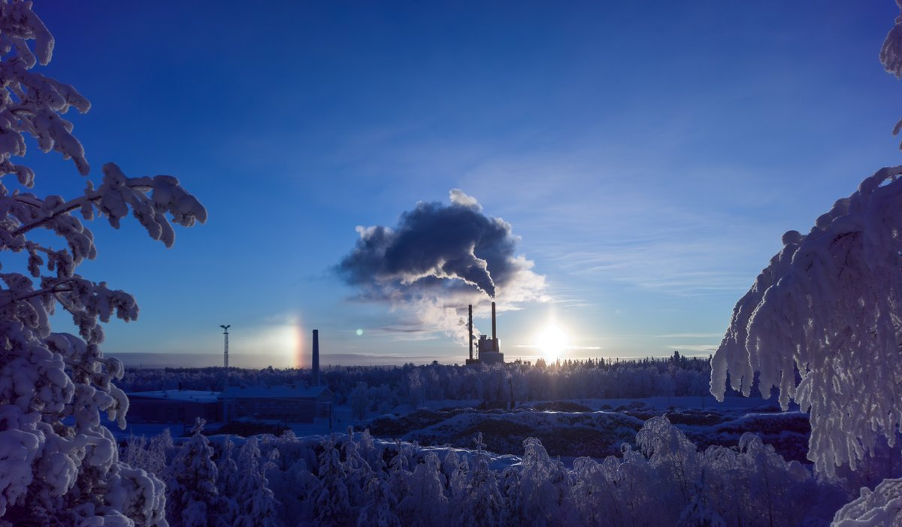

# Thread - 2026-01-29

**Original:** https://x.com/RiikonenMarko/status/2016868654038602054

---

### 1/1 - 2026-01-29 13:38 UTC

29 Jan 2026, Rovaniemi. A cold night of action is at hand. In the daytime I did not go to chase the snow gunning plume, just photographed the parhelia in Suosiola plume in industrial area while looking for solutions for a second blocker. It's going to be a "long distance blocker", a shaft that I stick in snow. There may be benefits to long distance blocking.

---

