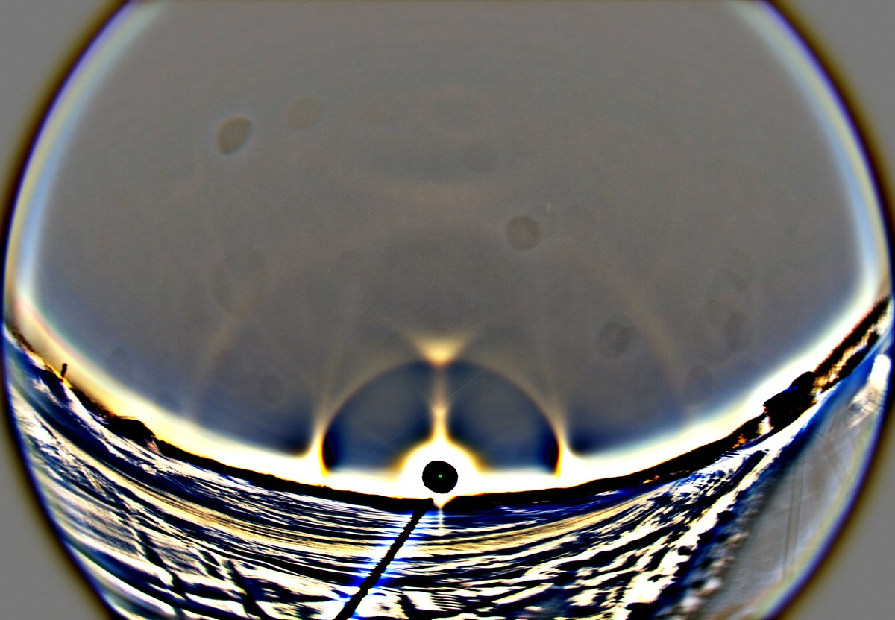
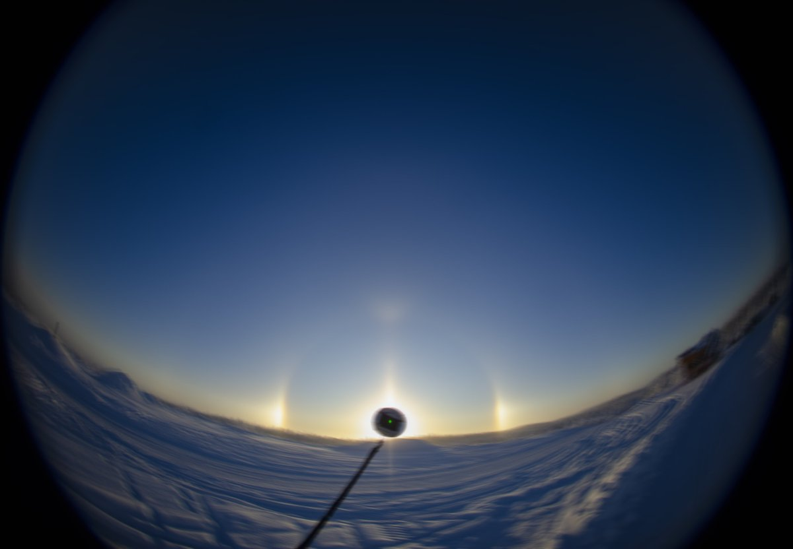
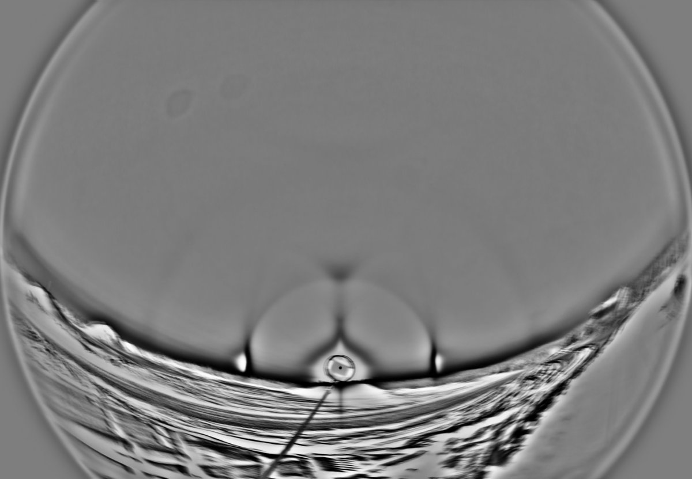
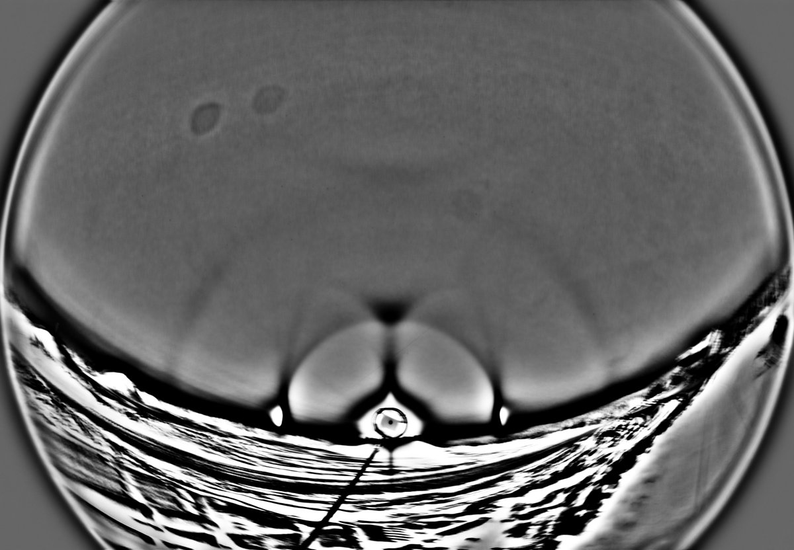
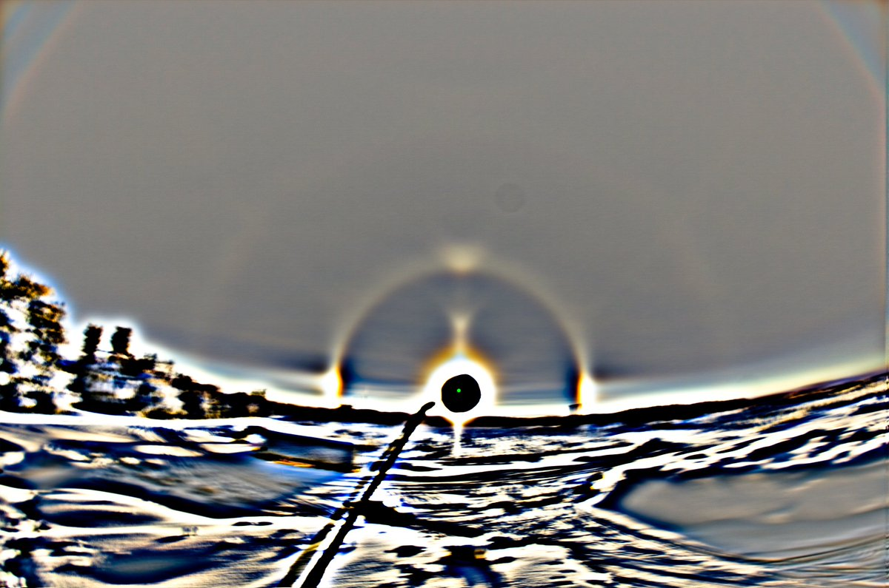
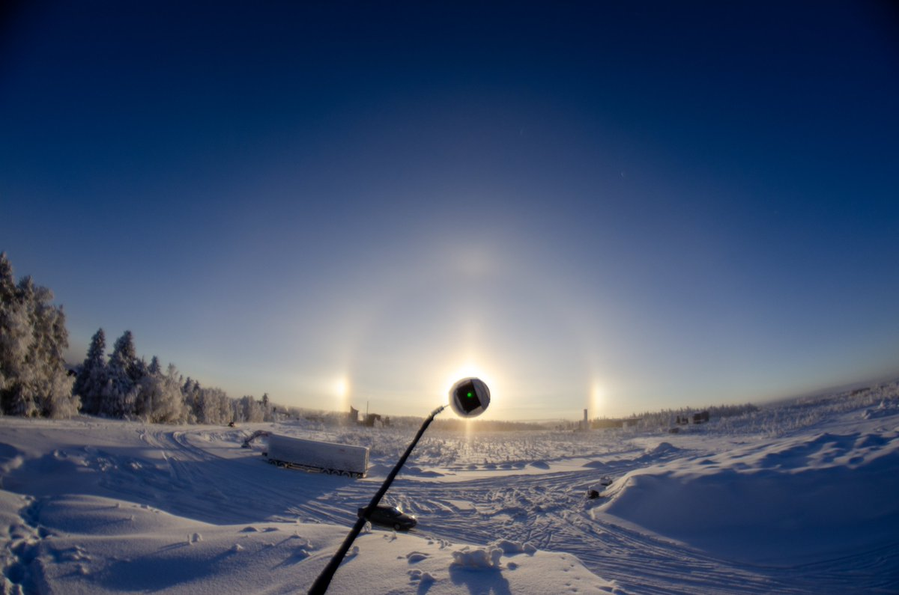
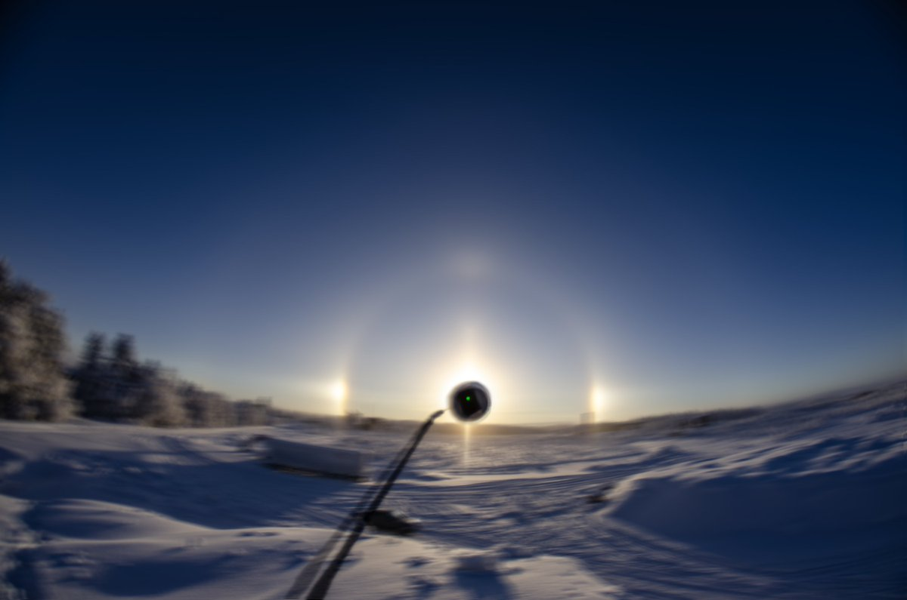
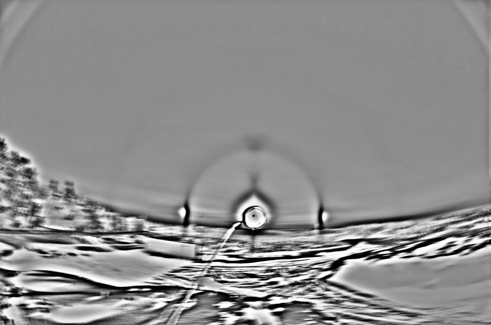
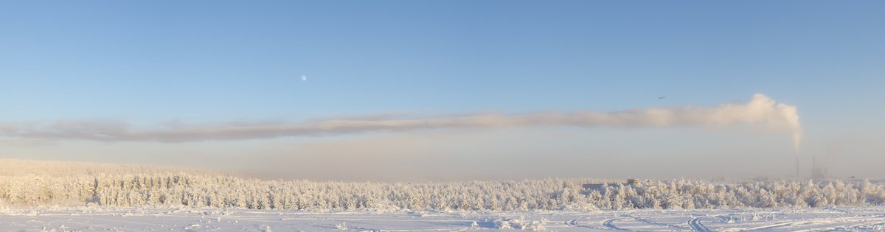

# Thread - 2026-01-30

**Original:** https://x.com/RiikonenMarko/status/2017231135810400266

---

### 1/3 - 2026-01-30 13:39 UTC

30 Jan 2026, Rovaniemi. Solar display today. Some huge spots in the image. Those are already affecting the halos. Not sure if on sensor or inside the lens. I have cleaned the sensor two times this winter. I'll swap lenses to find out. Apukka around -30 C, railway station -25 C.

Last night as I was about to go, stratus suddenly appeared and I decided to wait, let the car windows frost more. After an hour so the display was ripe enough. Looked like the rear window had again an elliptical halo in addition to plate and Parry halos. Not as clear as before.

Then I went to chase to east. There was ice fog maybe on a kilometer stretch near Sierijärvi on the main road, a passable display of parhelia, zenith and horizon arcs, and parhelic circle under a streetlight. No place really to try spotlight. Came back, low stratus hanged, but no halos anywhere, which was a bit strange. But I didn't check all around. Felt kind of worn out and came back to sleep. So it was just a quick checking round. Certainly missed action.

---

### 2/3 - 2026-02-01 13:30 UTC

30 Jan 2026, Rovaniemi. An earlier stage, 128 frames, 5s interval (for the above 125f). Something above the Moilanen in bgr (second image), but b-r has nothing. That thought still doesn't mean it couldn't be "Lefaudeux", it is not first time that b-r fails to pick a colored halo. But naah – not convincing enough.

---

### 3/3 - 2026-02-05 21:19 UTC

30 Jan 2026, Rovaniemi. Suosiola plume photographed at the time of the first post's display. A separate part of the plume makes an ice fog landfall below the moon. Smoke stack plume ice fogs are always highly local affairs which can make photographing their displays challenging. Can't be 100% sure, but it seemed to me that in the places I photographed the halos, they were from the snow gunning plume.

---

