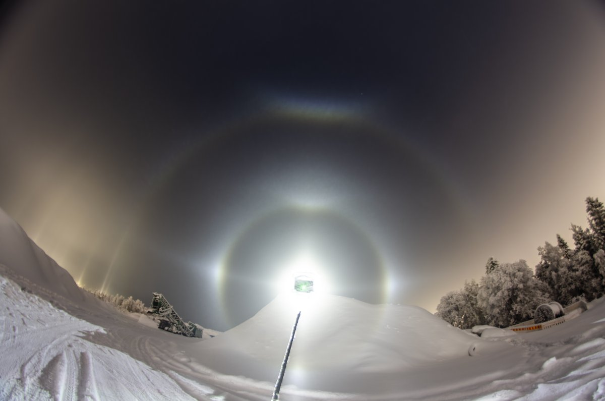
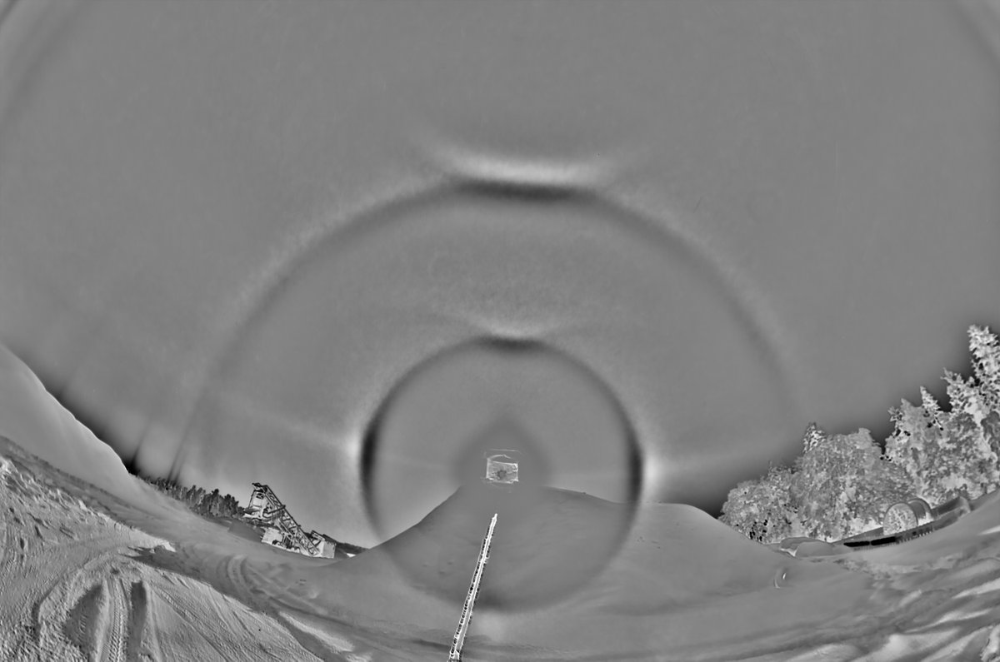
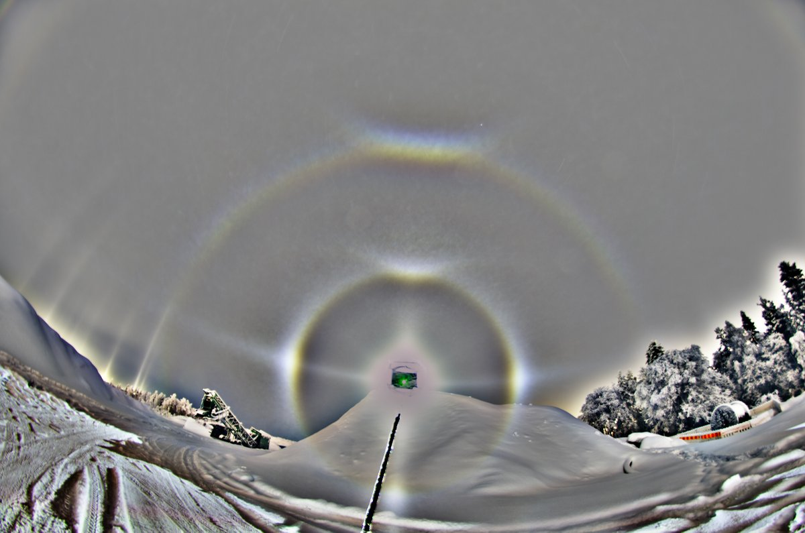
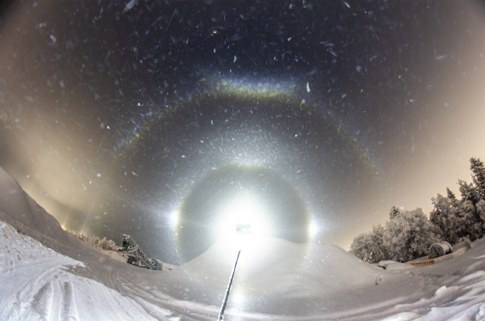
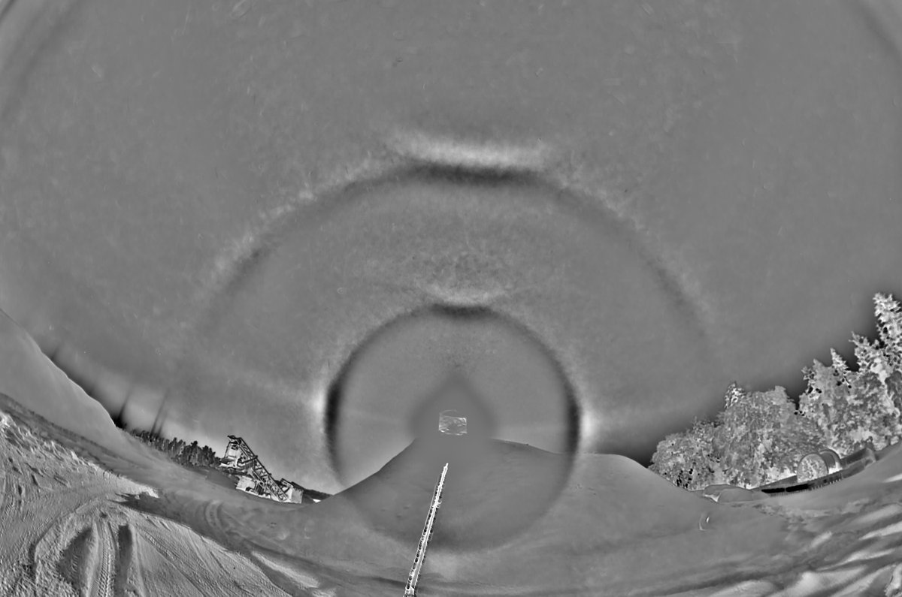
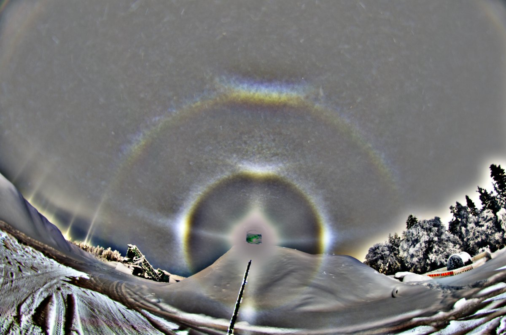

# Thread - 2026-01-30

**Original:** https://x.com/RiikonenMarko/status/2017369497892430206

---

### 1/2 - 2026-01-30 22:49 UTC

30/31 Jan 2026, Rovaniemi. Ice fog everywhere, but really poor, except for some pockets of better action. Got this 70 x 30s stack of a quite sparse swarm. Then it just got worse and came to apartment after some 5 hours out. As it happens, here is one of those better pockets tonight – have been watching from the window pillars and parhelia on outdoor lights for more than an hour already. Coming in, I admired an impressive parhelic circle under one of the lights. Probably this is thanks to the Suosiola plume, coming this way, boosting the ice fog. But there are no real places to do spotlight here.

Railway station steady -29 C, Apukka around -32 C.

In the early morning hours, if I can drag myself to it, I could check the frost on car.

---

### 2/2 - 2026-01-31 16:03 UTC

30/31 Jan 2026, Rovaniemi. For all practical purposes, helic arc was visible only in the beginning of this display. Here I have stacked those 14 frames. Parry arc is weak.

---

