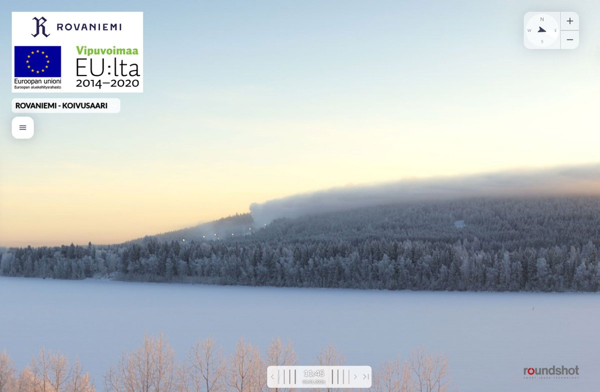
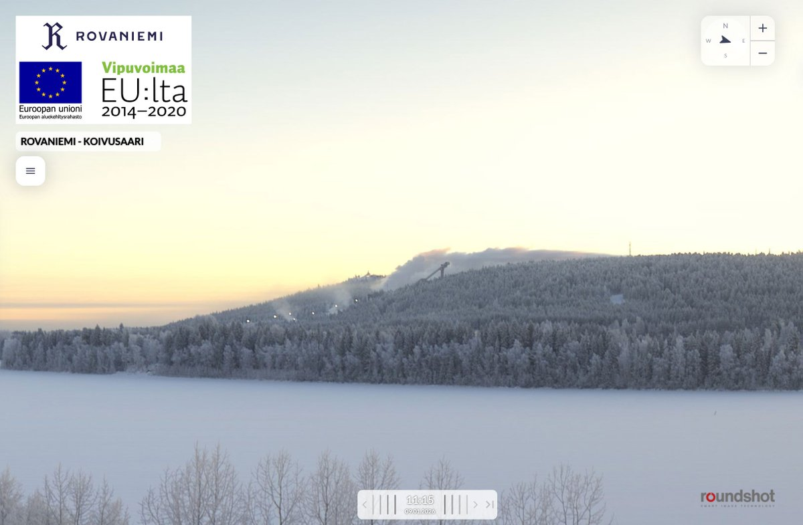
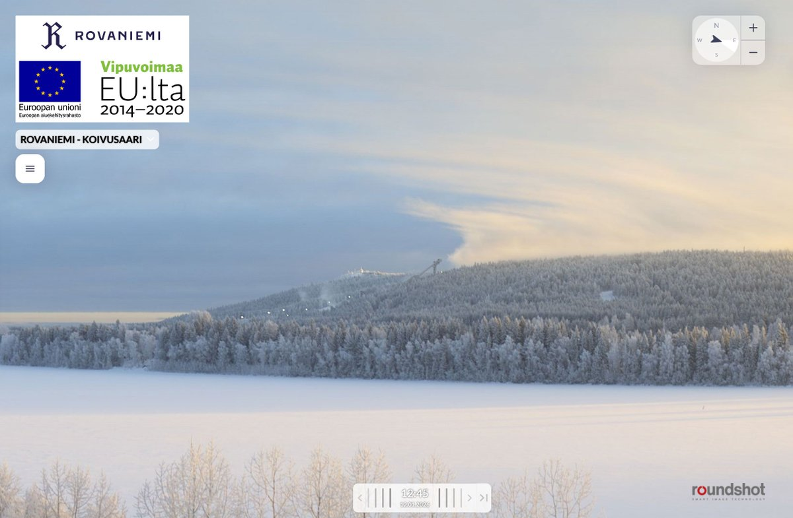

# Thread - 2026-02-01

**Original:** https://x.com/RiikonenMarko/status/2017988531612688699

---

### 1/2 - 2026-02-01 15:48 UTC

Instructive images of Ounasvaara gunning from the January cold snap. As it happened, they had air off the stick guns but not the propel gun. Higher up on the flank the latter is growing a massive cloud, whereas the sticks lower down give a wishy-washy evaporating puff. In the last image from 11 January no cloud whatsoever is growing because they had shut down the propel gun.

Human moisture sources are not an element in ice fog formation. It is all about nuclei, nature provides the water vapour. If there is not enough of it, the human sources or, say, openings in a river will not help, except sometimes very locally only above the source – I have occasionally seen feeble displays above river openings and above airless snow guns.

---

### 2/2 - 2026-02-01 15:48 UTC

For the record, let's add also this image from 12 January, showing the propel gun was back online high up on the hill. So it was something like a day and a half no-air break. My report about chasing on the 10/11 night says that "Snow gun plume seemed to be going to Toramo pit direction" https://t.co/W3aB0WkOXM, but that was just to avoid longer speculation. My bones were telling me the pressure air was not actually on and there was really no cloud, but because I didn't go to check the Toramo direction to be sure, I just made up the story to have an easy exit.

---

