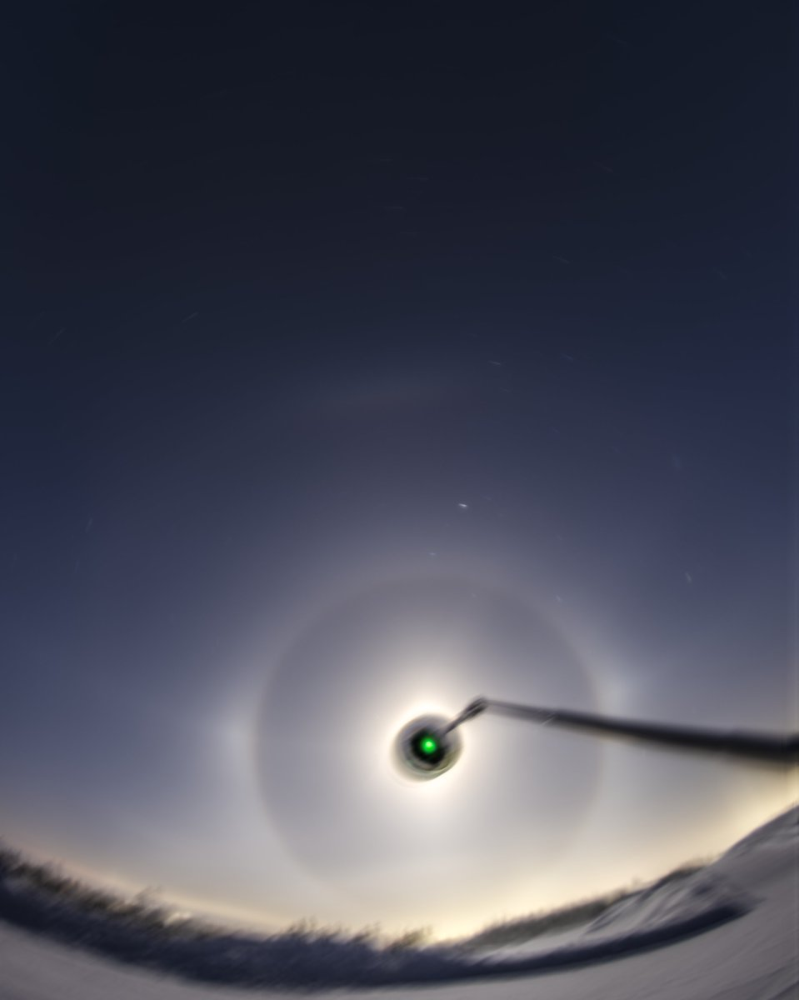
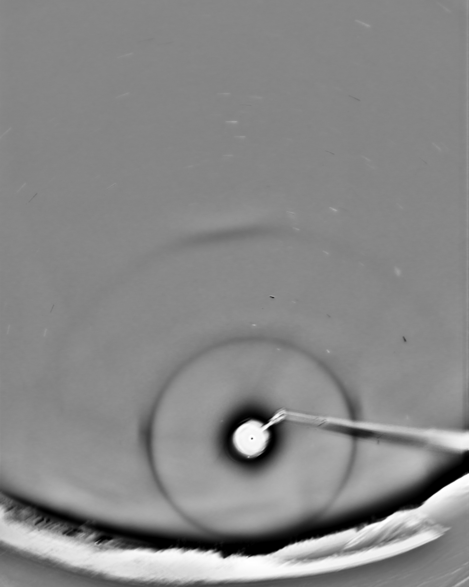
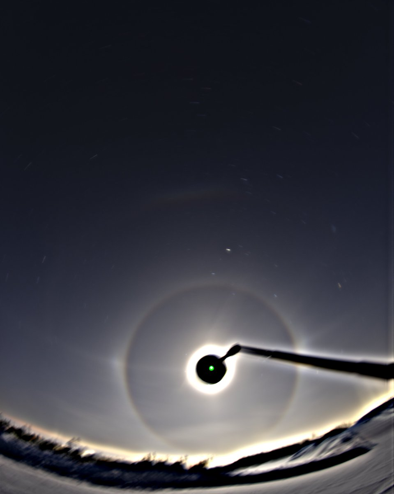
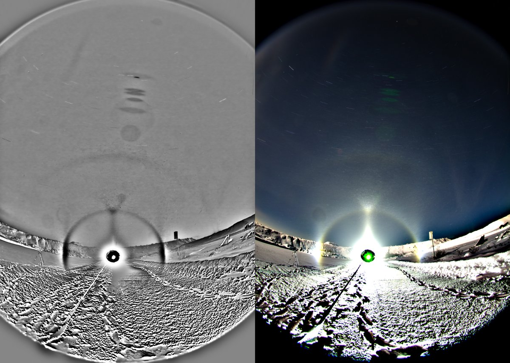

# Thread - 2026-02-01

**Original:** https://x.com/RiikonenMarko/status/2018048581228237060

---

### 1/1 - 2026-02-01 19:47 UTC

3/4 Jan 2026, Rovaniemi. The massive solar or lunar diamond dust displays simply do not occur Rovaniemi. Go north, go east, go west, go south of Rovaniemi and you have them. Levi, Ruka, Oulu, Kajaani, you name it – they all got them. But not here. It can be better than this one, sure, but there is some limiter in Rovaniemi that keeps it from ever getting even near the massive category.

But there is plenty of chances for spotlight here (too much even) and it's the spotlight that is the most likely to produce something interesting. I took also spotlight, as shown by the last image, but nothing of interest this time.

---

