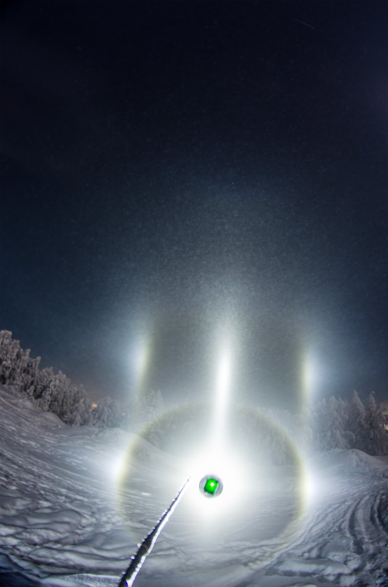
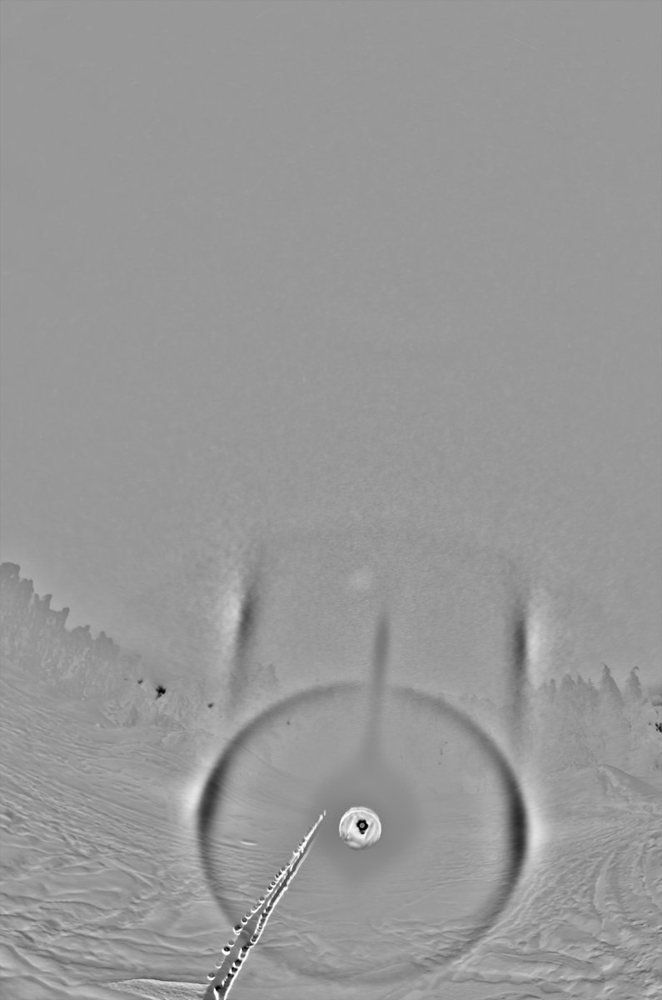
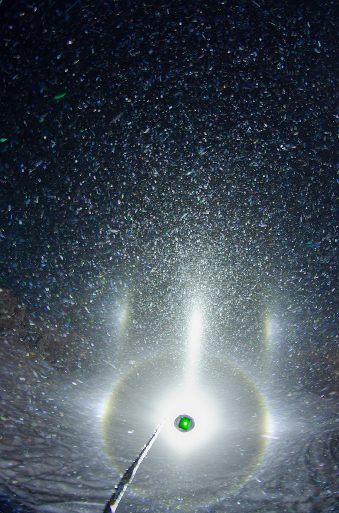
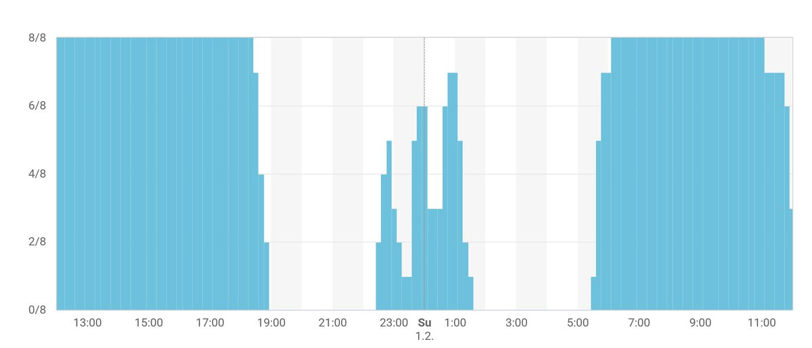
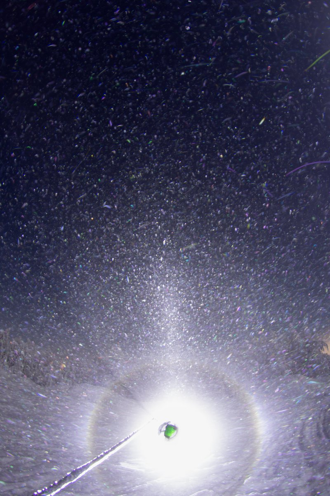
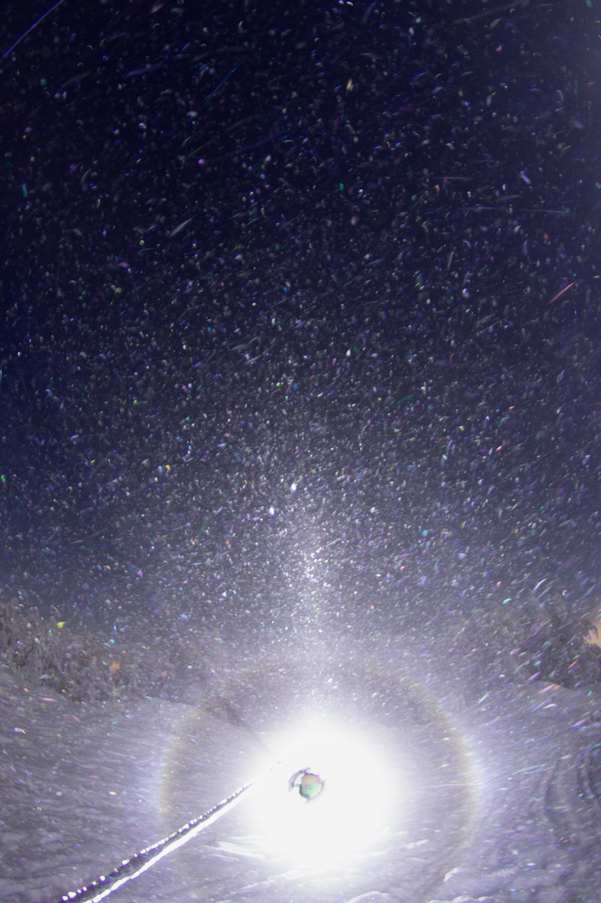
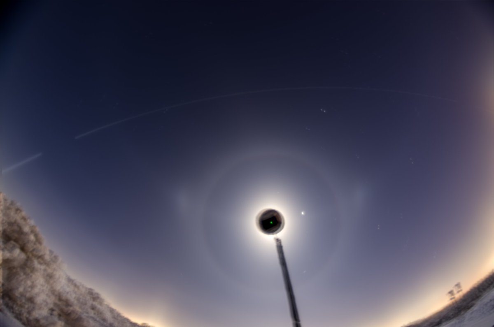
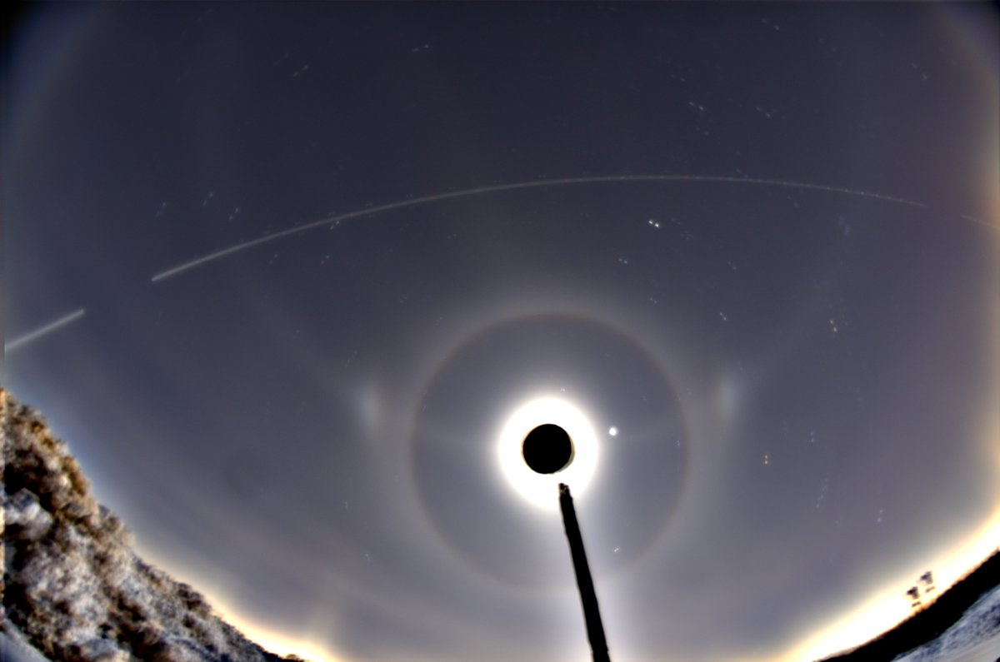
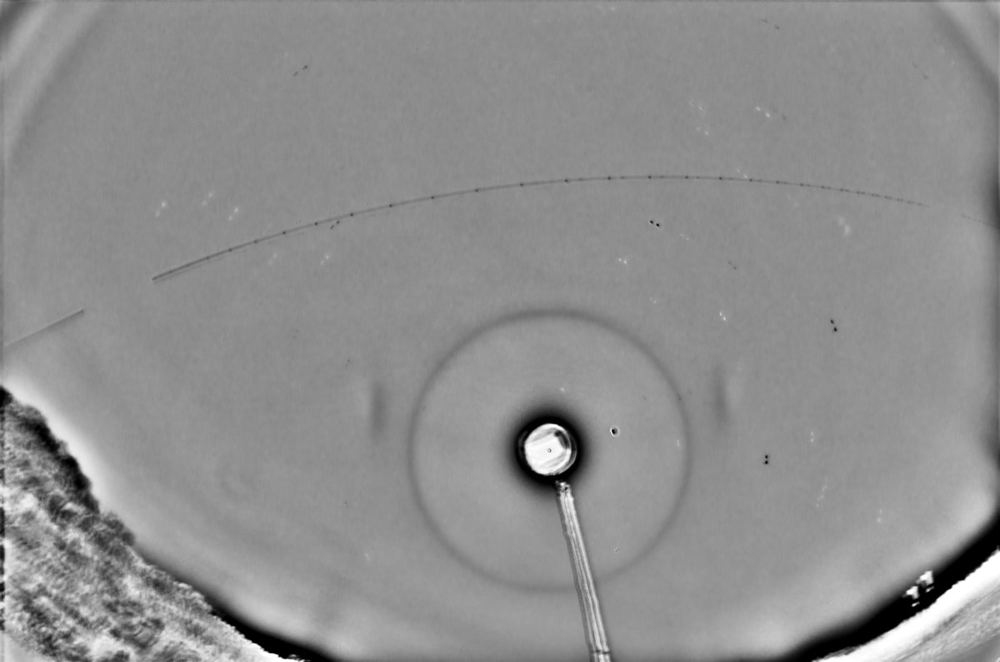

# Thread - 2026-02-01

**Original:** https://x.com/RiikonenMarko/status/2017912630095102149

---

### 1/3 - 2026-02-01 10:47 UTC

31 Jan / 1 Feb 2026, Rovaniemi. And suddenly it was clear, broad pillars reaching up to sky. Amscrayed real fast. Under the first lamp out of the door, parhelic circle was visible. Then made a mistake by heading to the industrial area – ice fog faded away. Turned back to Korkalovaara and headed to the bike park, which is just 500 meters from my apartment. Quick lamp-on-the-car-roof check, compact Lilje in the beam. However, once I got the photography going, it was still impressively dense glitter of big crystals but nothing remained of the Lilje & co. That's the cost of the wrong decision at the start.

The last image is FMI cloud cover graph, showing the sky clearing at 7 pm. Luckily I happened to peer out of the window a little before 7, otherwise I would have missed this one pretty much completely. Optimally of course I was there already waiting, because the action is the best in the beginning of such a change.

Last night I should have gone to bike park when parhelia were visible here for more than an hour. I wrote "But there are no real places to do spotlight here" https://t.co/2gERMV4YNZ, which was of course a lie. While the bike park is nested inside the suburb, there is actually about a 90 degree sector where there are no building and no lights nearby. The only real disadvantage are the trees around, but you can lift the counterparhelia above the treeline by placing the light at close distance to the camera.

Anyway, the display crapped incrementally until a point was reached where I decided to go look elsewhere. In the industrial area pillars were present, tanarc in the beam, but it started crapping right away and didn't bother with photos. This decline was related to stratus coming in, as shown by the graph at 23 pm, wind also picking up and that was that.

Korkalovaara probably stroke the sweet spot for this swarm. I could see that in the city direction it was thicker, in the other direction it thinned out. Railway station -26 C.

---

### 2/3 - 2026-02-01 11:22 UTC

31 Jan / 1 Feb 2026, Rovaniemi. As the display crapped there was a stage where counterparhelia were pretty much non-existent, instead, psychedelics gained prominence. Two 10 frame max stacks.

---

### 3/3 - 2026-02-01 11:29 UTC

31 Jan / 1 Feb 2026, Rovaniemi. Leaving the bike park, I headed first to Ylikylä snow dump. It was not worth doing spotlight, but took 16 x 30s of the weak lunar. It is always worth trying these displays where parhelia are far from 22° halo on the off chance that Lowitz, Liljequist or even some alternate type of arcs would materialize in the stack.

---

