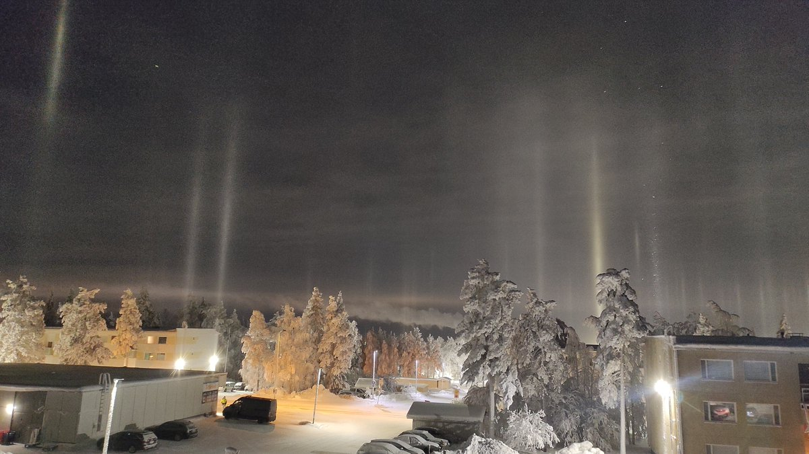

# Thread - 2026-02-05

**Original:** https://x.com/RiikonenMarko/status/2019279864105181583

---

### 1/1 - 2026-02-05 05:20 UTC

04/05 Feb 2026, Rovaniemi. Where is this heat coming from? Not the Suosiola plume that is seen trailing east above the treeline in the middle of the image. All snowguns that I know might be operating, are far in the direction where the Suosiola plume is trailing. Could it be natural? Well, daylight is approaching and I need go for some errands, hopefully the source is revealed. In any case this is crap diamond dust. Walked out to a neighboring darker parking lot and switched on spotlight: no other halos visible.

---

