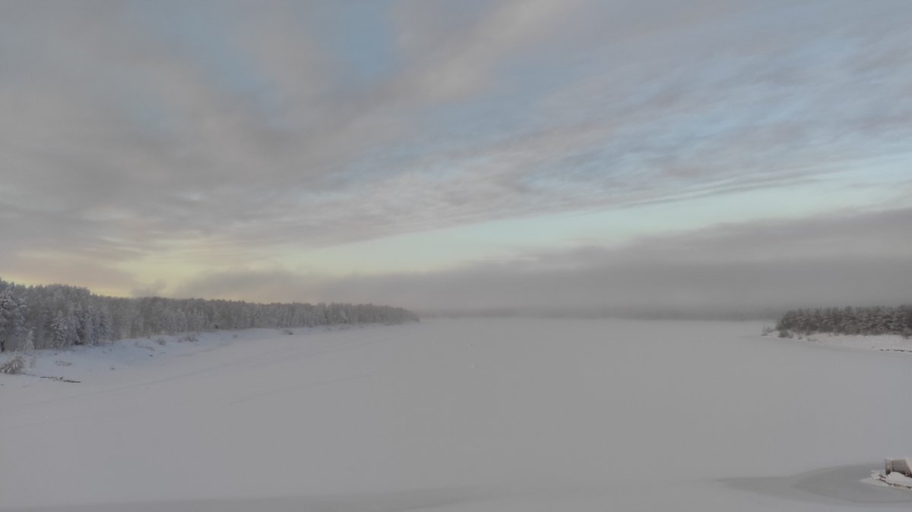
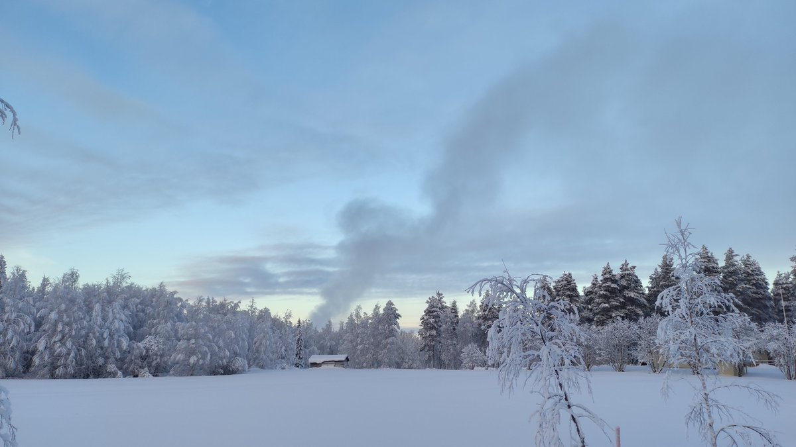
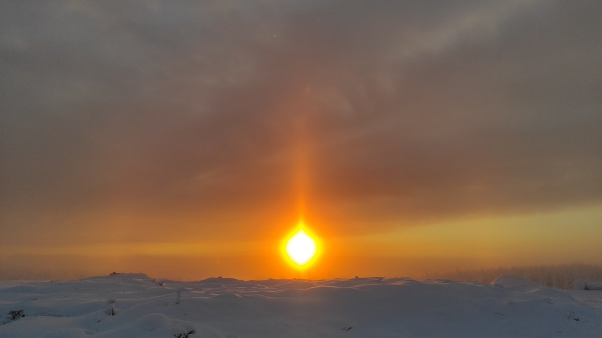

# Thread - 2026-02-05

**Original:** https://x.com/RiikonenMarko/status/2019339485016641772

---

### 1/1 - 2026-02-05 09:17 UTC

5 Feb 2026, Rovaniemi. In reference to https://t.co/b2Tpg57Sut Large swathes of land was enveloped in ice fog south of industrial area. I drove around to find the source and was about to give up. But then made one more turn to check one more direction and there, crossing the Valajaskoski bridge I spotted the it (first image). 

Getting closer, to my astonishment it turned out someone was just making snow on his backyard. One propel gun was running next to a big mountain of snow. I drove around in hope of meeting some locals to ask what's going on. Happened upon a strolling couple who kindly informed me that it is deposit snow to be lorried early next winter to Arctic Circle.

It is of course nice to know now that there is still snow making in Rovaniemi, but this new location quite far away means completely new roaming grounds that I know nothing about. Are there any locations with relief, for example? Well, guess that just has to be found out.

Third photo of a weak display earlier on from Anttilanvaara. Soon after clouds blocked the sun, but I managed a stack that I will publish later.

---

