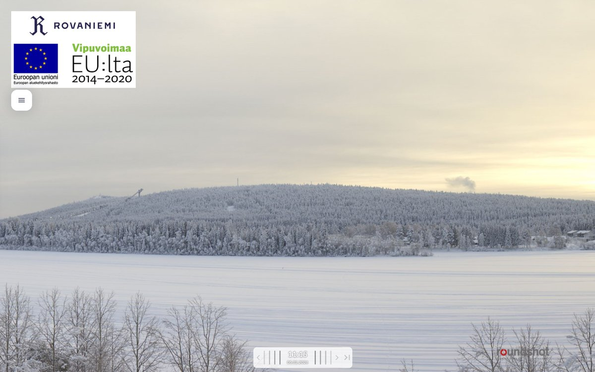
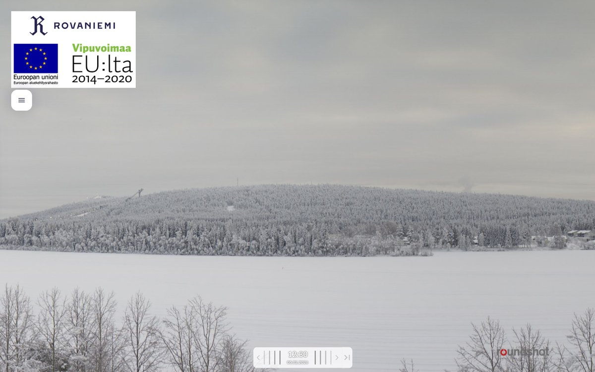
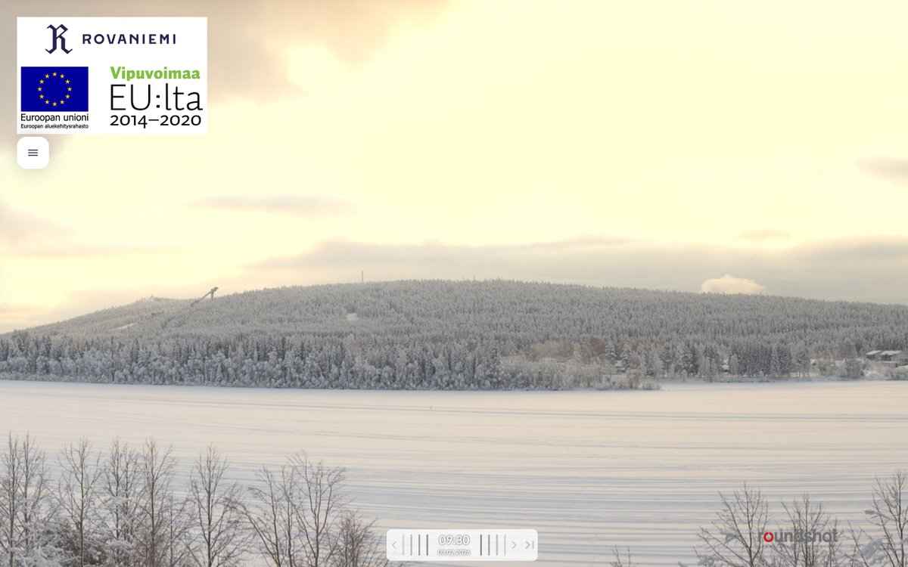

# Thread - 2026-02-05

**Original:** https://x.com/RiikonenMarko/status/2019388897399112161

---

### 1/2 - 2026-02-05 12:33 UTC

What's that cloud above the southern side of Ounasvaara (on the right of the image)? Can be only one thing: snow making. I noticed it also two days ago (the third image), however, yesterday it was not there. Anyway, this means they are making the deposit on the other side, not where the slopes are and where I expected it to take place. Will go investigate in the evening.

---

### 2/2 - 2026-02-08 19:48 UTC

Let's add here for the record that I went to investigate only the next day and saw nothing indicative of snow making. The cloud has not repeated since.

---

