# Thread - 2026-02-06

**Original:** https://x.com/RiikonenMarko/status/2019886129449955778

---

### 1/7 - 2026-02-06 21:29 UTC

5/6 Feb 2026, Rovaniemi. Even though it was cloudy and the layer too high up to be nucleated by gunning, I left because Suosiola plume looked healthy, continuing long downwind. Headed to Valajaskoski where this snow gun is operating on somebody's backyard.

There was indeed thin diamond dust and it got thicker when the sky cleared up. But it was in a small area and no good place to photograph. Got only this 9 x 30s stack in a light polluted parking lot next to the hydroelectric power plant before it crapped because of clouding again. As the forecast has high probability of snowing for the rest of the night, I decided to come back to apartment. Car thermometer at -13...-14 C.

The lamp and camera were pretty much level. There is something like a V-shaped arc in the cusp of tangent arc that is too high to be Parry. Probably just a random shape from too little data, too bad I could not get a longer stack.

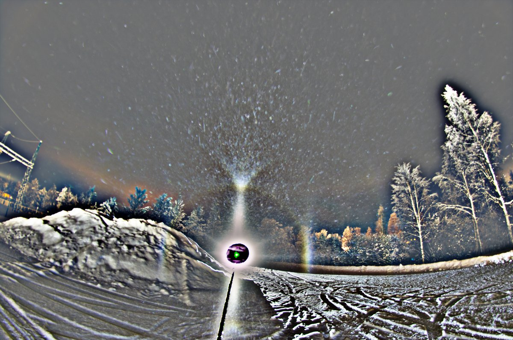

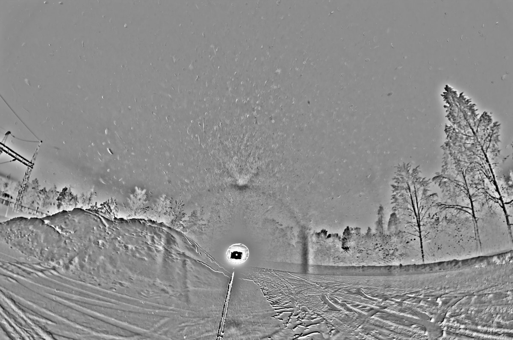

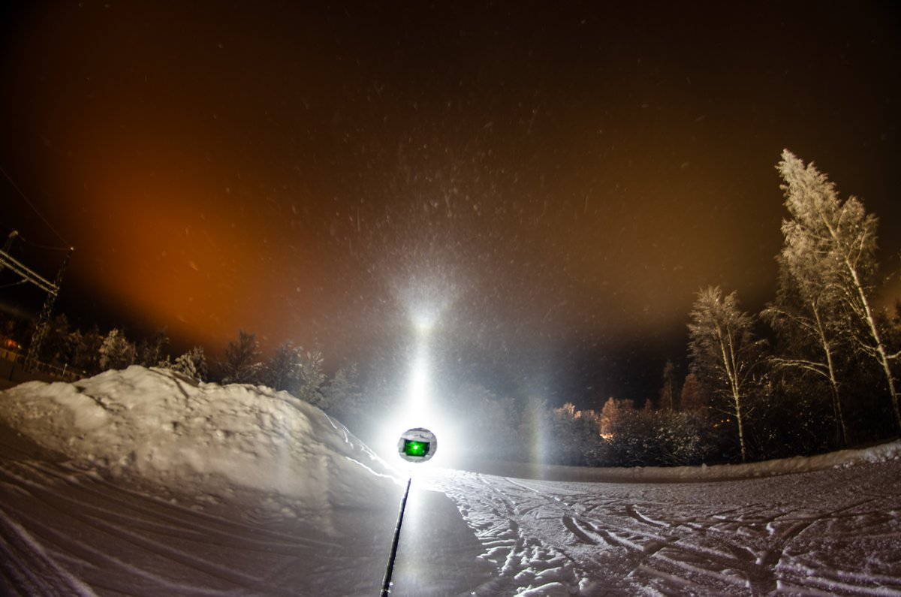

---

### 2/7 - 2026-02-07 13:03 UTC

6/7 Feb 2026, Rovaniemi. I was already cozily snuggled in my apartment, but no rest for the wicked. Had to leave for a second round because a glance out of the window told so – the low cloud that had killed the display had descended to become fog.

In Rautiosaari, 500 meters from the snow gun, found a passable place to photograph on river ice. A problem was that I was a tiny bit outside the swarm. Only about 200 meters away was full action judging by the pillars. But I kept my calm and waited. It paid off: diamond dust came over and got some shots.

The highlight was the fringes that Martikainen had discovered earlier this winter in a display on the night of 13/14 December in Juva: https://t.co/2sqU3CoNsW Watching the display behind the camera, suddenly I realized, my goodness, the parhelia have these compact little additional parhelia immediately below and above. I was worried of having overexposed them, tuned the exposure down, but by then the fringes were gone. But no worries. They are visible in several shots. Here is one for a sample. I'll take a better look when I have time, it is possible that coming days and nights are quite busy.

(The starting post date should also be 6/7 )

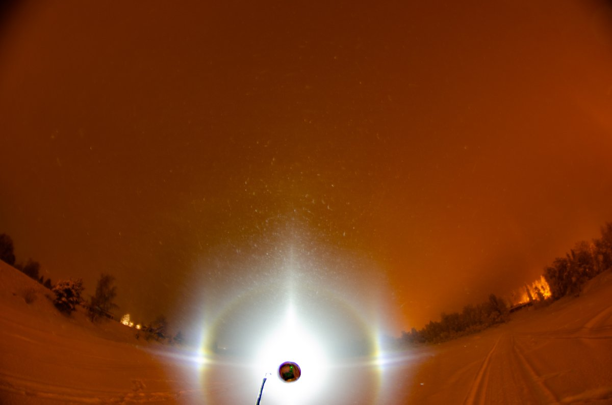

---

### 3/7 - 2026-02-08 18:44 UTC

6/7 Feb 2026, Rovaniemi. Another multiplication event I saw was the parhelia doubling momentarily horisontally. It was captured also on camera, though not as good as I saw it.

Here https://t.co/t5LzVnH0WF is described something similar I photographed in Rovaniemi, and that we explained with inhomogeneous swarm (in the next post is the dysfunct link gif). I wonder what kind of distance difference we are talking about along the Minnert's cigar to have that degree of shift? The classical instance is close to the eye, but I don't think the shifted instance is that far away either.

Is the horizontal dublication of parhelia in this recent display from similar effect, or is there something else going on? Earlier this winter I saw parhelia (or maybe it was just the other parhelion) getting briefly multiplicated in gusts of wind, similar to what we saw in Tampere with Luomanen (https://t.co/ArzzYO1U7B , at the end). Tried to capture it on video, but then the wind calmed somewhat and it was no more repeated.

But in this recent display it was rather calm fog conditions. Yeah, so much halo mysteries waiting for answers.

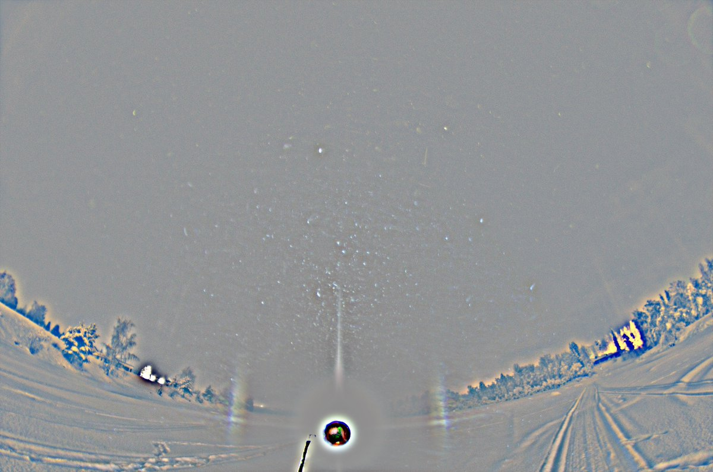

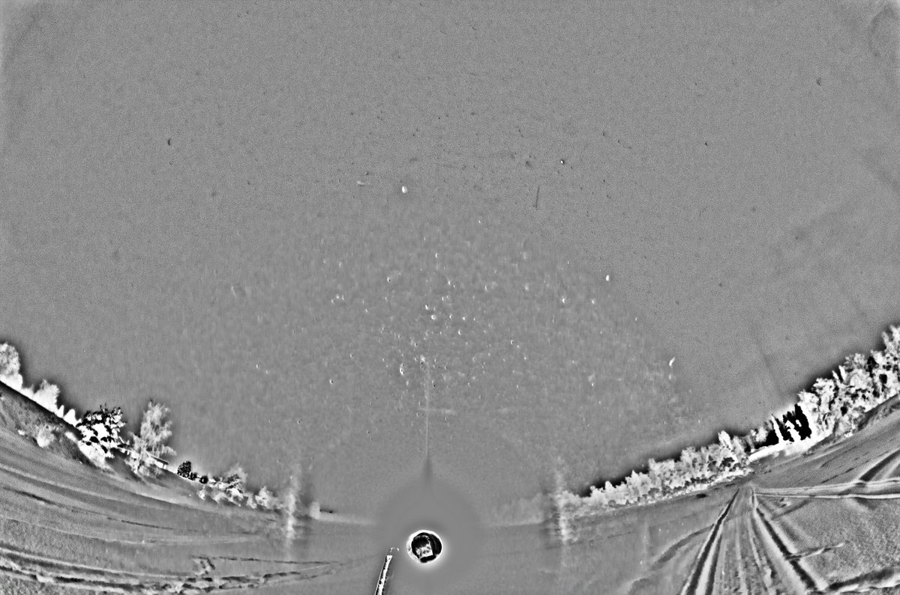

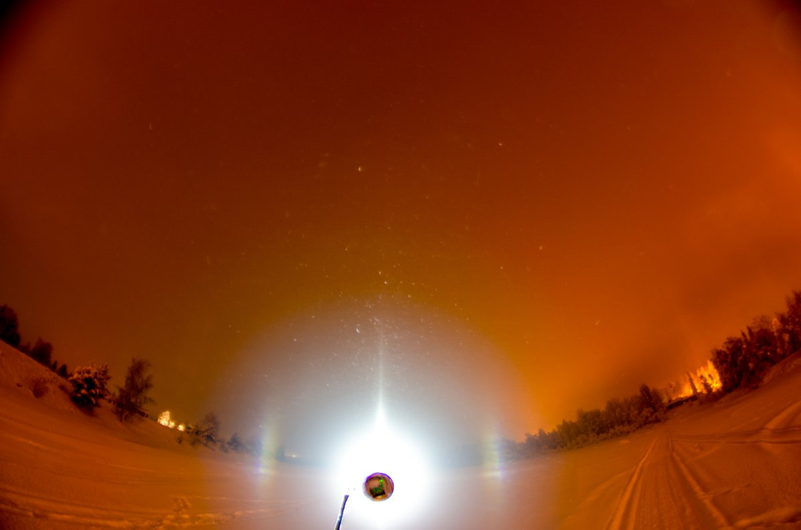

---

### 4/7 - 2026-02-08 18:56 UTC

This is the gif that is missing from https://thehalovault.blogspot.com/2007/12/crystal-swarm-effects.html The display occurred on the night of 14/15 Dec 2007 in Rovaniemi.

All prospects are X will spoil the gif by compressing it (happened on the first try), so here is the original: https://drive.google.com/file/d/1vLp6qHoXNZaqsz7d99FzD5lbtPJssz0N/view?usp=sharing

[🎬 2020572420193636640-HAqDoETWoAA5kI2.mp4](media/2020572420193636640-HAqDoETWoAA5kI2.mp4)

---

### 5/7 - 2026-02-09 17:52 UTC

6/7 Feb 2026, Rovaniemi. The full stage during which parhelia were triplicated. The effect was visible even when the display was weak, but I woke up to it only when parhelia were at their brightest. After a while realized, damn, I may be overexposing it, made necessary adjustments, but that was the moment the extra parhelia disappeared (last frame).

In the second last frame of the third row the three parhelia are almost of equal brightness. In the first three frames of the third row parhelia exhibit also horizontal multiplication as there are two parhelia side by side.

This is an uninterrupted set, exposures 15 s, last two frames 20 s (they are darker because I smallened the aperture). The light, Olight Javelot Turbo was a couple of degrees below the horizon as evidenced by the counterparhelia in front of the background trees.

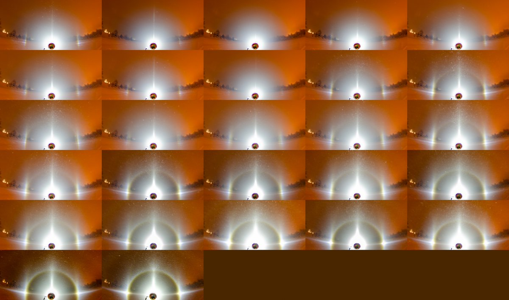

---

### 6/7 - 2026-02-12 13:37 UTC

6/7 Feb 2026, Rovaniemi. Select frames stacked.

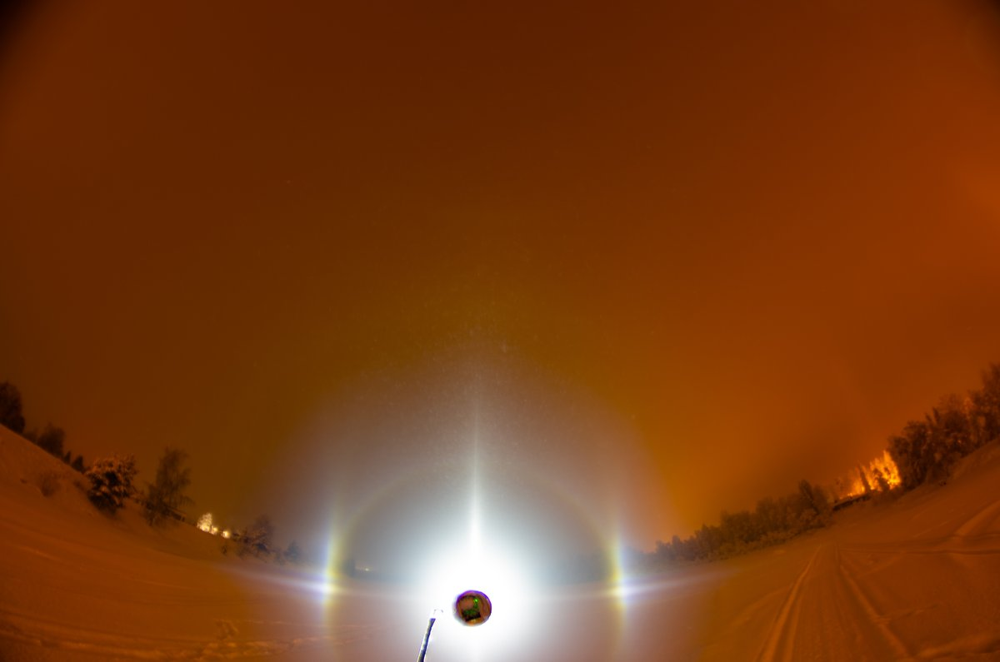

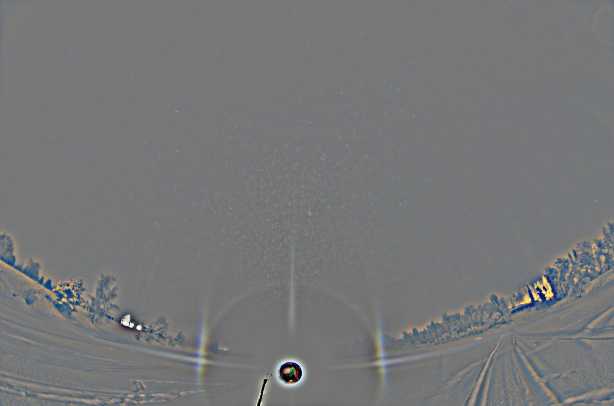

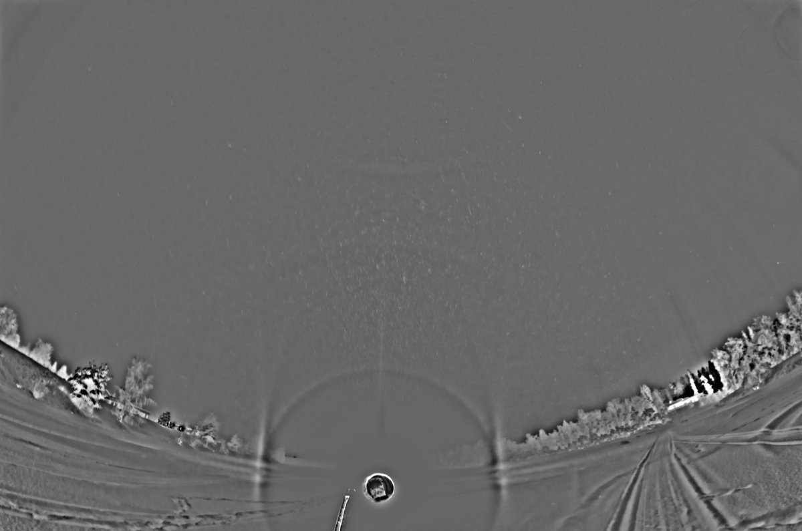

---

### 7/7 - 2026-02-12 13:40 UTC

6/7 Feb 2026, Rovaniemi. Select frames stacked 2. The difference to the above is I chose frames that had no overexposed parhelia.

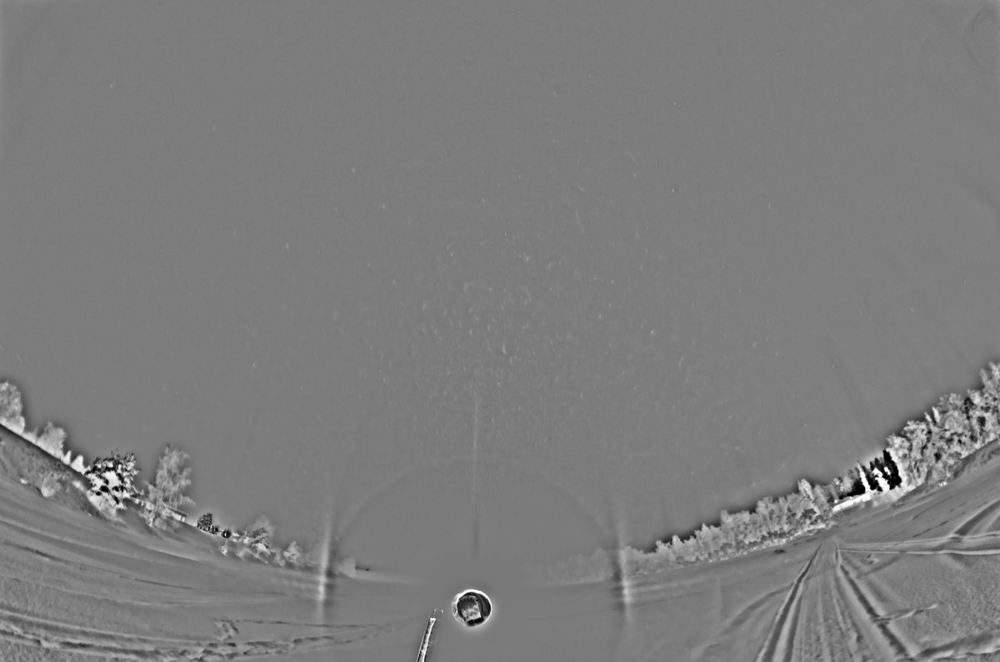

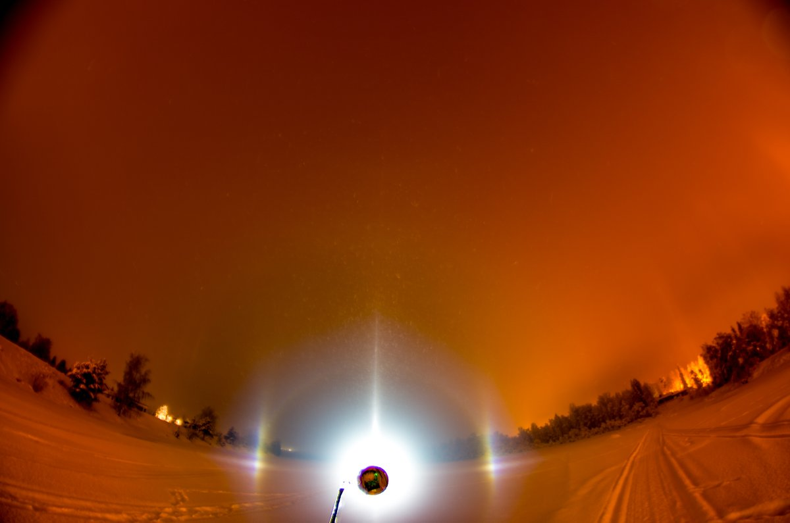

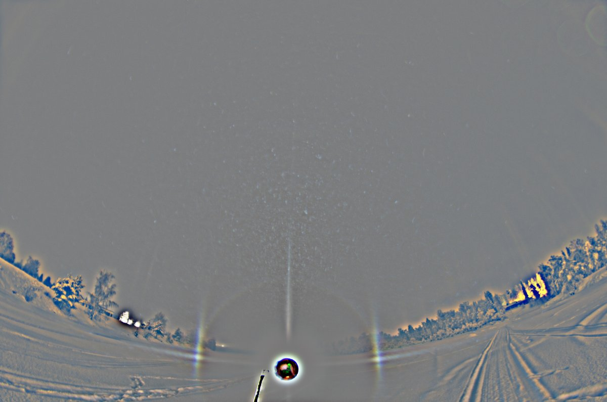

---

