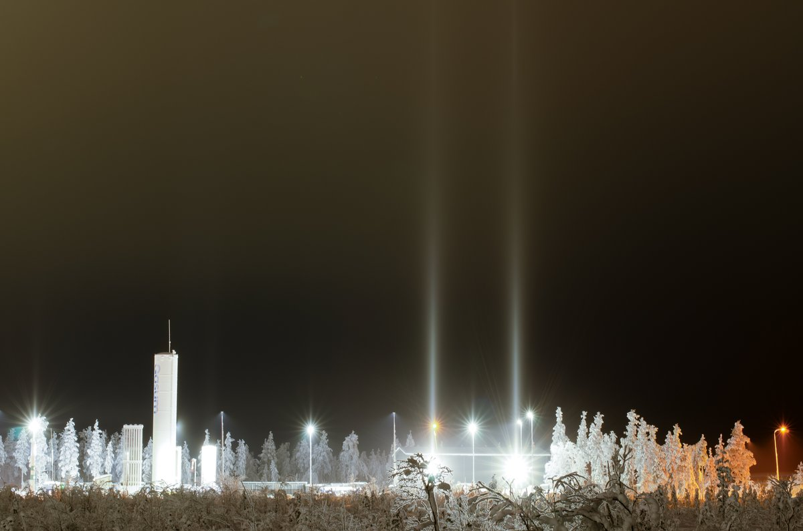

# Thread - 2026-02-08

**Original:** https://x.com/RiikonenMarko/status/2020609431348633739

---

### 1/1 - 2026-02-08 21:23 UTC

8/9 Feb 2026, Rovaniemi. Geared up and headed towards the backyard gun for the third night (car roof had parhelia, no frost on windows). South of industrial area snowfall began. And pillars on passing cars. Turned back before destination because it was hopeless. Back in Korkalovaara no pillars and only the lightest snowing. I think the local nature of stronger snowfall was because it was from gunning nucleating the stratus. Also pillars were rather too sturdy for natural origin. In the daytime I drove to the same direction and a massive ice fog started in around the same place. But sunshine was dimmed due to the clouds, so no hope for any proper diamond dust halos (there was high cloud parhelia and 22° halo).

Anyway, on the way back this evening, photographed this pair of pillars next to the Gasum station. Perhaps conditions improve as the night progresses.

---

