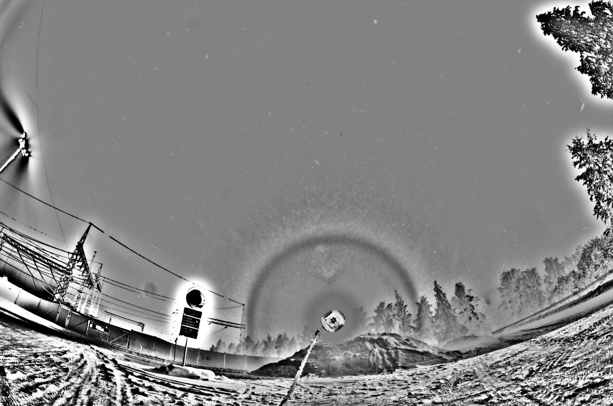
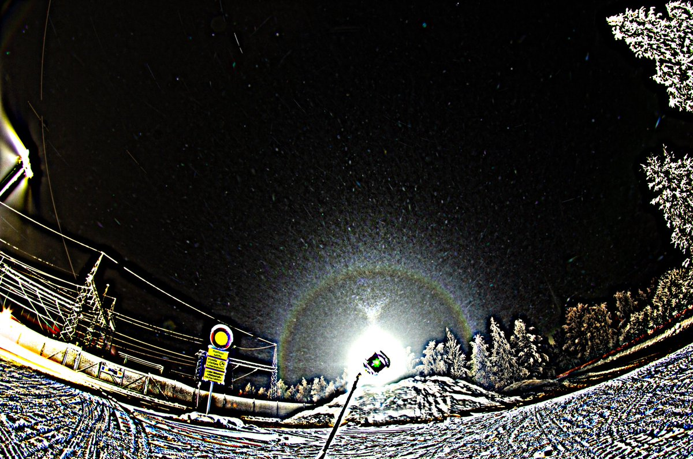
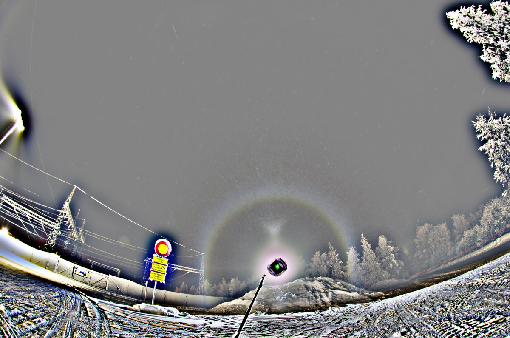
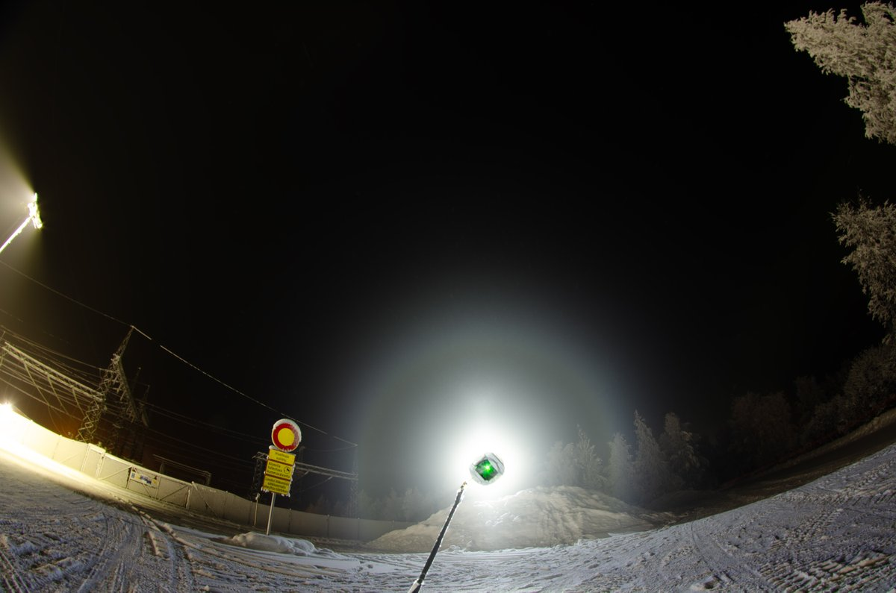
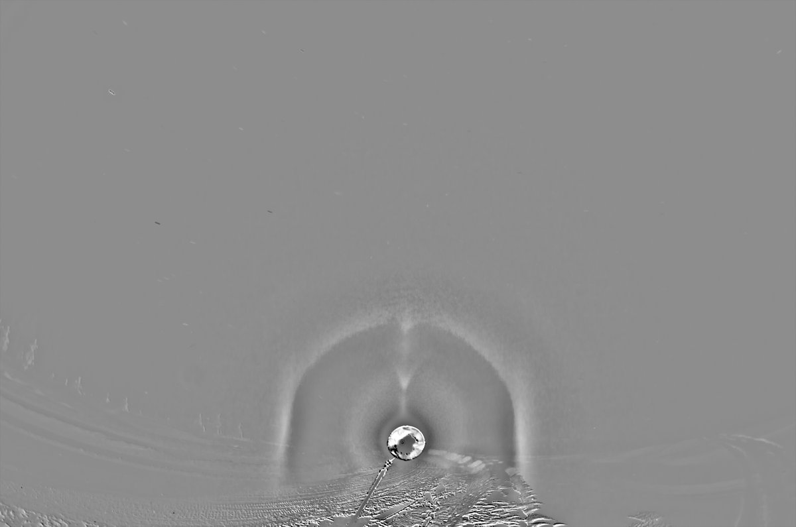
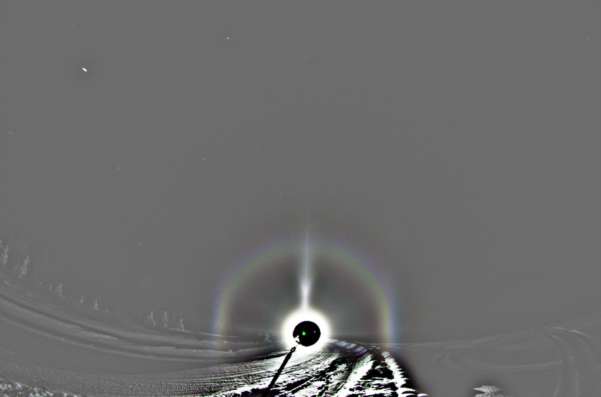
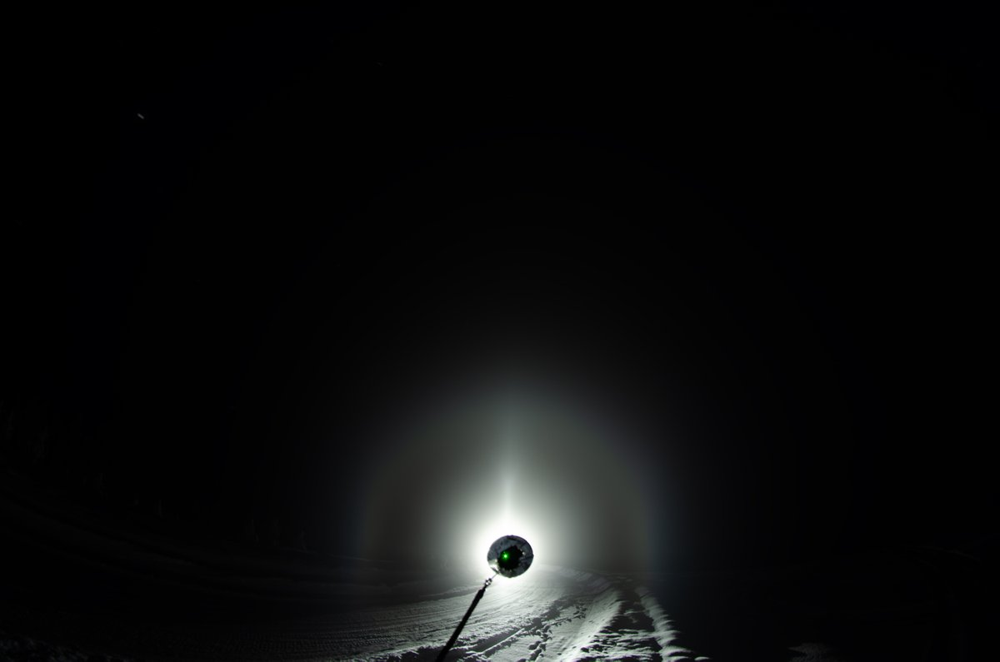

# Thread - 2026-02-11

**Original:** https://x.com/RiikonenMarko/status/2021692892281032847

---

### 1/4 - 2026-02-11 21:08 UTC

11/12 Feb 2026, Rovaniemi. There was action in Valajaskoski before stratus came (same script as the last night). This has been a winter of Moilanen arcs. After the season is over, I need to make tally on what percentage of displays Moila was visible. But they are not for granted. Winter 2023/24 I got only one Moila display.

I wonder if that's 18° halo there? Or the lamp playing tricks again? It has a halo feel to it, visible also in the second last usmed image.

---

### 2/4 - 2026-02-11 21:18 UTC

11/12 Feb 2026, Rovaniemi. Before the previous post's set, I photographed in the nearby gravel pit, which is really dark. Got this vanishing diffuse display. The 22° halo is pretty badly artefacted.

I have been visiting this pit every night. But there either has been no diamond dust or it has been crap.

---

### 3/4 - 2026-02-11 22:42 UTC

11/12 Feb 2026, Rovaniemi. Just leave a note here on the car display as I left. It was still early growth, but parhelia and parhelic circle were visible, as well as Parry and Tape arcs. What's noteworthy was that it was not frost, but deposited crystals – I just wiped the dust off with brush. So there must have been plate and column crystal diamond dust here since my ride in the daytime. Or was it only plate, and the crystals then acquired extra growth to account for the Parry stuff? Anyway, not the first time I encounter deposited display, but just thought it is worth a note.

---

### 4/4 - 2026-02-12 13:11 UTC

11/12 Feb 2026, Rovaniemi. Visited the car later at night and it had similar, but not quite as well defined display. In the morning as I left, I could again just brush the stuff off, nor frost whatsoever on the windows, so it was again deposition from precipitation. But that must have been the constant weak precipitation from stratus, no pillars visible in the neighbourhood any time I glanced out of the window. So I am a question mark here on how those crystals make these relatively good displays.

---

