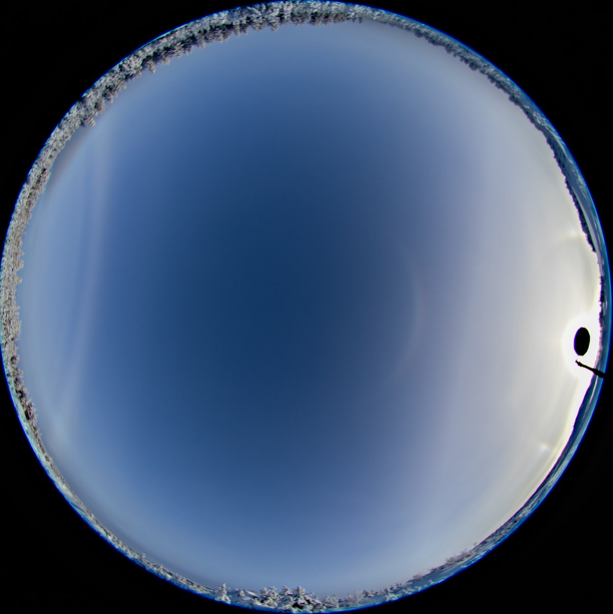
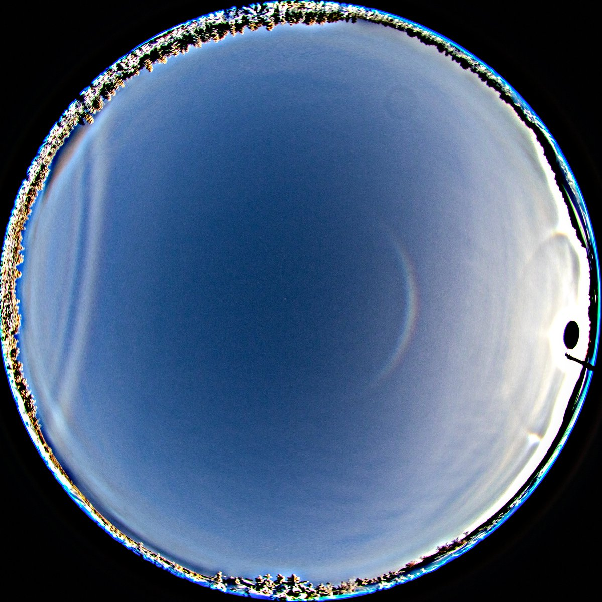

# Thread - 2026-02-12

**Original:** https://x.com/RiikonenMarko/status/2021989769832517721

---

### 1/1 - 2026-02-12 16:48 UTC

11 Feb 2026, Rovaniemi. A little ride in the daytime, got this Bouguer at the Hietavaara frisbee golf park, 900 meters from the backyard snowgun. Railway station -20 C, Apukka -23 C. This kind of situation where fogbow/cloudbow occurs in a layer which main meat is little above the ground, happens in Rovaniemi every winter and can last days. 20 frames stacked (10 and 10, aligned by rotating), interval 5s.

---

