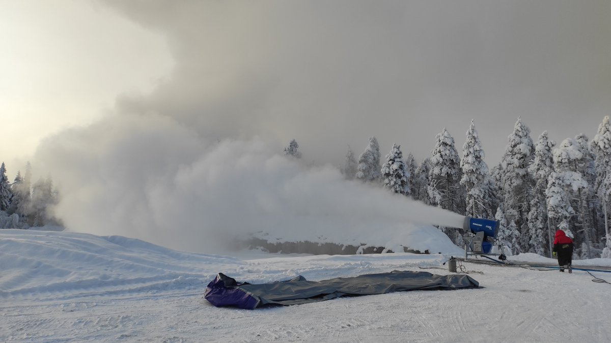

# Thread - 2026-02-12

**Original:** https://x.com/RiikonenMarko/status/2021936445158572466

---

### 1/1 - 2026-02-12 13:16 UTC

Now there are two snow-making locations in Rovaniemi. In January I had driven to Sierijärvi area to check whether the Juujärvi racing has started gunning, but except for one night, it's been silent there. Now I paid the first visit in this month and it as happened, they had just started out. The boss told me of numerous technical issues that had caused the delay.

Anyway, this means that the season won't be over any time soon even if the backyard operation near the hydroelectric plant would be wrapped up. However, after two nights it looks like a long windy spell will ensue, so there will be less displays to chase.

---

