# Thread - 2026-02-13

**Original:** https://x.com/RiikonenMarko/status/2022119828983558472

---

### 1/11 - 2026-02-13 01:25 UTC

12/13 Feb 2026, Rovaniemi.  Foggy night, -23 C. Had to do the windshield first. This was already the third night of plate & Parry in deposited crystals, and I had not taken any documentation yet. Tape arcs were distinct and even a weak Hastings was present.

Then I got going. Could have gone to Sierijärvi now but decided in favour of the good old backyard gun. Was surprised to find strong parhelia on streetlights in Rautiosaari, just some hundred meters from the gun. The swarm was violent, but in a small area and shifting.

The highlight of the night (from visual observations) was psychedelic colors parhelia. That's right, it did not have the usual red inner edge – it was all made of psychedelics. Hopefully it got captured on camera.

Here is an example of the more basic action, a 8 x 10s stack of one of the violent early stages. The crystals were huge and the swarm was so dense that the already a bit cooled camera lens started immediately gathering crystals.

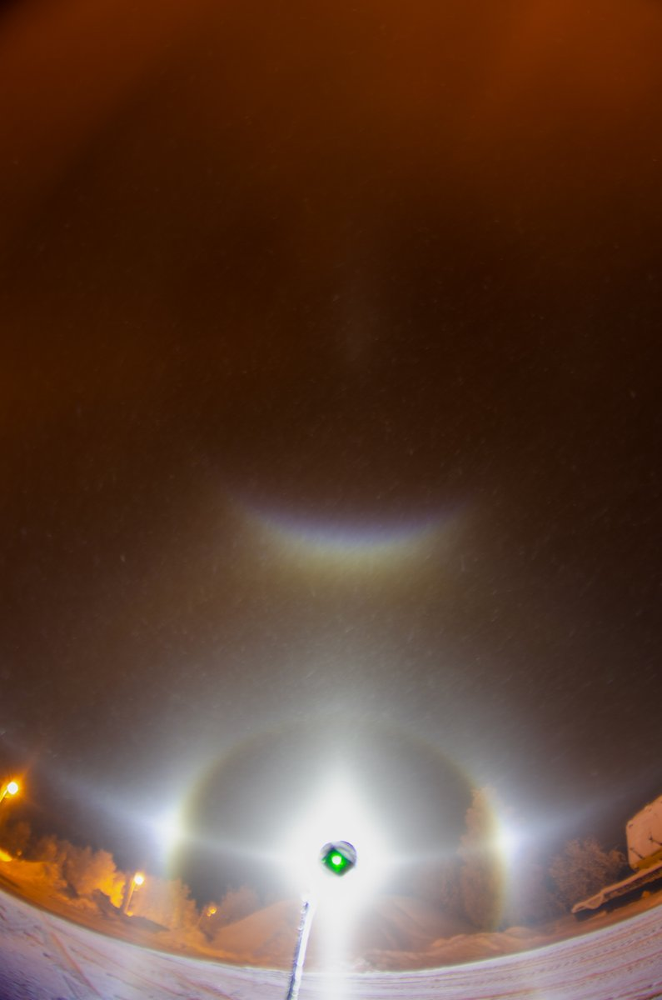

---

### 2/11 - 2026-02-13 18:41 UTC

12/13 Feb 2026, Rovaniemi. Demonstrating that the car display is formed of deposited crystals. We have this going even tonight (13/14), for the fourth night in a row, the stratus has been precipitating constantly.

But it beats me how this poor quality precipitation makes these rather good Parry & plate displays (I will publish more videos in this thread). I took a look in the spotlight beam last night whilst photographing the window halos and there was the weakest parhelia and 22° top brightening visible amid crap crystals. In my mind the windows should just get covered by crap that makes no display whatsoever.

Do I need to add a glass or plastic pane to the gear? Take it out in a massive plate-column-Parry display and see what kind of display is deposited. It could prove interesting also in Moila displays.

[🎬 2022380578620772400-srfyLLqKKrj2_AyG.mp4](media/2022380578620772400-srfyLLqKKrj2_AyG.mp4)

---

### 3/11 - 2026-02-13 20:09 UTC

12/13 Feb 2026, Rovaniemi. False alarm. The psychedelic color parhelia I talk about having seen in the opening post didn't last in photographs – the parhelion looks completely normal. There is psychedelic glitter, but it is random, not concentrated on parhelia. I wonder why my perception was so wrong.

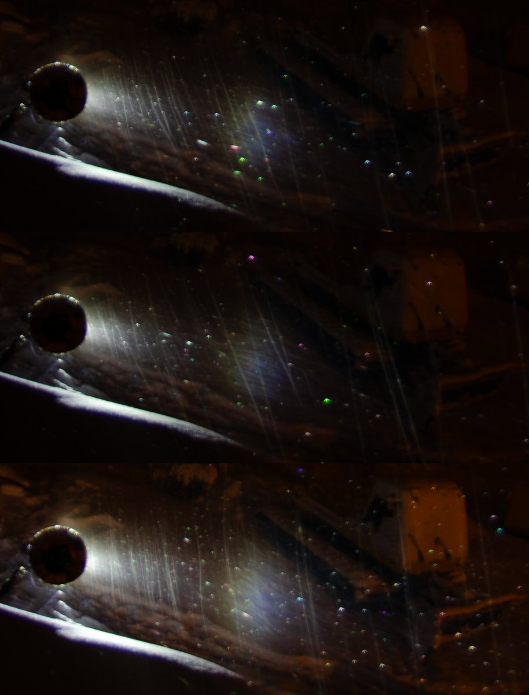

---

### 4/11 - 2026-02-13 20:42 UTC

12/13 Feb 2026, Rovaniemi. The first set I took of the violent swarm in Rautiosaari amid serious light pollution. The lamp (Javelot Turbo) and camera were pretty much level, if there was difference, it was towards positive elevation, but just fraction of degrees in my estimation.

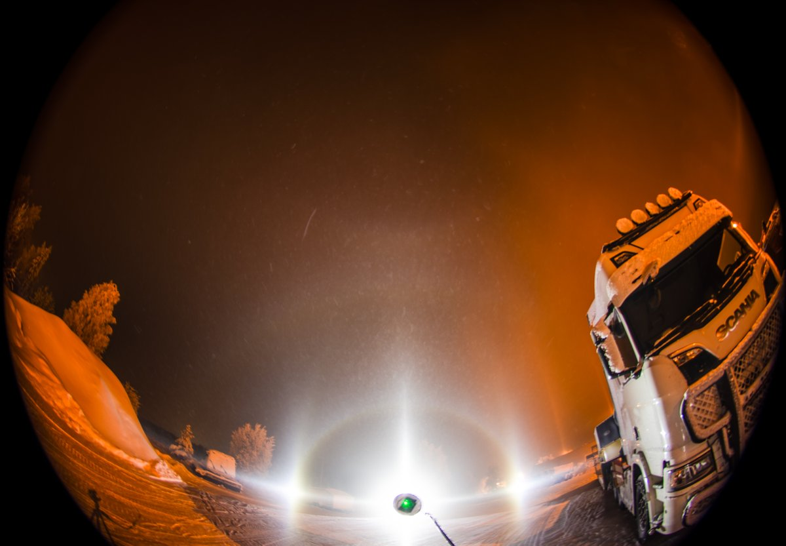

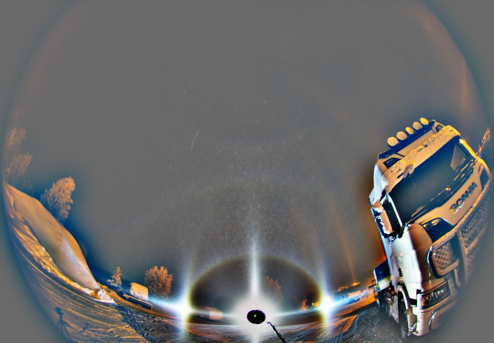

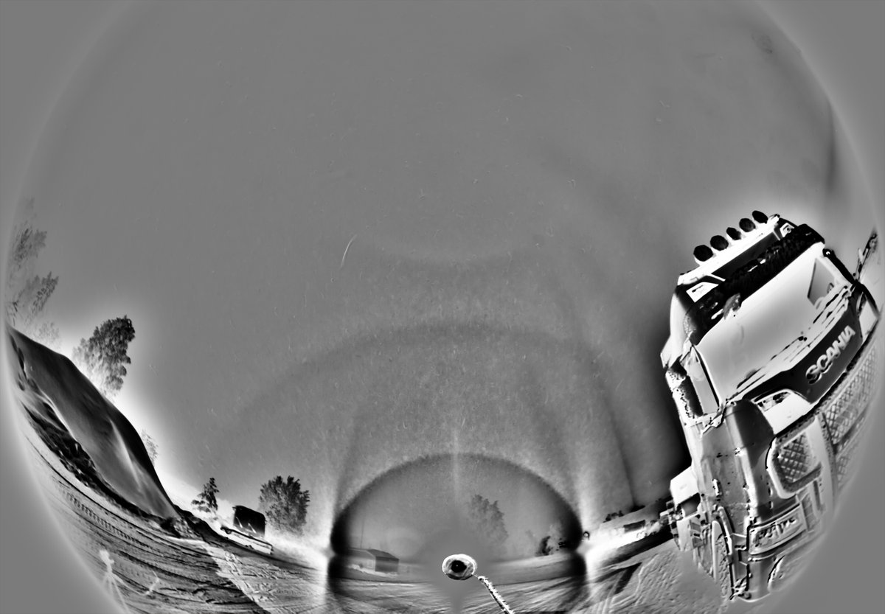

---

### 5/11 - 2026-02-13 20:46 UTC

12/13 Feb 2026, Rovaniemi. The swarm shifted and I followed. Too much light pollution here, too.

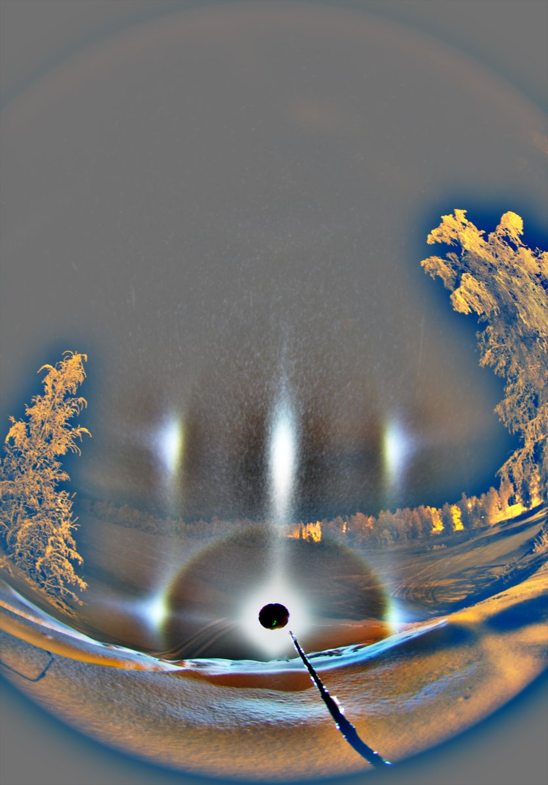

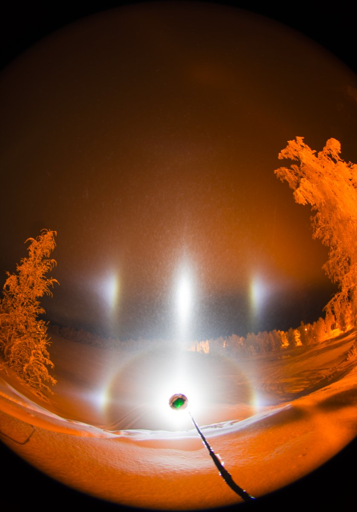

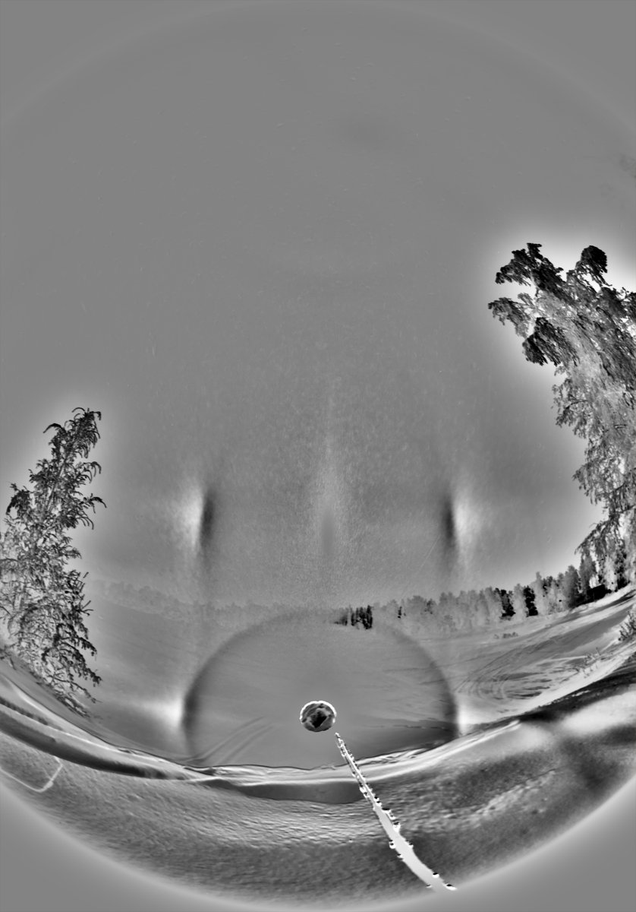

---

### 6/11 - 2026-02-13 21:06 UTC

12/13 Feb 2026, Rovaniemi. The deterioration of the display was marked by the psychedelics. I hope to get good psychedelics in a dark location.

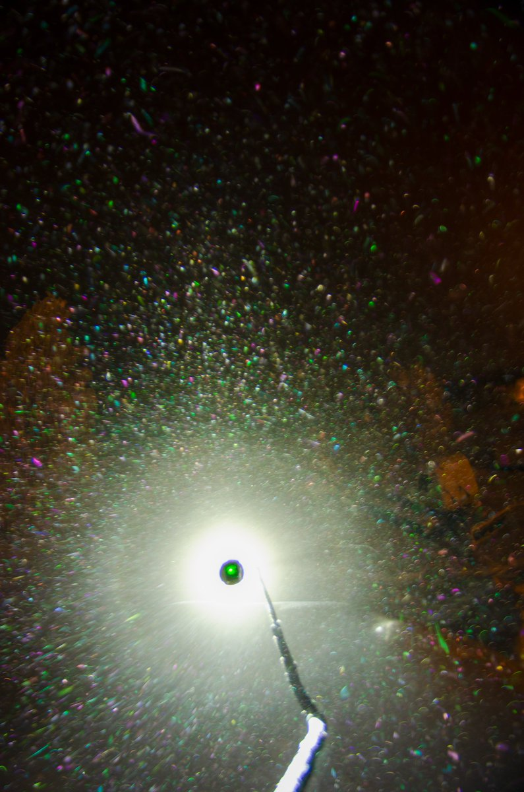

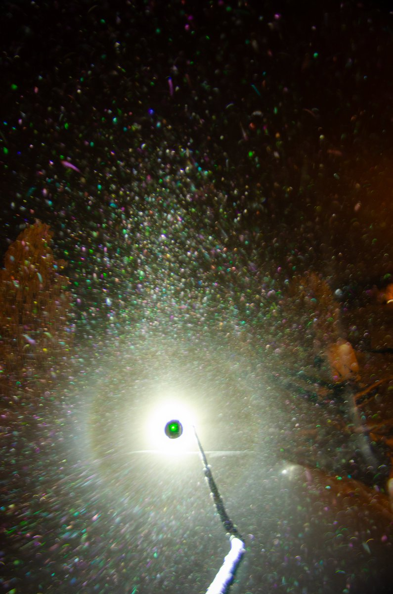

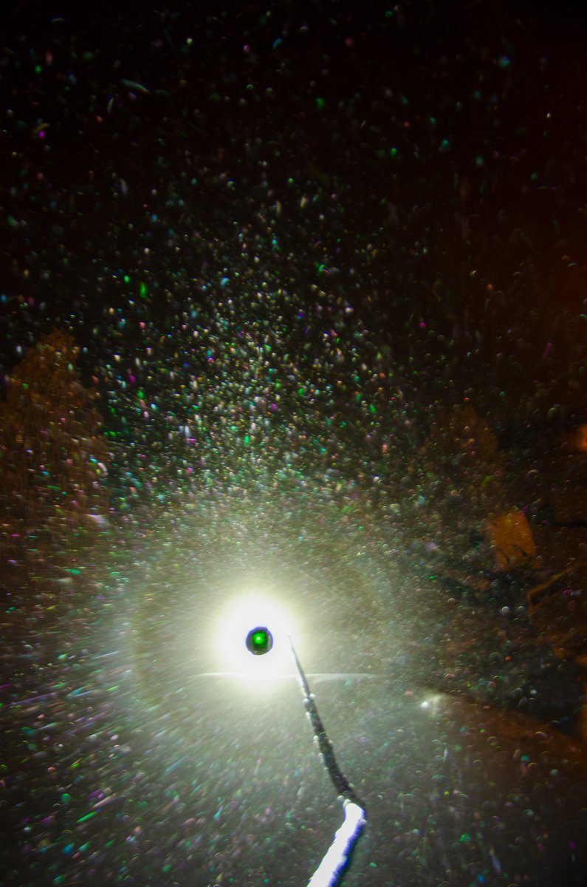

---

### 7/11 - 2026-02-13 21:37 UTC

12/13 Feb 2026, Rovaniemi. Lamp on the car seat, shallowcave and deepcave Parry arcs, horizon arc.

Original video: https://t.co/7zSMmVPIU4

Regarding my perplexion above concerning how the crappy stratus precipitation can make these quality windscreen displays, I just recalled the Post Terminal display earlier this winter https://t.co/7nJ0DjdfyL It quickly deposited crystals on car giving a windscreen display. But it had only 22° and 46° halo even if the airborne display's dominating halo was parhelia.

Yeah, that was proper diamond dust and yet no halos from oriented crystals on windshield. Actually, I think I have another, possibly even more compelling example to cite. Need to dig it up.

[🎬 2022424862460121570-wa-Du109AE2lsAvG.mp4](media/2022424862460121570-wa-Du109AE2lsAvG.mp4)

---

### 8/11 - 2026-02-14 08:13 UTC

12/13 Feb 2026, Rovaniemi. Hastings. I noticed this first from the phone display.

Original: https://drive.google.com/file/d/1JiWMsjWUepjkLfL1G9VpVincA6-t3Vsh/view?usp=sharing

[🎬 2022585063708258678-7GiXRKdXIpE1_r8n.mp4](media/2022585063708258678-7GiXRKdXIpE1_r8n.mp4)

---

### 9/11 - 2026-02-14 08:19 UTC

12/13 Feb 2026, Rovaniemi. A distinct Tape arc.

Original: https://drive.google.com/file/d/1EQEK-jRPWRXZ1YvoLXurnEY09K0lYziZ/view?usp=sharing

[🎬 2022586523602841702-9PMrLsAvv3-LyglY.mp4](media/2022586523602841702-9PMrLsAvv3-LyglY.mp4)

---

### 10/11 - 2026-03-30 07:52 UTC

12/13 Feb 2026, Rovaniemi. Hastings in all-sky view. This is shot with Canon 80D. The video quality is better than in Nikon D7000, but I couldn't get more light to it. Either I don't know how to use the camera or then have to buy a brighter light. A brighter light of course is always good investment as it combats better the unwanted lights in the surroundings.

[🎬 2038524686196265075-x7W9ZCZfdb7cE0de.mp4](media/2038524686196265075-x7W9ZCZfdb7cE0de.mp4)

---

### 11/11 - 2026-03-30 07:57 UTC

12/13 Feb 2026, Rovaniemi. Another one from Canon. Original for this and the previous post's video:
https://drive.google.com/file/d/1zAWSDKcKYT223JS5K1mfKR7LzmToTAGc/view?usp=sharing
https://drive.google.com/file/d/1xxzxWewl5kD112m85xvGTD3faaeadA2i/view?usp=sharing

[🎬 2038525892452847766-e_uWBMd_ejkwasL_.mp4](media/2038525892452847766-e_uWBMd_ejkwasL_.mp4)

---

