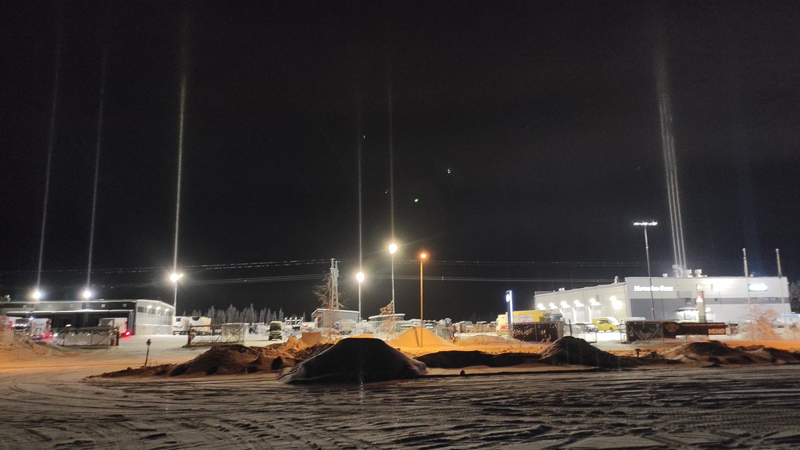

# Thread - 2026-02-15

**Original:** https://x.com/RiikonenMarko/status/2023126590830342343

---

### 1/1 - 2026-02-15 20:05 UTC

15/16 Feb 2026, Rovaniemi. Tonight and last night we had the winter's first Jedi sword pillars. Even if there are counterlamps against the ground in the first photo, this was really diluted ice fog and not good for spotlight.

Otherwise there was not much going on. Visited the backyard gun, but only a very local ice fog lingered in which mostly nothing was seen. Light snowfall likely is the reason for the poor action. So that was that for tonight.

One more thing, visited Sierijärvi and no snow making was going on. So it's probably on the backyard gun to carry the season to finish.

---

