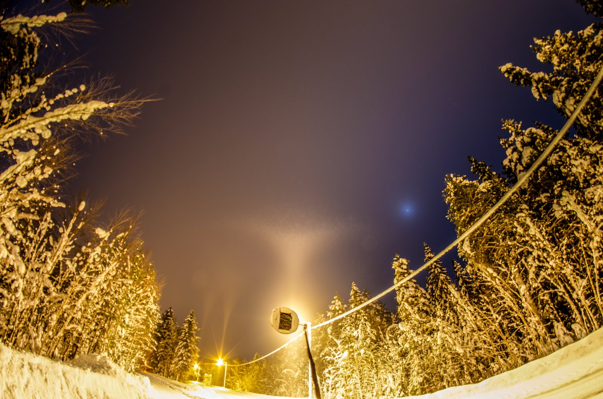

# Thread - 2026-03-01

**Original:** https://x.com/RiikonenMarko/status/2028091656688255047

---

### 1/1 - 2026-03-01 12:55 UTC

28 Feb / 1 March 2026, Rovaniemi. This is all I got last night. The fog layer started just above the tree-tops, with occasional wafts on the ground. By all reason this should have been well nucleated into ice fog, but all there was was whimsical action under a few nearby streetlights where the little breeze carried the stuff.

Possibly it was too warm. Both railway station and Apukka at -5 C, which is in my limited experience (guns are not usually on at such high temps) the threshold above which the ice fog formation becomes unstable.

I was basically waiting for 6 hours next to gun. When the action disappeared completely around 0130 I gave up. Should have stayed, of course, the fog stayed and it started gradually cooling after about 0200, at 0500 Apukka was already at -6.7 C.

Anyway, as to this tanarc, the swarm was not that dense but it was made of big crystals. Visually impressive.

Coming night should be fog/stratus again, but FMI forecast precipitation probability is in the 50-70% range, so it may not be good.

---

