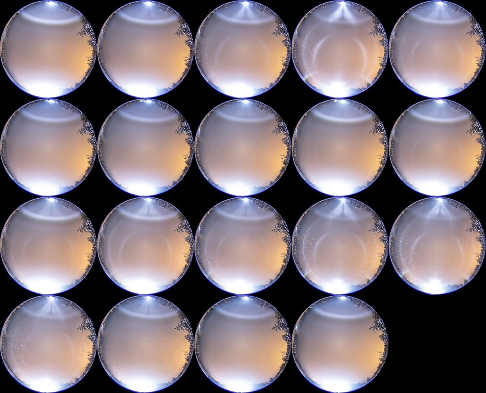
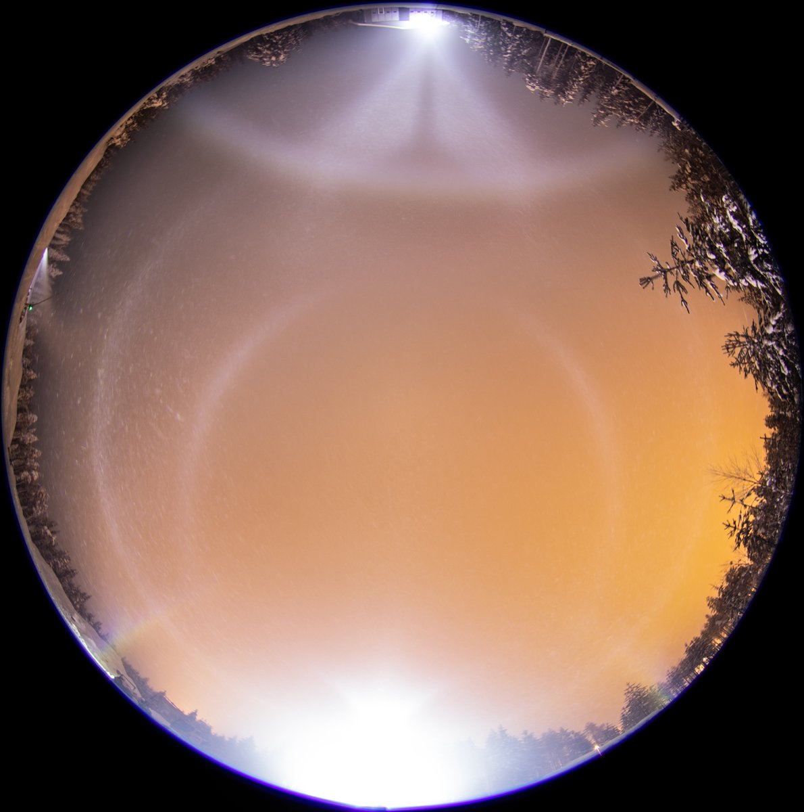
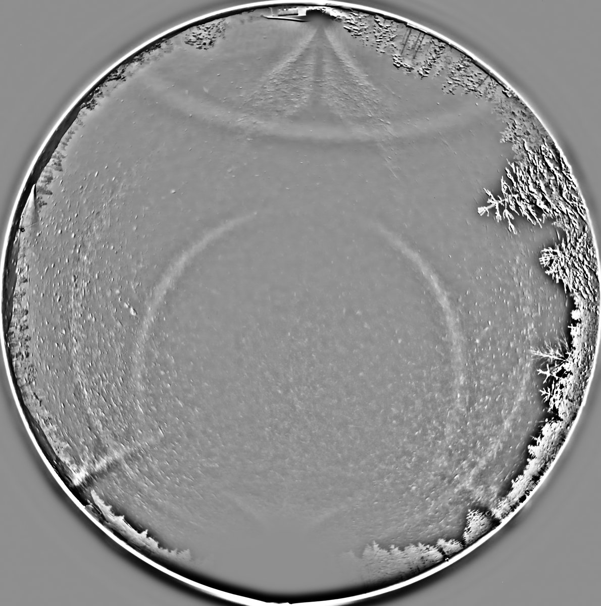

# Thread - 2026-03-04

**Original:** https://x.com/RiikonenMarko/status/2029137994322457066

---

### 1/2 - 2026-03-04 10:12 UTC

1/2 March 2026, Rovaniemi. Just like previous night https://t.co/4Jr95DVeb8 on this night ice fog was tied very close to the snow gun. It was more consistently present on the streetlight polluted main road, but some deviations in the breeze allowed to get a display at the site. Temp uniform all around because of thick fog, -8 C at the time the photos.

---

### 2/2 - 2026-03-04 10:41 UTC

1/2 March 2026, Rovaniemi. 5 best frames stacked. Diffuse arc in spotlight beam is a sight to behold. Highly recommended!

---

