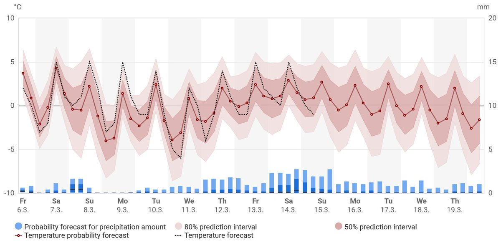

# Thread - 2026-03-06

**Original:** https://x.com/RiikonenMarko/status/2029828701723013500

---

### 1/1 - 2026-03-06 07:57 UTC

Last night fog again, -7 C. But no more gunning. The diamond dust season might be over by the looks of the 15 day FMI forecast.

I would expect there still be windshield displays. And Herincs-Ujvarosi displays of the frozen puddles should start becoming possibility soon. Traditional surface displays of course have been there all the time since about end of January, but I have not gone after them – it's been busy enough as is. Moreover, pristine surfaces are in shorter supply now due to the tourism explosion.

---

