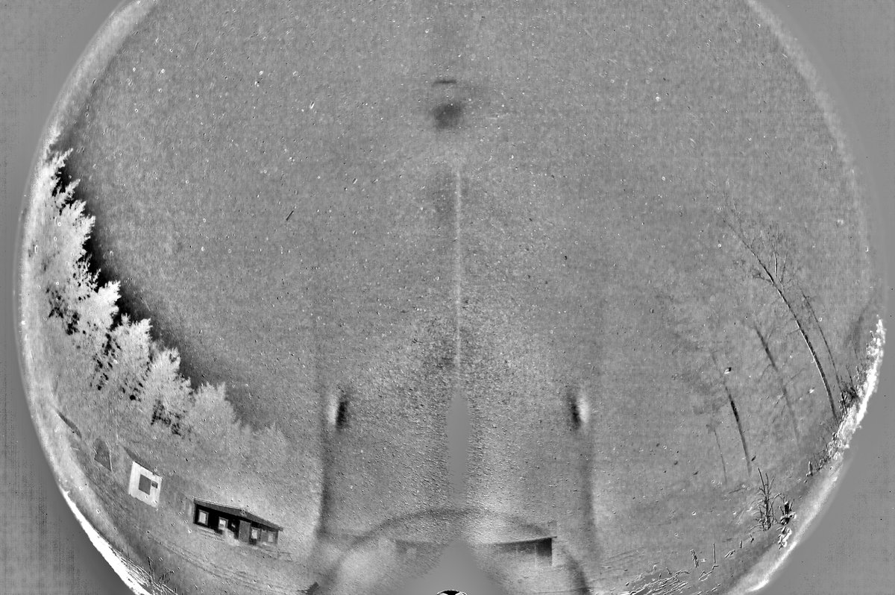
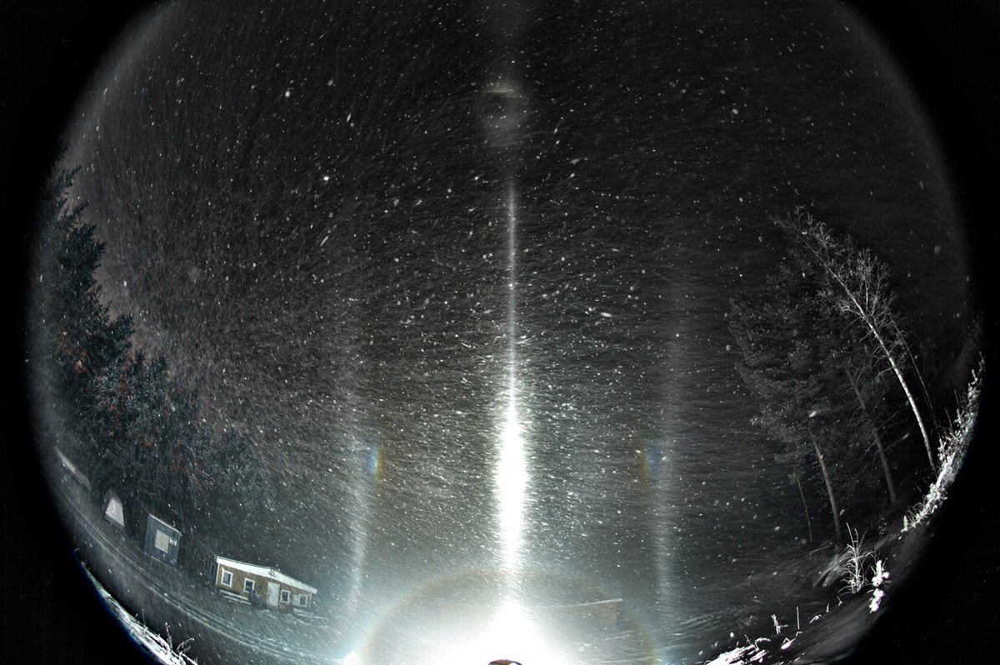
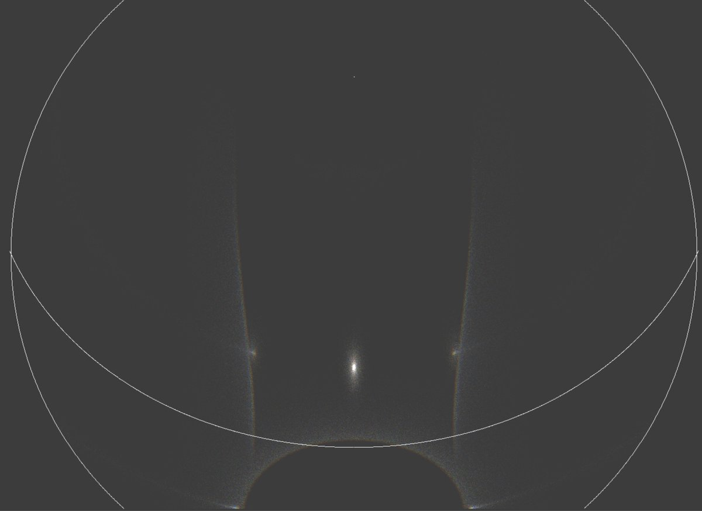
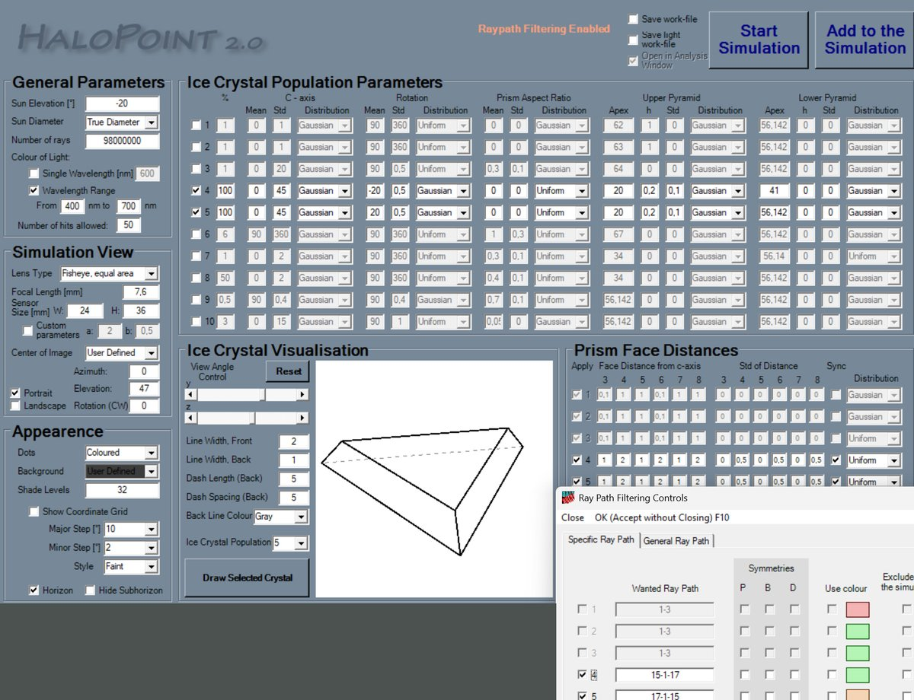
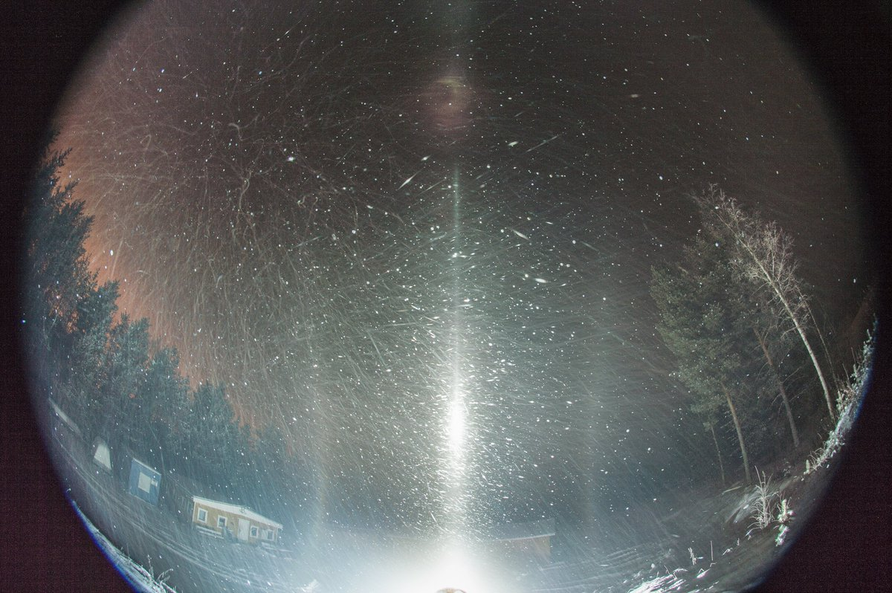

# Thread - 2026-03-22

**Original:** https://x.com/RiikonenMarko/status/2035724365002600822

---

### 1/2 - 2026-03-22 14:24 UTC

Had another look at the display on the night of 28/29 November 2016 in Rovaniemi, originally presented in the Halo Vault post "Problematic arcs in a spotlight display" https://t.co/w4MZsmHixT As shown by two first images here, the long arcs that shoot past counterparhelia would not seem to meet parhelia either if continued, the outwards curvature is too much.

There are at least two other known cases of a similar looking feature. Both are in odd radius displays. Maybe it is a kind of an odd radius halo that sometimes can occur by itself. See the last image in the Halo Vault post "Odd radius sub-plate arcs" https://t.co/nhNBZKGKGc for the two other displays.

Earlier, I attempted explain the November 2016 display with kinds of 35° arcs, but the curvatures were wrong: https://t.co/2MStL2Ot1j Now, as shown by the simulation here, I attempted again by using tailored Lowitz axis position and pyramid angle, but still no success. I didn't try that much, though, maybe it is possible to find better match.

A very weak 46° halo in the display helped with the light elevation estimate, which must be close to 20 degrees below horizon.

Original nefs are available: https://t.co/guOyt2DMes

---

### 2/2 - 2026-03-23 16:53 UTC

Alone for the eventuality that this kind of display repeats, every diamond dust chaser out there should first of all carry the crystal sampling kit; and second, have it so that it is ready to be turned on in seconds. The other halos in the display are at absolute minimum – just the countersun – so the sample would have been highly representative of the long arcs. You could have basically said, "it was these crystals that made those arcs", and with some luck the contribution to the understanding of the arcs would have been decisive.

Had I actually taken a sample, there wouldn't have been much time. While the arcs are discerned in photos for about 6 minutes, the peak stage was only 1-2 minutes. For this reason, sampling must be ready to be started in a jiffy. Every minute is precious, because usually you need to have 10 to 20 minutes to have enough crystals (there are exceptions, "super swarms", that blanket your car windows in a minute or two as if in a snowfall). 

I never have maintained quite the required level of readiness. It's not too difficult, however. If you have the petri dish and gasoline out and cold already, and near the camera where you are looking at the display, it don't take long to start when you see the display turn an interesting phase.

I am not sure if it is possible to have a lidded dish with gasoline readily poured in. That would be the fastest – just remove the lid. However, gasoline evaporation may frost the bottom of the dish. Although not fatal, the resulting noisy background is nevertheless something you want to avoid. Frost starts growing also if you have an empty dish out in the open. They should be kept protected, inside a cold box or bag, to be taken out only when it's action time.

Crystal sampling more than doubles the complexity of the already complex the operation, which is why the pull of the no-sampling side is strong. This winter I grew the sampling spine only late in the season. It's good I did, because I got some interesting displays sampled. Next winter, if am still in the game, crystals will be high priority from the start. But as it looks now, I probably won't have the money to keep the car for yet another winter. If anyone is coming to chase to Rovaniemi, and if there is room in the car, I am happy to join as the crystal sampler sidekick.

---

