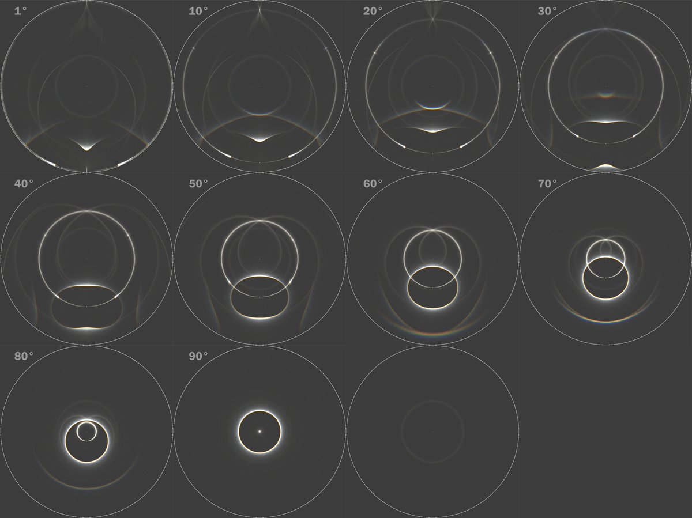

# Thread - 2026-04-09

**Original:** https://x.com/RiikonenMarko/status/2042127251425132993

---

### 1/2 - 2026-04-09 06:27 UTC

Perhaps integrated zenith arc is possible at all light elevations. Here is checking out how it relates to other halos in a plate + column display. I mimicked it by simulating Dufay in full triangles at 1 degree elevation and stacking that simulation with rotated versions of itself (the last simulation).

The light elevations at which it has been observed are for Rovaniemi display 15-16 degrees, Jutland 20°, Siziwang Qi 21°. All these displays had Dufay, but in principle integrated zenith arc should be possible to see also in a display that has just the zenith arc.

Hopefully we get the observed elevation range extended soon!

---

### 2/2 - 2026-04-09 06:50 UTC

Forgot the first IZA by Antti Henriksson in a display from Levi ski resort snow guns: https://t.co/XA5E30E8hG

It is for 18 degree light elevation. I have a two image stack made which shows in b-r the arc crossing the 46° halo / infralateral, no doubt having made a full circle of the sky. I'll ask him for permission to publish here.

Jutland: https://t.co/Vckjx7cLiR
Siziwang Qi: https://t.co/FwgEYlKzWy

---

