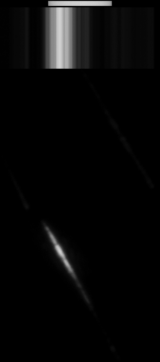
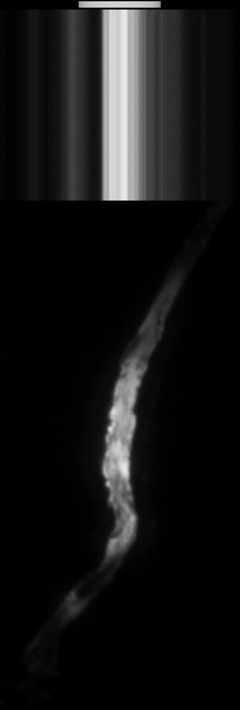
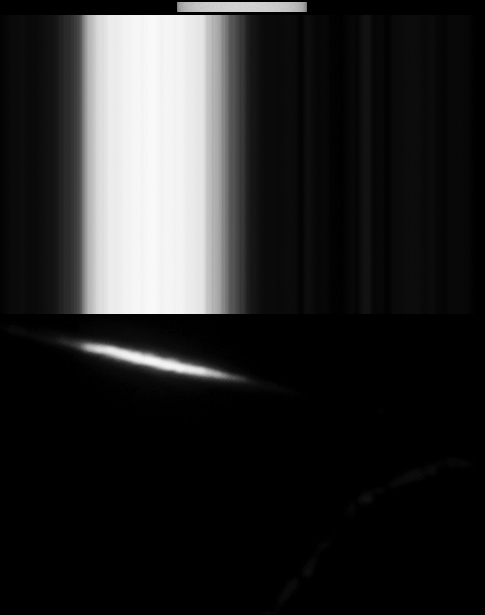
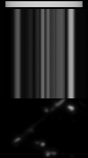
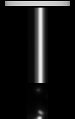
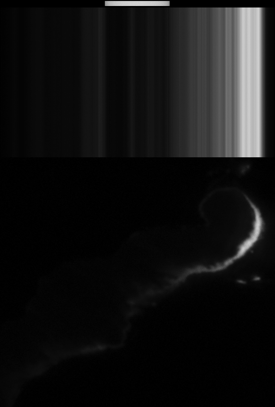
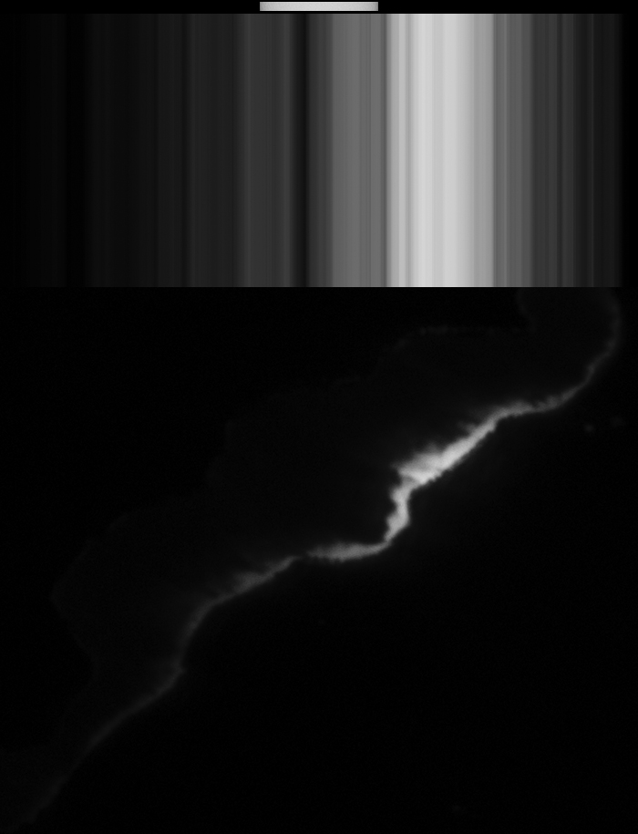

# Thread - 2026-04-15

**Original:** https://x.com/RiikonenMarko/status/2044381850462794049

---

### 1/4 - 2026-04-15 11:46 UTC

Reflection countersuns are usually vertically striated. In this and the next three posts are vertical maximum-intensity projections of sun's reflection off a water body to create crude reflection countersun analogs.

The horizontal bar at the top gives the sun's width. The horizontal position of the bar is arbitrary, it doesn't indicate the true sun azimuth relative to the reflection.

I took the photos from an airplane. Heavy underexposure was necessary to avoid clipping the bright reflection.

Not sure if I have published some or possibly all of these before.

---

### 2/4 - 2026-04-15 11:46 UTC

---

### 3/4 - 2026-04-15 11:46 UTC

---

### 4/4 - 2026-04-15 11:46 UTC

---

