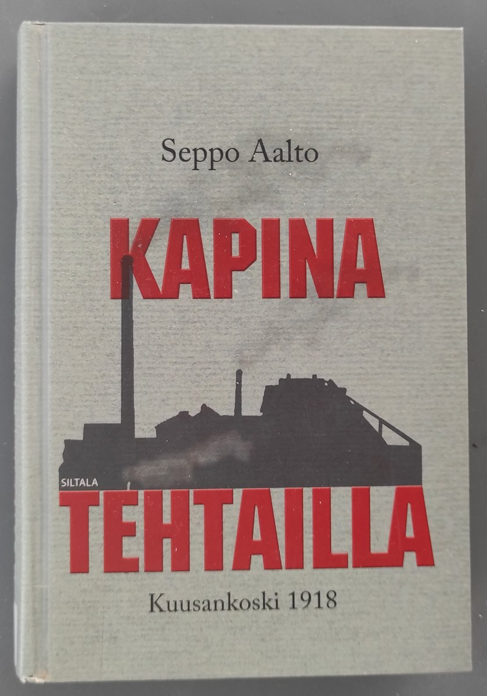
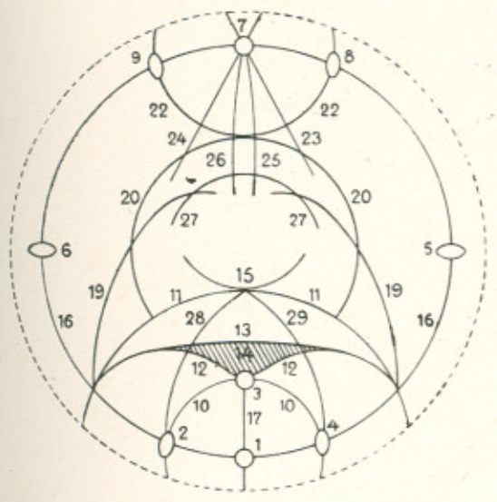

# Thread - 2026-04-17

**Original:** https://x.com/RiikonenMarko/status/2045052834396221507

---

### 1/1 - 2026-04-17 08:12 UTC

In the Rovaniemi city library I randomly happened to take this book from the shelves of Finnish history – "Mutiny at the factories". Then I randomly happened to open a page where an interesting name stood out: Ernst Biese, one of the 10 March 1920 Kuusankoski display observers.  

"The events of the last two weeks of January raised the tension at the Kymi factories to its peak. The most eager part of the Civil Guards were ready for battle, and some of them set out on daring raids. The leaders Brejlin, Biese, and Norrman, however, realized that it would be pointless to engage in open war at the Kymi factories."

According to index, Biese appears on three pages. The book is chock-full of information. Somewhere around page 80 all the people and different organizations were just too much and I had to throw the towel in (340 pages in total).

One of the Biese's drawings of the halo display is shown here. He also painted the display on a large metallic hemisphere. Unfortunately the Helsinki university site by Matti Leskinen that displayed photos of the hemisphere is no more. Wayback machine draws blank. Does anyone happen to have the site / photos stored?

---

