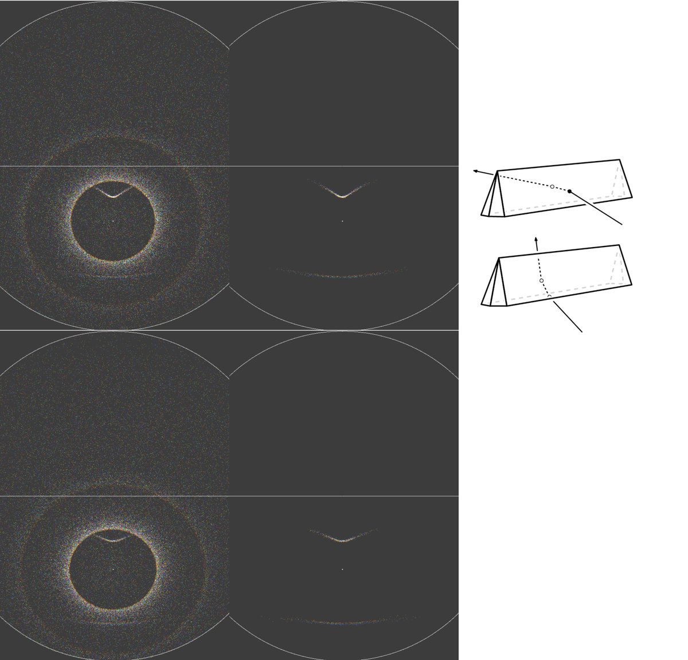
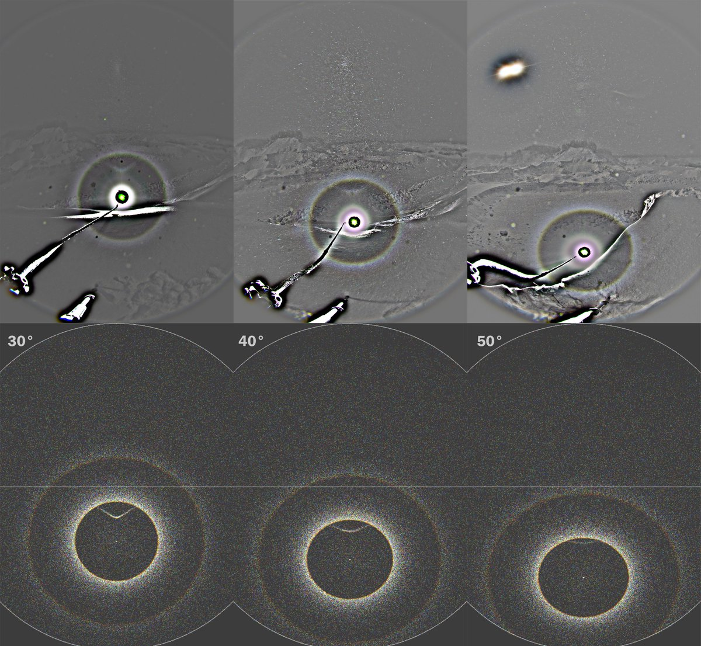
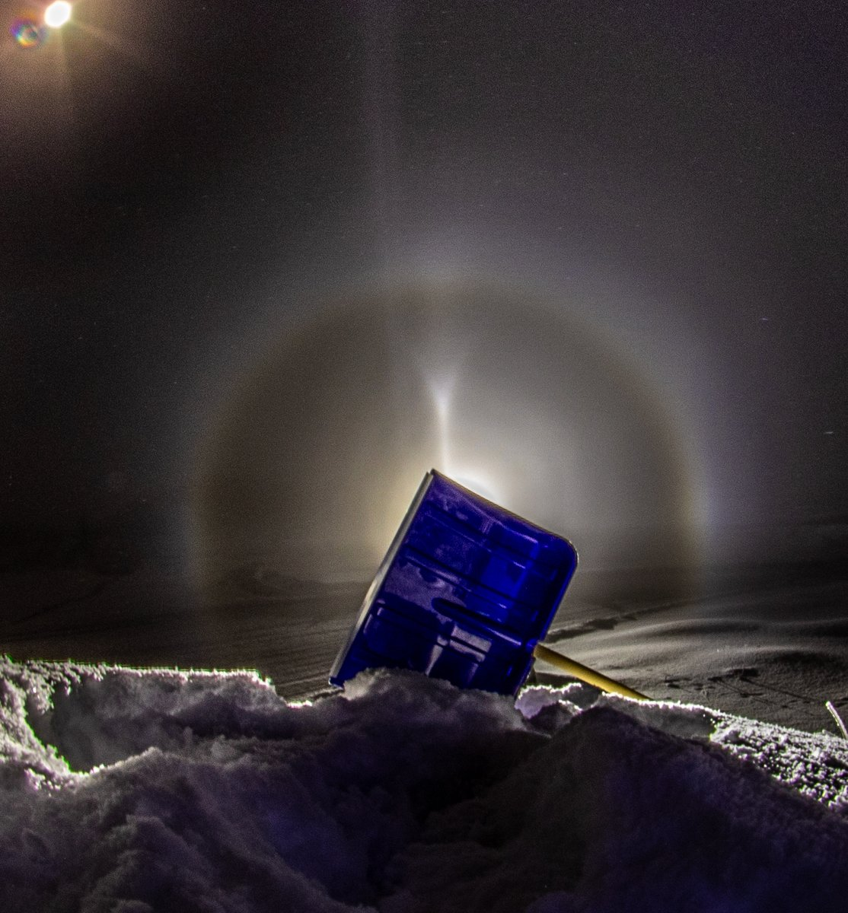
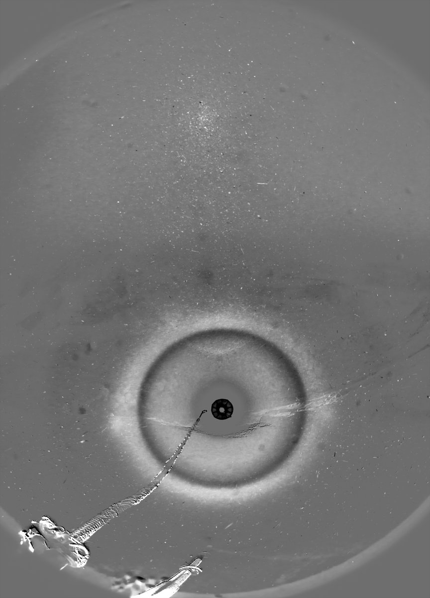
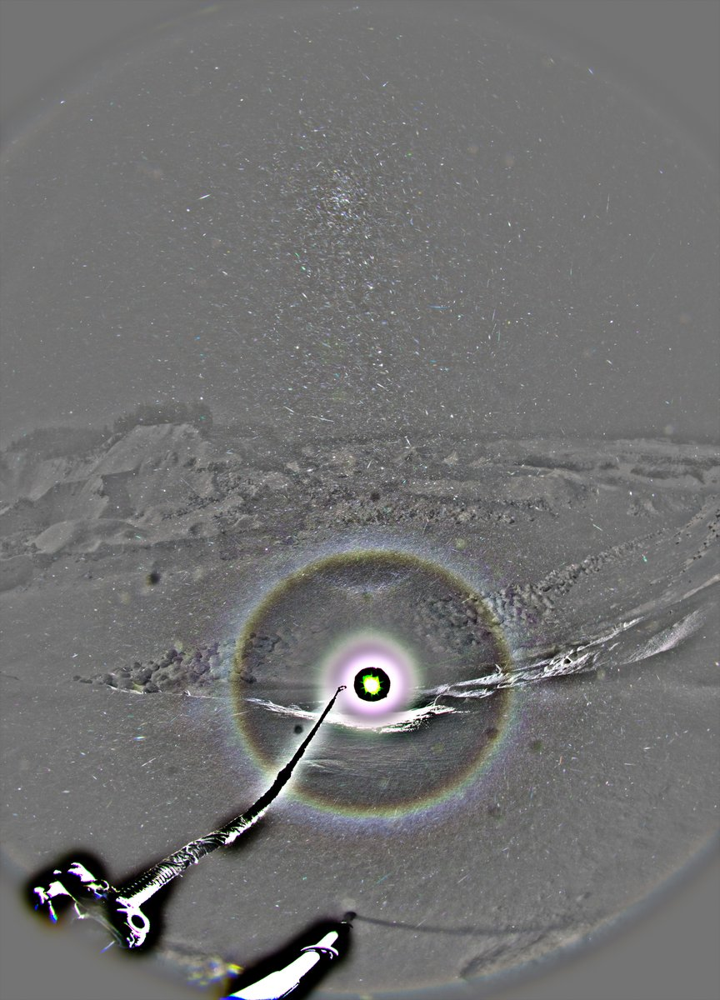
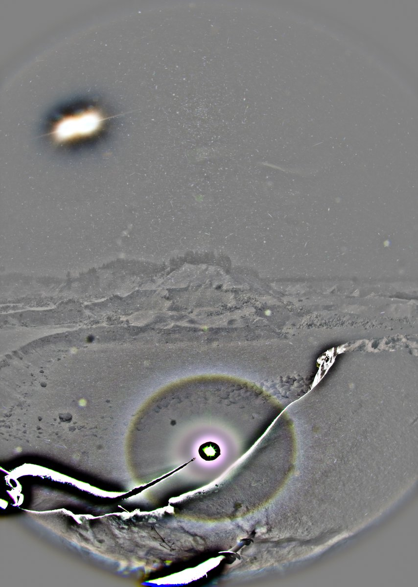
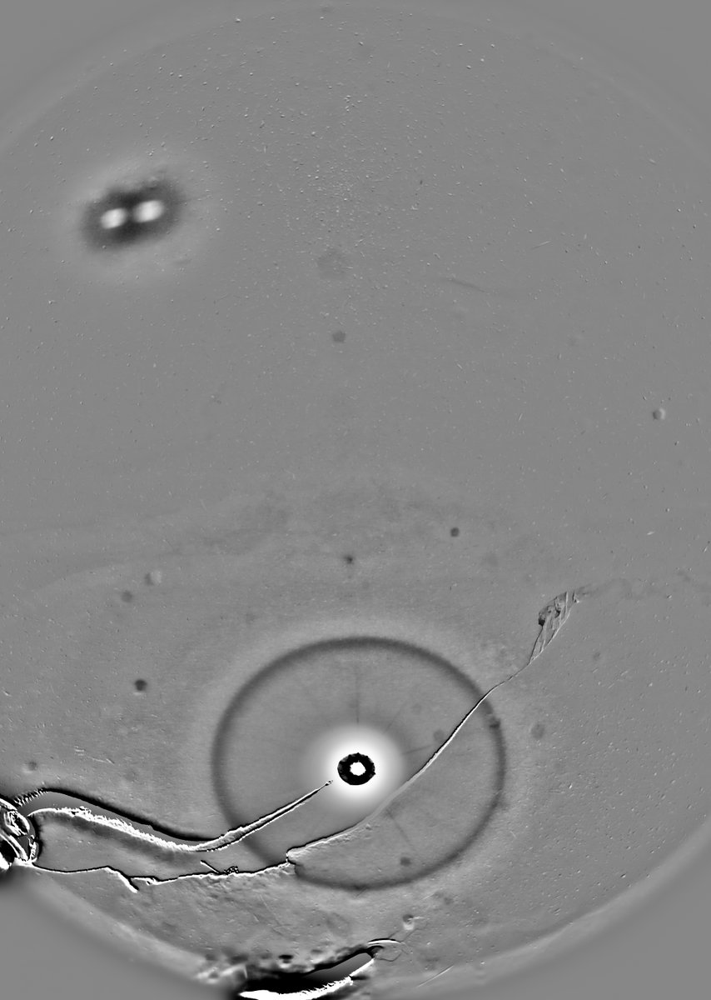
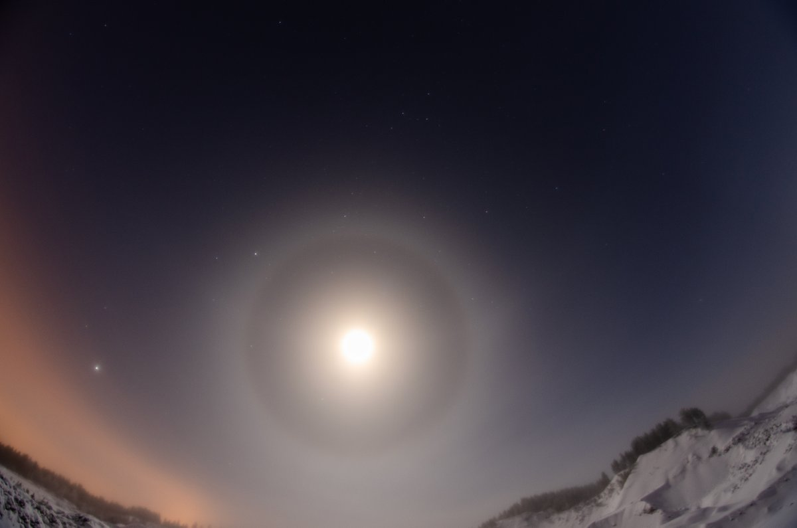

# Thread - 2026-04-19

**Original:** https://x.com/RiikonenMarko/status/2045837702512161243

---

### 1/3 - 2026-04-19 12:11 UTC

New Year night 2026, Rovaniemi. I took sets at three increasingly lower elevations at Jokkavaara gravel pits while Moilanen arc was visible. At around -50° elevation Moilanen arc has become very faint. But not because of weakening swarm: at the same time in the beam of my other led lamp at only slightly negative elevation Moilanen was kicking strong (the second image). The Moila weakening is only because of elevation related intensity decrease. Full prism was used in simulations, probably it was truncated to some degree. In the simulations accompanying the stacks only light elevation has been changed.

In the third image I have allowed the arc that arises from raypath entering horizontal face, exiting Moila face. It is not seen in the display. One more evidence to suggest that Moila crystals don't have horizontal faces. On that note, notice also the lacking of countersun in the -50° stack.

---

### 2/3 - 2026-04-19 12:11 UTC

New Year night 2026, Rovaniemi. The two lowest elevations with color channel extracted images.

---

### 3/3 - 2026-04-19 12:11 UTC

New Year night 2026, Rovaniemi. Seems like I had scribbled afresh some notes of the night, probably not that interesting read, but I paste it here anyway for the record.

Headed to Jokkavaara around 4 pm. -32 C For a long stretch after the Sierijärvi junction (the first time I see thirties this winter). It always warms when you arrive to Oikarainen (about where the streelights start) and up at Jokkavaara it was -28 C.

The night's theme was Moilanen arc. It was present, I surmise, all the time except when ice fog started fizzling out. Three progressively further negative elevations for the stack series, Javelot Turbo at the bottom of the pit.

At the same time I let the other Nikon photograh the lunar display. Didn't see Moilanen visually nor from the camera screen, probably because moon was so high. Would be cool if the single orientation counterpart turns up in stacks. I don't think we have photos of it without Moilanen.

The last negative elevation was so deep that Moila may have been superposed with 22° halo, or maybe very close to it on the inside. In any case, I didn't see it. But I confirmed its presense using Acebem in near horizon position. It was quite strong actually, so I look forward to see the deepest elevation stack [This is the -50 elevation stack]. Took some photos of the Acebeam Moilanen with phone, but it froze. Then I took photos with Canon, using the shovel as blocker and camera resting on motor coolant bottle. But I don't know if something got wrong. I put the interval timing on but could browse afterwards only two photos. We'll see.

As always, there is something to new learn when dealing with ice fog. I was paying attention to the flipsun in the Javelot beam. At other times it was pretty much non existent if not completely absent, other times weakly present. As is my wont, this time, too, I pointed the Acebeam often straight up. It allows for estimating what's to come. If there is for example only sparse crystals on the ground, but at full-blown layer glitters above, it usually means that soon it will land on the ground and you should be getting ready photograph.

So when I saw the flip-sun in the Javelot beam and pointed the Acebeam in my hand straight up, I was befuzzled by not seeing the zenith spot. Then I understood: plate oriented crystal were only on the ground level in a very shallow layer. And indeed, when I looked again at the upwards pointed Acebeam beam, I could see the zenith spot, but it was in so close crystals – just a couple of meters above myself – that it was not a spot, but just brightly lit crystals and so hard to distinguish.

Then the lunar halo started to fade. As usual, the ground level part lingers longer, but inevitably even that fizzled away. Nothing to do but head back. The westerly wind had turned northernly and the cloud was now going over the Ounasvaara to the other side. I drove to check, but as there are no places with good relief, I was not excited (Jokkavaara spoils you) and returned to apartment.

Later, after the New Year's banging has somewhat subsided, I saddled up again, around 1:30. The western slopes had already been groomed and lights turned off, so I had the ski jump complex in mind. But the display was so crap that I took only some stacks a the bottom and then called it a night, was back at the aparment after 3 am.

One other little tidbit of information I learned was about the parhelia on the Ounaskoski bridge. At least once earlier this winter I had seen strong parhelia on the bridge in an ice fog that was crappy pillars-only elsewhere (I have two videos, unpublished). The same effect was present this night, too. Every time I crossed that bridge since starting at 4 pm there were parhelia stripes visible from the yellow lamps. They were there when I came back from Jokkavaara hours later, they were there when I made the second trip at 1:30 am, coming and going. Elsewhere only pillars or nothing.

The river is open under the bridge and it was steaming, turning immediately into ice fog, which was much thicker than elsewhere. So the parhelia must be related to the extra supesaturation. But extra supersaturation should only crap the crystals further, so there is some mystery here.

The photo is of the lunar display. I'll do the stack at some later time.

---

