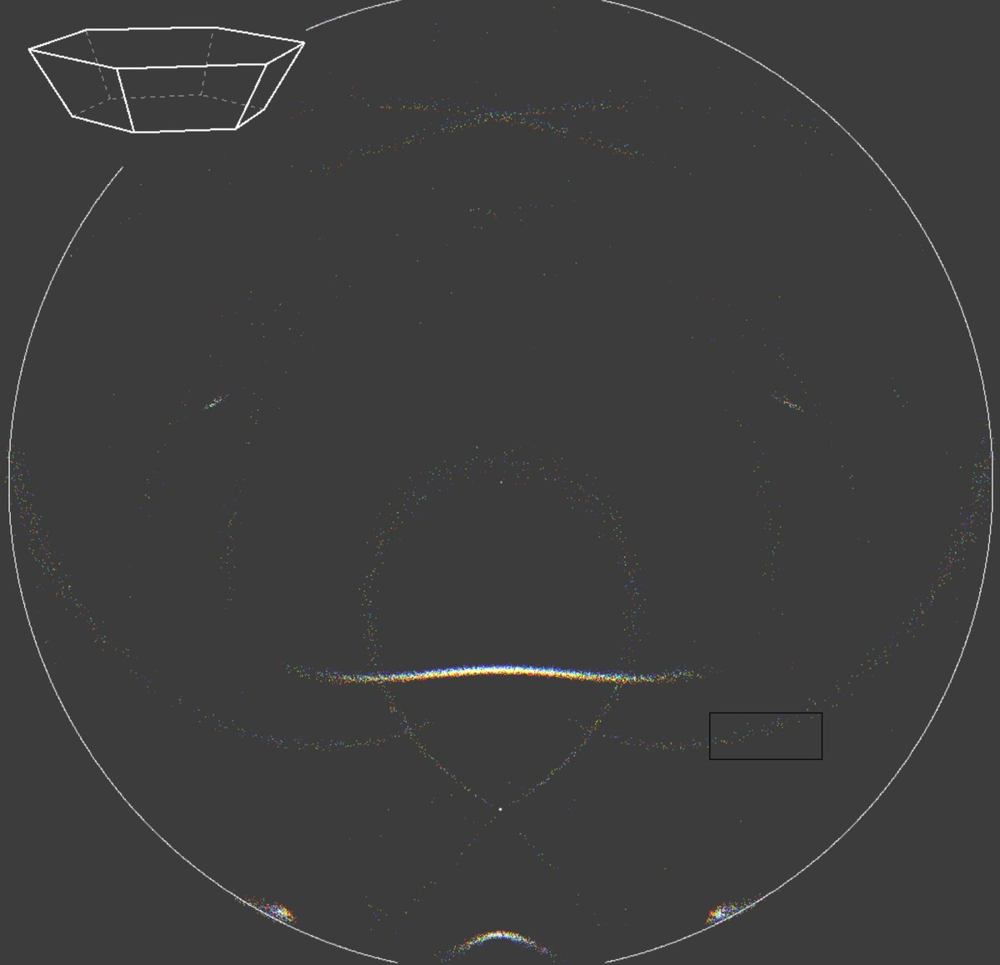

# Thread - 2026-06-17

**Original:** https://x.com/RiikonenMarko/status/2067233498977419730

---

### 1/1 - 2026-06-17 13:10 UTC

Pyramid helic arc requires exceptionally sharp 23° plate. Finding oneself in that situation, a wise man takes all-sky stack, because why settle for national or personal firsts when prospects are for global firsts. The simulation is for 30°, tilt 2 degs. While the colored opposite cross and the concise spots have complex 6 and 5 hit raypaths, the rectangled arc is simpler 3-hit, 1-23-25.

---

