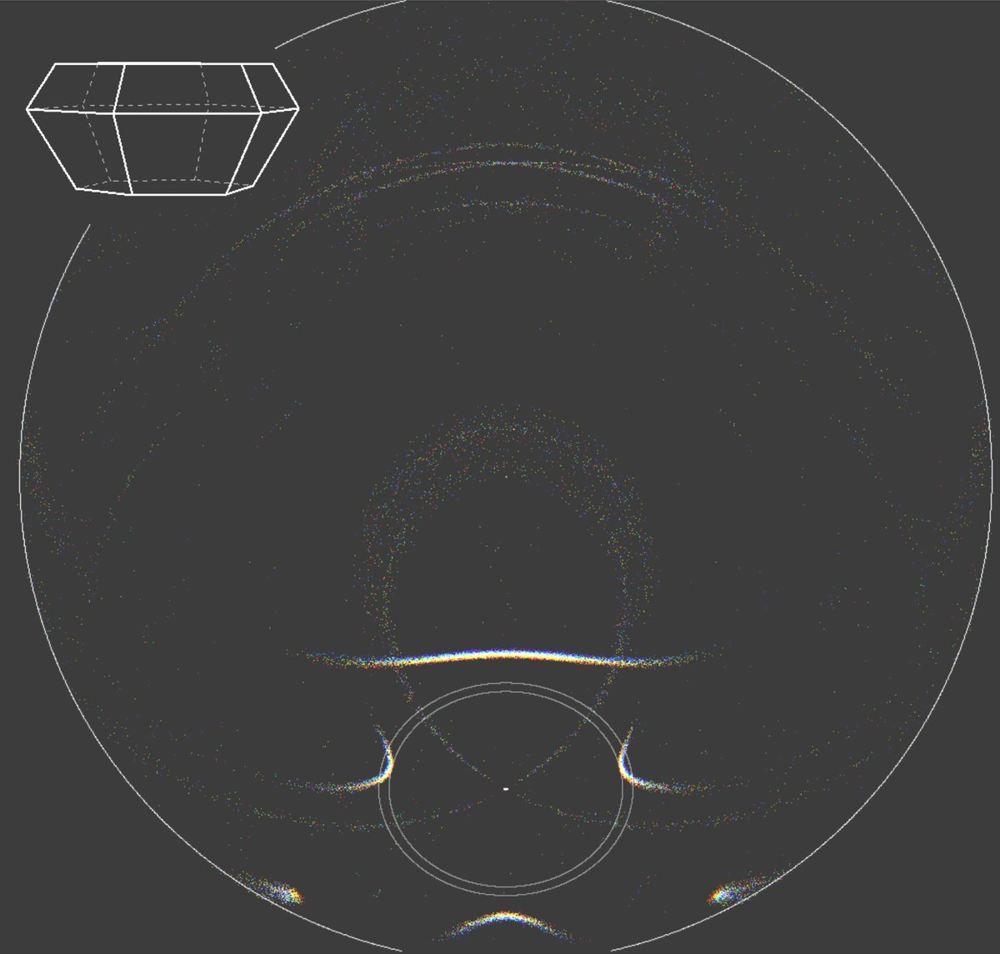

# Thread - 2026-06-19

**Original:** https://x.com/RiikonenMarko/status/2067923194858672615

---

### 1/2 - 2026-06-19 10:51 UTC

I think those crystals exist sometimes solely. On 8 Feb 1987 I photographed one in diamond dust in Joensuu: https://t.co/kDySDqXKv0 (page 13). It was a mystery to us until in 1993 Tape mailed simulations after we had mailed him duplicates of the slides.

But of course there must be more proof than that. A stacked 17-minute stage of the display on 11 July 2024 at the Kuurna hydroelectric plant seems quite a representative case:
https://t.co/rDAq6sPci9

Anyway, combo-pyramids just get you different multi-hit specialties (a pyra-pyra as an example here). So when the plate arcs tell you that tilts are exceptionally small, all-sky is always worth it.

People really should be starting to think about the automated systems. It's not sustainable that you need to go out to some field and babysit the camera. Automatic cameras guarding the sky tirelessly at open locations is the future the community should be working towards.

---

### 2/2 - 2026-06-19 14:22 UTC

@hoshi_kinuta Here is a cleaner case of 23° plate: https://www.taivaanvahti.fi/observations/show/99249

---

