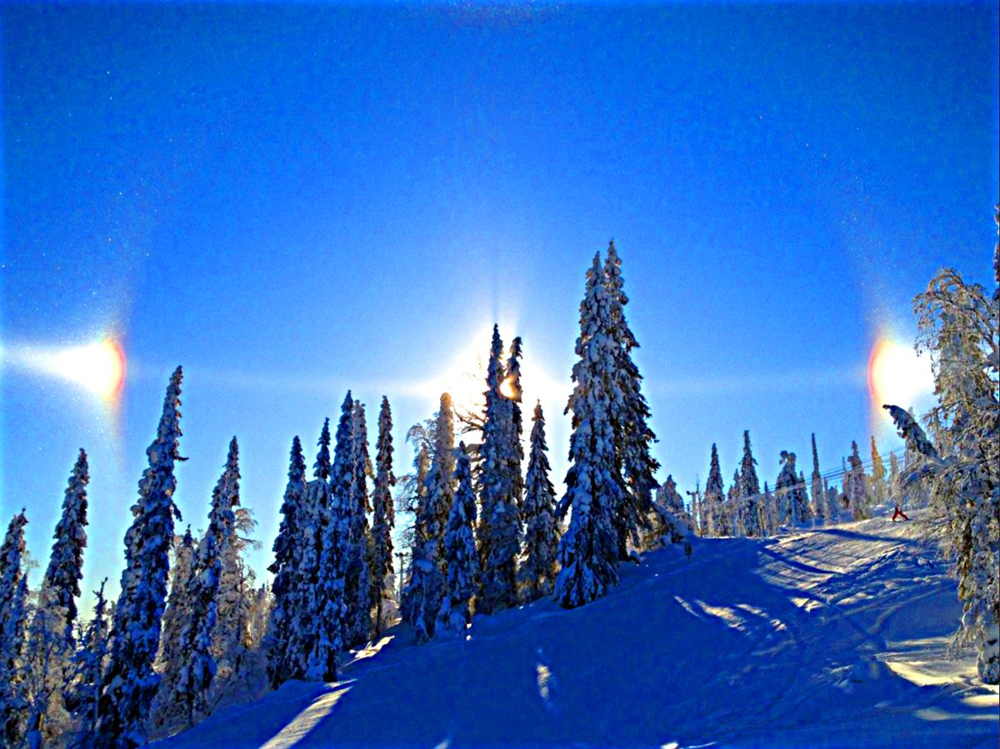
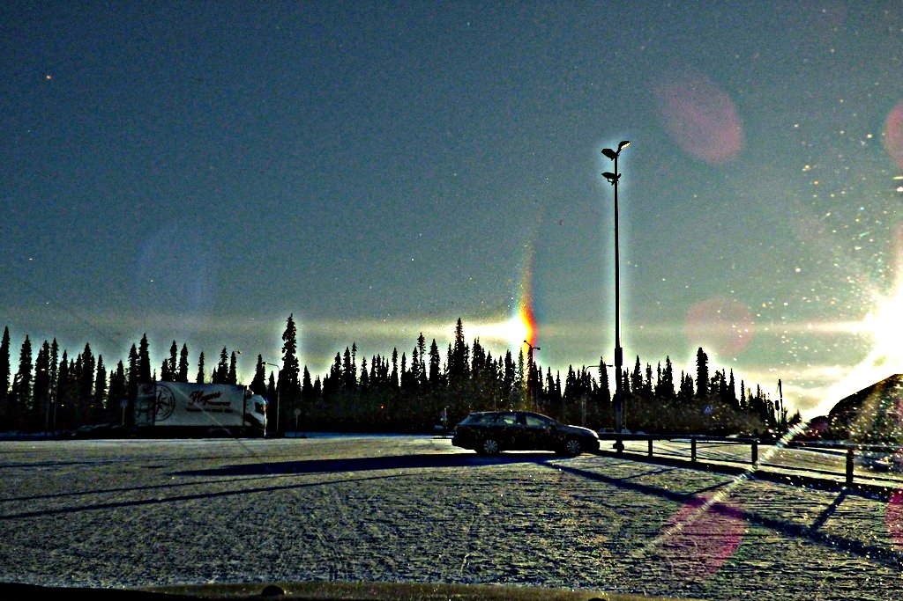
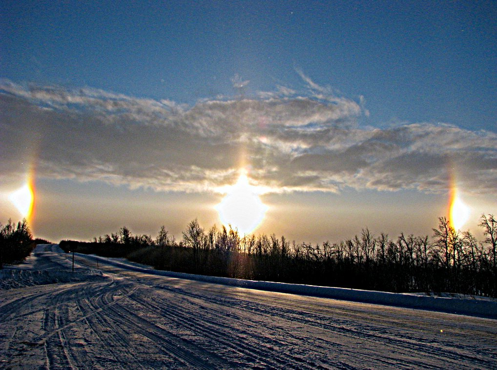

# Thread - 2026-06-21

**Original:** https://x.com/RiikonenMarko/status/2068766407559405737

---

### 1/4 - 2026-06-21 18:42 UTC

You found an earlier case! Published 2019, so it's a legitimate first, not prediscovery that someone dug from the drawer. The "murakamiT fringes"! Inspired, I have been checking today on Taivaanvahti displays. Started from the beginning and now going on 2015. Nothing yet. Clearly, the fringes are not for granted.

---

### 2/4 - 2026-06-21 20:11 UTC

So I checked Taivaanvahti archives until 9 Feb 2019 of murakamiT post. Just two weakly suggestive cases came up.

First by Jarppe Länsiö on 27 Feb 2012 in Pudasjärvi: https://t.co/Eo6CAdOum1
I have copied a slightly usmed version of it here.

Second by Veli-Pekka Siltamaa on 5 Nov 2016 in Kittilä:
https://t.co/Kdmdp5uHqY
Again, a slightly usmed version shown.

Neither of these quite pass muster for me. MurakamiT still holds the first observation.

I also kept in mind Martikainen/Juva type fringes, but saw nothing suggestive of them.

---

### 3/4 - 2026-06-22 10:22 UTC

Let's add also this one by Pekka Paksuniemi on 28 Feb 2009 in Enontekiö: https://t.co/8DkbMBKdlH

The two in the above post come out a bit stronger than this one.

Anyway, there is still an abundance of bright diamond dust parhelia photos to check. The German observations, for instance. The search is still on.

---

### 4/4 - 2026-06-22 11:01 UTC

@hoshi_kinuta Just an example of a possible case from elsewhere on the web: https://sheridanmedia.com/news/188906/sun-dogs-a-colorful-weather-phenomena/

Anyway, that's of no concern for the quest for the first because it's from  2025.

---

