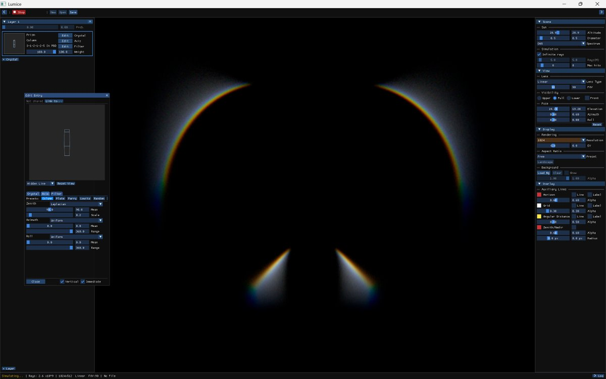
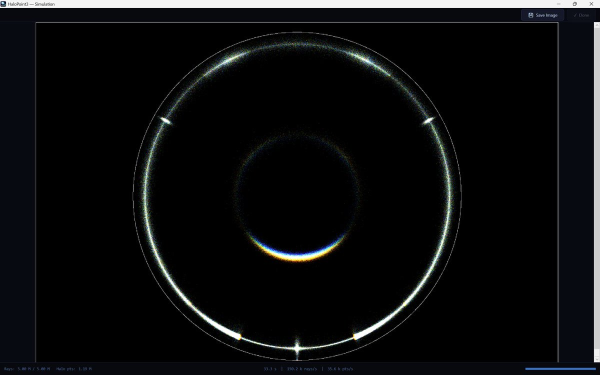
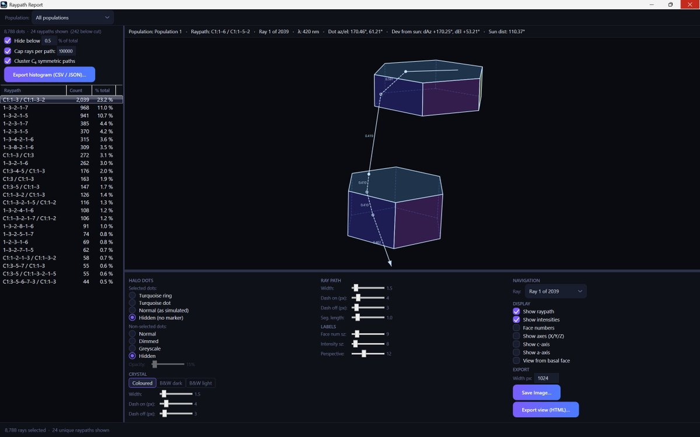

# Thread - 2026-06-26

**Original:** https://x.com/RiikonenMarko/status/2070370461398040812

---

### 1/1 - 2026-06-26 04:55 UTC

Good times have arrived for halo simulating! A handful of people are working on new shiny tools, and two have been publicly released this year. First to come was Lumice by Jiajie Zhang https://t.co/VUbbePpoz4 and a few days ago Jukka Ruoskanen published HaloPoint 3 https://t.co/qWKeC7bs4x. In the images, first is a simulation with Lumice squeezing out the tanarc blue edges and then some multi-scattering analysis with HaloPoint 3.

---

