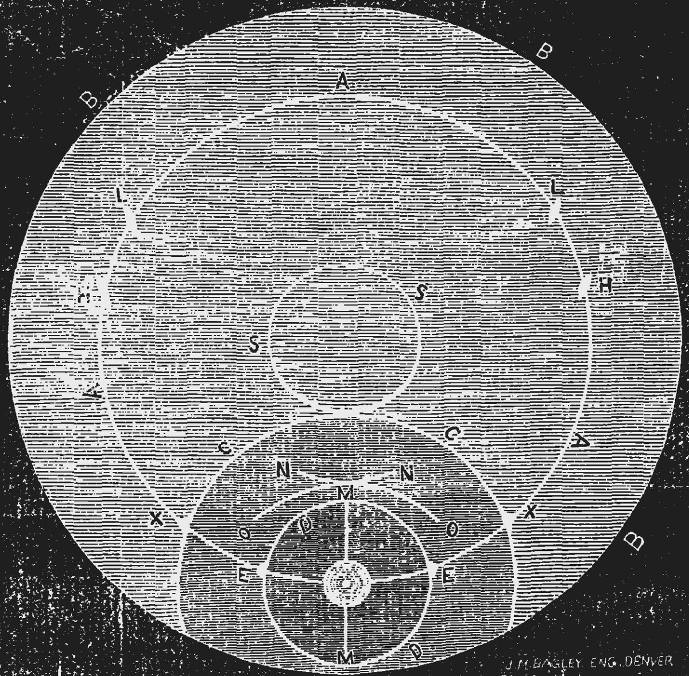

# Thread - 2026-07-08

**Original:** https://x.com/RiikonenMarko/status/2074701029426225663

---

### 1/1 - 2026-07-08 03:44 UTC

I have written a post in The Halo Vault about a historical display of some significance. It was seen in Denver-Boulder on 23 December 1876. Shown here is the drawing by James A. Barwick. https://thehalovault.blogspot.com/2026/07/1876-denver-boulder-display-lays-claim.html

---

