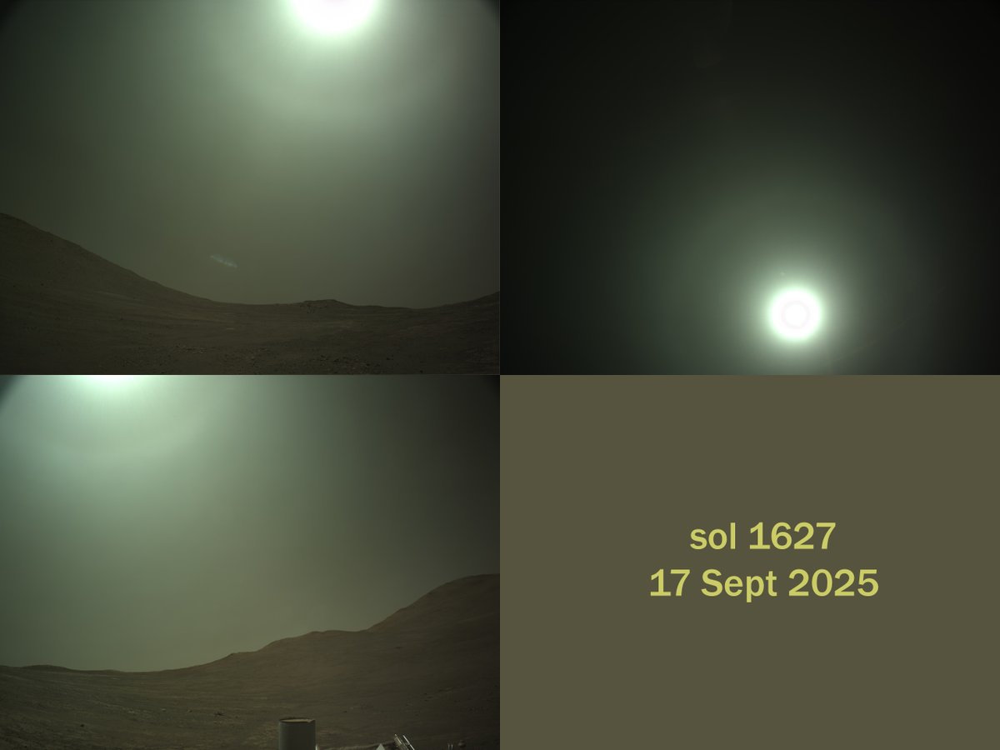
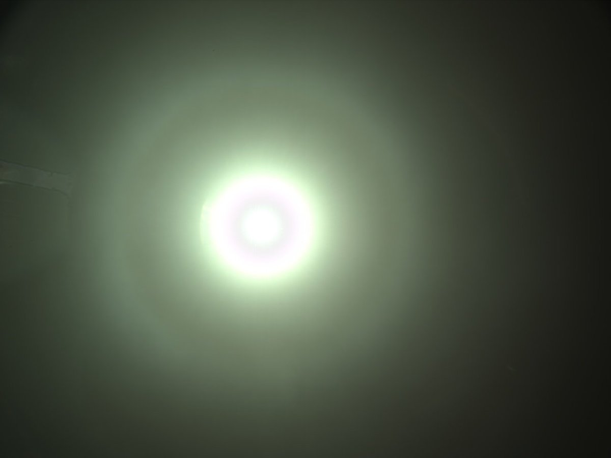
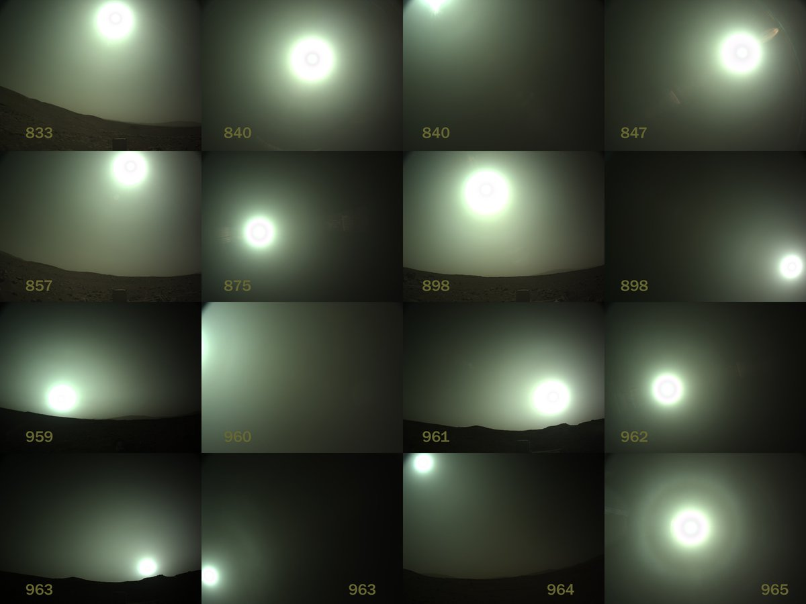
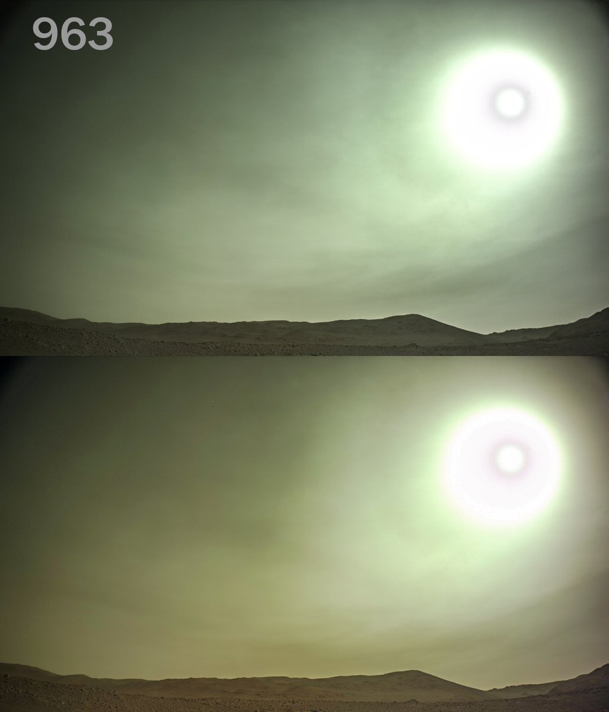
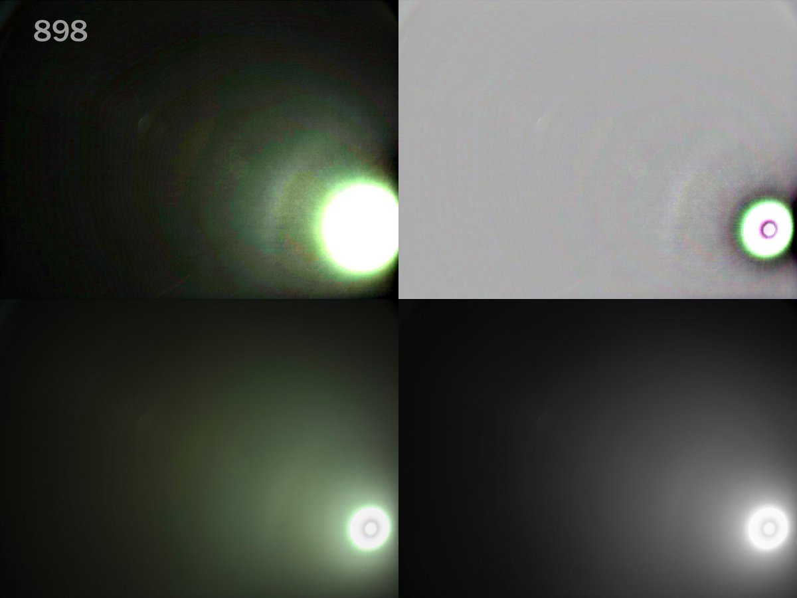
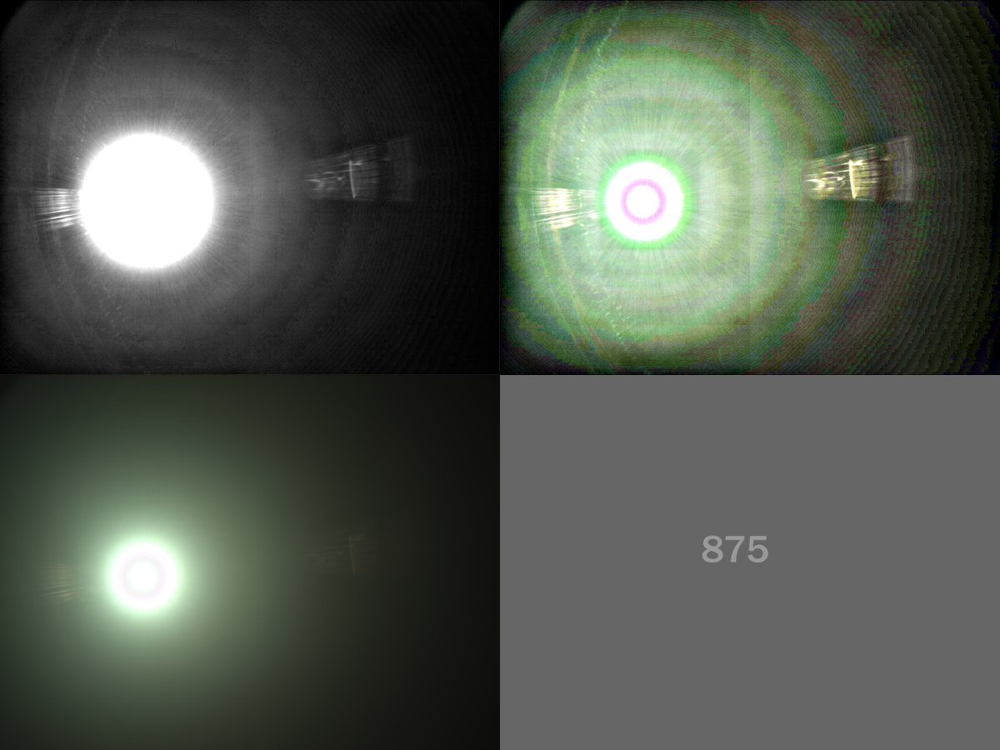
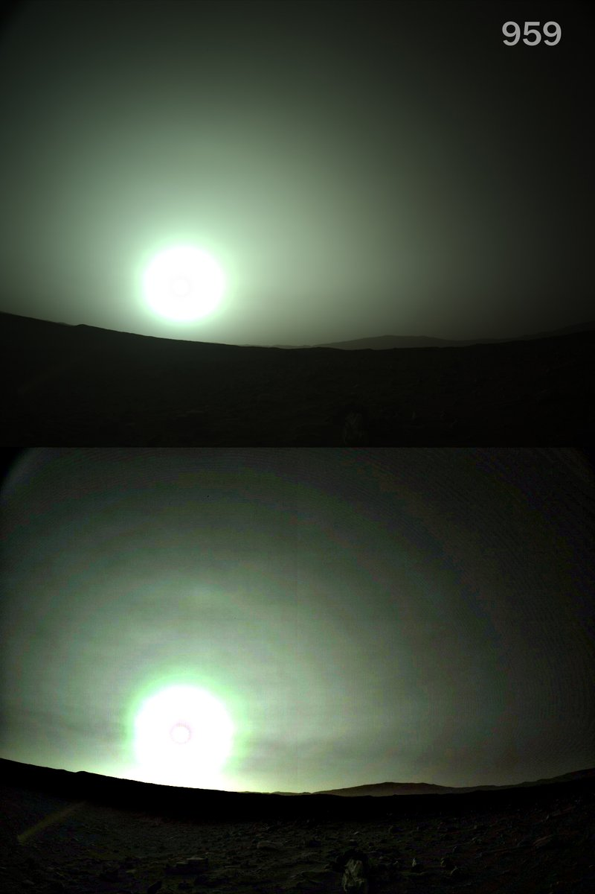
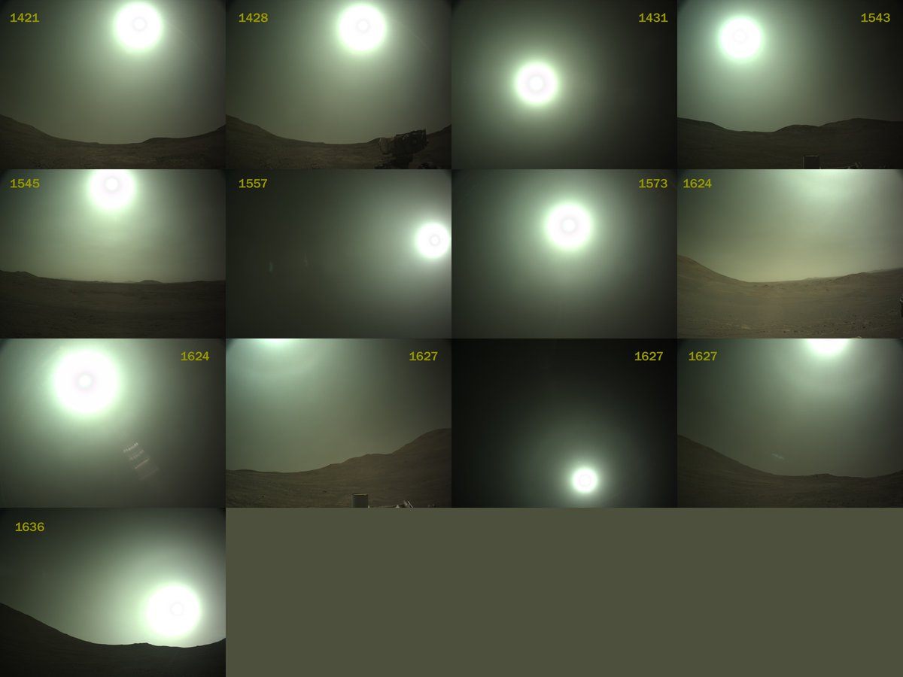
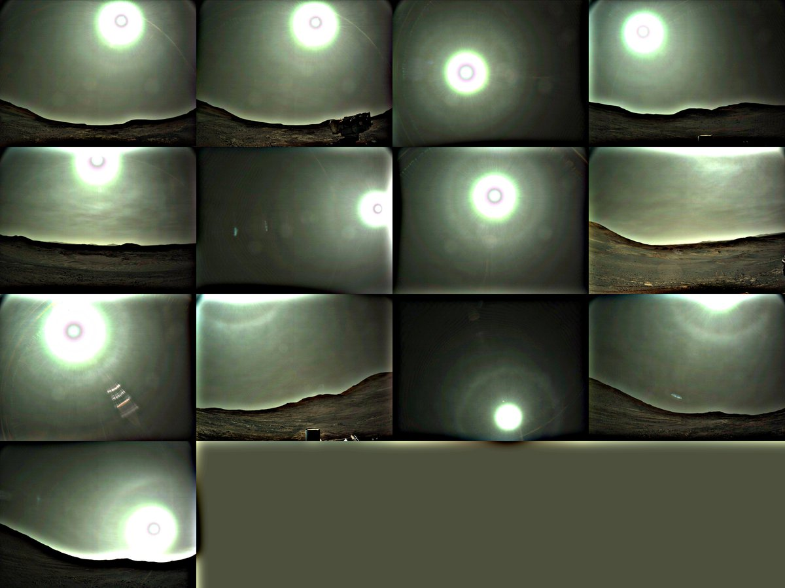

# Thread - 2026-07-09

**Original:** https://x.com/RiikonenMarko/status/2075171611481698341

---

### 1/7 - 2026-07-09 10:54 UTC

Been going thru Perseverance navigation camera images for halos on Mars. https://t.co/YZhzV7DW3I In 2021, a bunch of 22° halos were found during northern hemisphere summer from sol 145 to 303. https://t.co/Fhfa8ejE69

I have now continued from that. The next summer (sols ~810–990) wasn't good, got not one certain 22° halo. But the next one (~1480–1660, mid-2025) turned out better. Here is the best display, sol 1627.

Some corner of the web should have also the raw images. The file format, though, doesn't open in Photoshop.

---

### 2/7 - 2026-07-10 08:07 UTC

Contrary what I say above, an unquestionable halo was captured during Perseverance's second Mars summer, on sol 965 (7 Nov 2023): https://t.co/sAKIa1DUfQ

I was unaware of this news, and missed the shot while browsing because I had skipped over a short section. Interestingly, the NASA piece says they were actually hunting for a halo photo. And finally got one just before the season ended.

---

### 3/7 - 2026-07-10 11:46 UTC

Here are all the cases that passed my filter for halo candidates from the second summer season (Mars Year 37), including the unequivocal sol 965 display. I think there are real displays here. Usming for example sol 898 gives much a halo like feature that looks rather more like an arc than circular halo. Sun elevation is actually most suitable for an arc, 43 degrees, giving 2 options: 22° tanarc and 23° plate arc. For the above post's image sun 79 degrees.

If anyone have time and skills, the raws could be worth checking out.

---

### 4/7 - 2026-07-13 07:13 UTC

So I had a look at the raws. Claude wrote a script that converted them to 16 bit tiffs (there are also various ready tools that can do that, but this felt the easiest way). Supposing it did the job right, it was of no help – Enhancing the 16 bit tiffs gave no advantage over the NASA's ready-made 8 bit pngs as shown by the sol 963, which has the NASA version on top and my raw attempt below (which is actually worse).

Anyway, I'd say the apparent arc in 898 is a halo, as shown by the different versions in the second image. 875 is full of artefact rings, but I wouldn't count out that among them lurks a weak 22° halo.

Supposing 898 is real deal, it adds one more entry to the Mars halo catalog. Tanarc or 23° plate? I wonder what's above the sun in 959? Is the location right for tanarc considering the lens distortion? Is it bit too spot-like for comfort?

The raws are avaible in https://t.co/DzSPeOPJKK

---

### 5/7 - 2026-07-13 09:47 UTC

Sun elevation for 959 is 8.5°.

---

### 6/7 - 2026-07-13 10:22 UTC

Halos from MY 38 summer. The algorithmic meddling of X can be frustrating. Now it decided to hide my Mars posts thread, even if that's what I have been posting last. Had to use search to find the thread.

---

### 7/7 - 2026-07-13 10:23 UTC

Halos from MY 38 summer usmed.

---

