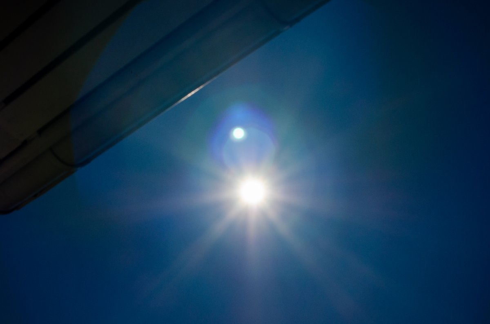

# Thread - 2026-07-11

**Original:** https://x.com/RiikonenMarko/status/2075865964210422096

---

### 1/3 - 2026-07-11 08:53 UTC

Testing automatic elliptical halo camera concept with blocker. Nikon D7000 on SolarQuest tracking mount, 50 mm lens with Marumi ND-100000 filter. 13s exposures, F8.

The cloud is Ac virga. Most Ac virga don't show ellipses and given in this case the transformation happened some time earlier, I wasn't expecting anything when the cirrus finally crossed the sun. And nothing is seen.

Even if the welding glass piece shaded only the smaller part of the lens, lens reflections were prevented. The crucial question is of course is the blocker small enough to not also block the elliptical halos should they have occurred. Judging by the angular dimensions that can be estimated from the size of the sun's disk, it was small enough at least for upper and lower parts of any ellipses (may be a different matter at high sun when they are circular). And I could have made it even smaller as the shaft was not fully extended.

The welding glass piece, which is 25 x 25 mm, was 57 cm from the objective lens.

Somebody should let an elliptical halo camera run all summer in some of the Ac-virga infernos. I have first hand knowledge of Tbilisi, but I suspect it's really a belt, extending  all the way to China, and possibly across southern Europe to Spain. There are prospects for real revelations here.

[🎬 2075865964210422096-u3Rb3LniuRhZJhr1.mp4](media/2075865964210422096-u3Rb3LniuRhZJhr1.mp4)

---

### 2/3 - 2026-07-11 08:57 UTC

Lots of artifacts without the blocker.

---

### 3/3 - 2026-07-11 11:06 UTC

The sky around the sun cleared for a while, but then what looked like Cirrocumulus came. But just when it was turning into ice, the camera stopped photographing, even as it was in infinite mode (this is unreliable in D7000).

When I got it back on, the shutter speed had reset to 1/30s, which is why series of the black frames were shot in 1s interval before I got it in order, managing to catch of the end of the virga. No elliptical halo. Not sure if Cc is even good for ellipses. I think there are some reports in Finnish Sivuaurinko era archives. Gotta take a look.

SolarQuest keeps its aim real good. If I fiddle with the camera, I may take the tracking off. That's what I did this time and that's why you see SQ doing corrective move after the dark frames, because it was lagging a bit behind when I turned it on again.

I extended the blocker now about 10 cm further.

[🎬 2075899447985209671-qTqB9rYE7uV_7eLv.mp4](media/2075899447985209671-qTqB9rYE7uV_7eLv.mp4)

---

