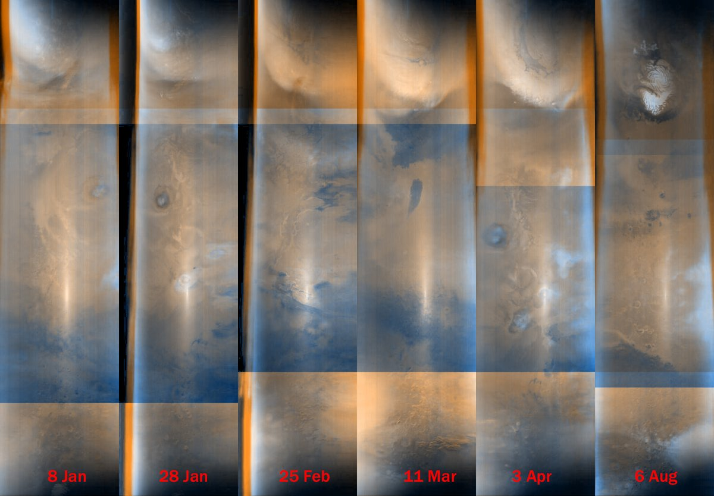
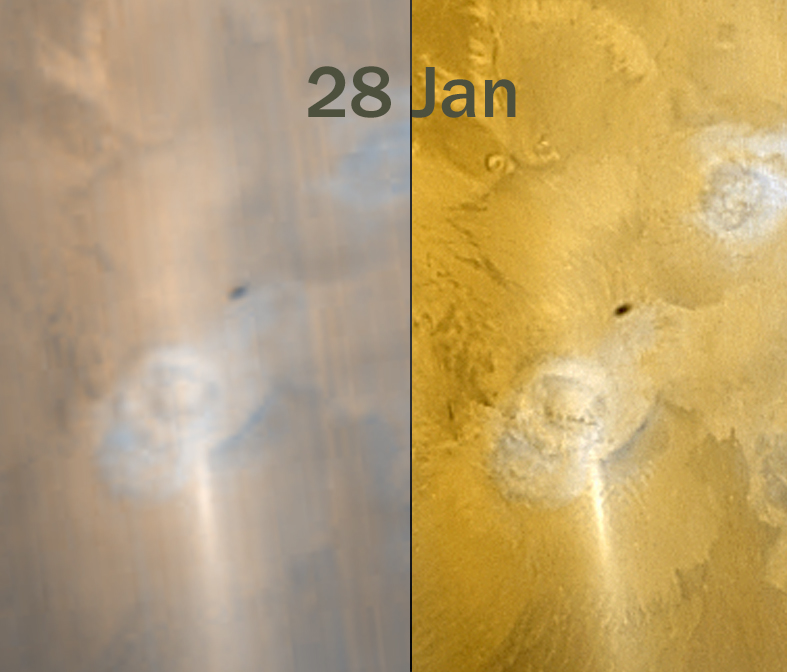

# Thread - 2026-07-22

**Original:** https://x.com/RiikonenMarko/status/2079967431246639548

---

### 1/2 - 2026-07-22 16:30 UTC

A persistent streak is present in Mars Global Surveyor probe images https://t.co/RtsUgn5SKm  Können (2006) identified a one on 28 Jan 2006 as flipsun https://t.co/2gQQKif6gD  Cooper et al (2019) were rather of the opinion that it's an opposition effect https://t.co/leXQnEUbcB  They point out it's visible "in great number of MOC data" (camera of MGS), giving Wang (2002) as reference.

Indeed, what little I browsed the 2006 images, the streak is there pretty much 24/7. So obviously we are not looking at a flipsun but an opposition effect. From the surface of Mars, more specifically.

Here are some examples, including the 28 Jan 2006 case, processed with Claude-script. MGS took red and blue channel images. Raws are available, but they proved difficult. These are from red and blue channel jpgs.

---

### 2/2 - 2026-07-22 16:30 UTC

Comparing a version of the 28 Jan streak appearing on Malin Space Science System site (same as Können used) with the Claude one. https://asimov.msss.com/mars_images/moc/2006/02/06/

---

