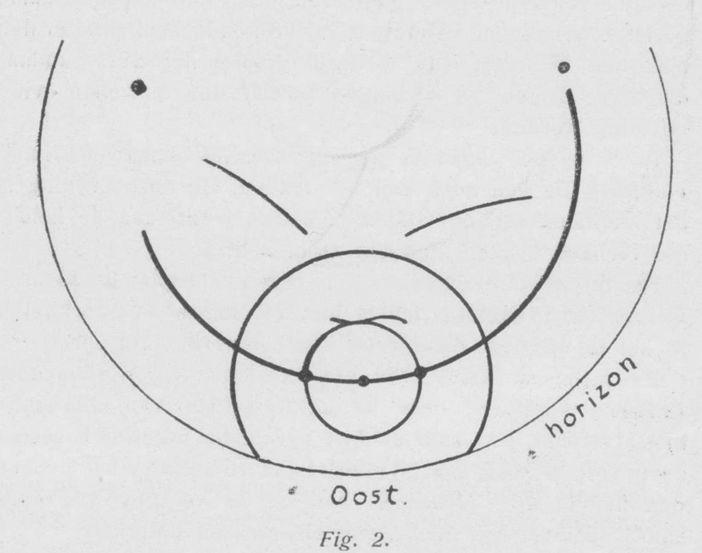
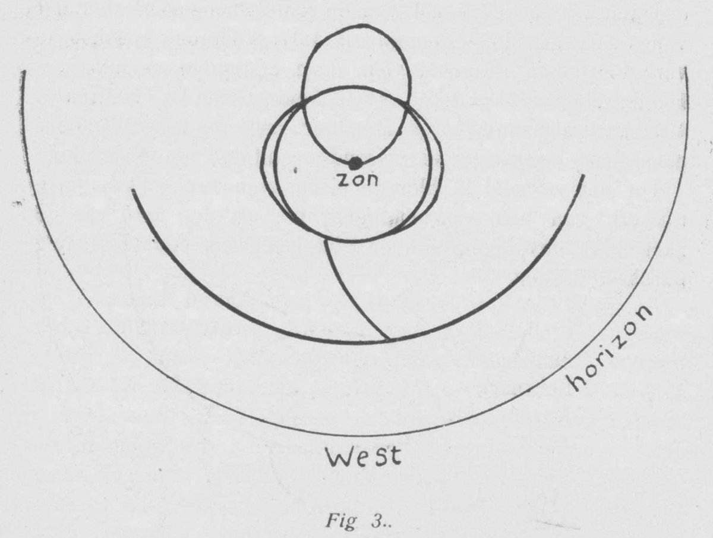

# Thread - 2026-08-24

**Original:** https://x.com/RiikonenMarko/status/2091869339670528023

---

### 1/1 - 2026-08-24 12:44 UTC

The Dutch Koninklijk Magnetisch en Meteorologisch Observatorium in Jakarta was also a place for halo observations in 1920's and 30's. Here is one of the better displays, seen on 24 October 1918 by the Head Observer Ryken Rapp. "The cirrus cloud that day was thin and extremely uniform, and it persisted from early morning until near sunset", writes S. W. Visser, who presents the observation in Natuurkundig Tijdschrift voor Nederlandsch-Indië, vol. LXXXI (1921), pp. 77–81. The journal can be found scanned from https://t.co/LNpGjs0iEL

Here is the full halo section extracted from that volume: https://t.co/OnYLPKfnuS  And Claude made translation of the observation: https://t.co/j3vburKYF5

Visser suggests vispy cirrus as the explanation for the strange arc in figure 3, but I guess helic arc is not completely out of question. As to the two funny arcs in figure 2, maybe Wegener is an option.

Jakarta is at a southern 6° latitude. In this area of the globe, you would expect the curse of the equator pretty much prevent the existence of such complex displays. But of course there are the rare exceptions. Or maybe the halo scene actually is better around Jakarta than it is in "known" South-East Asian areas, the Philippines, Singapore and Southern Thailand. Hopefully the Indonesians will soon pick up on halos!

---

