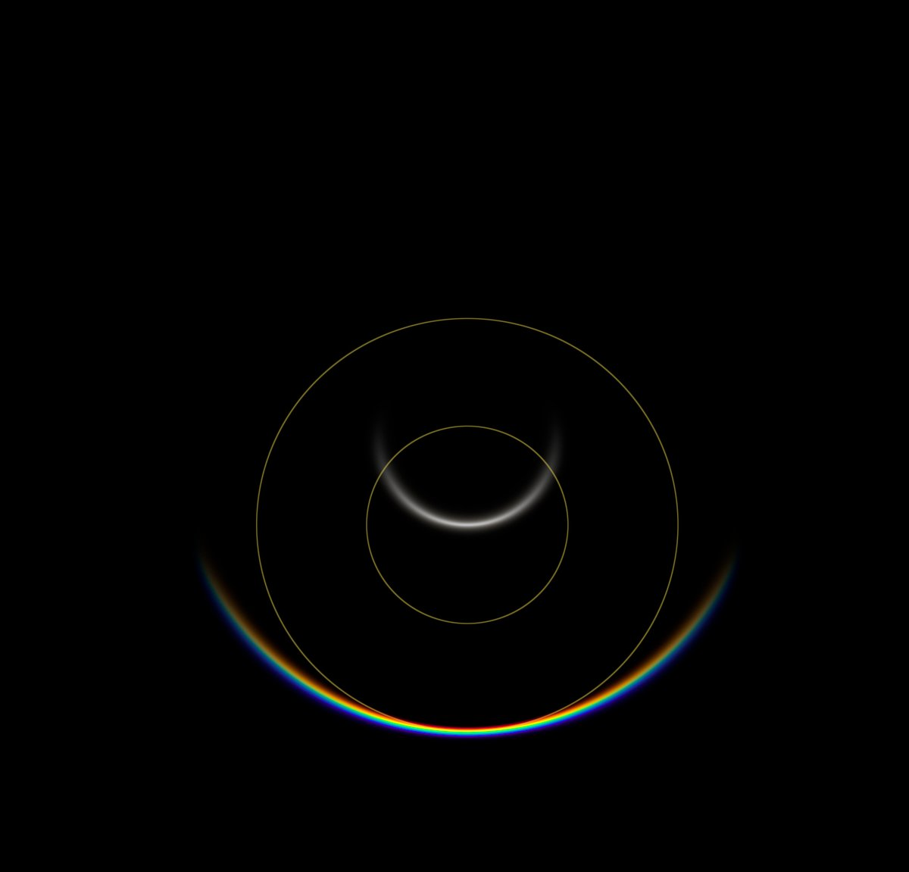
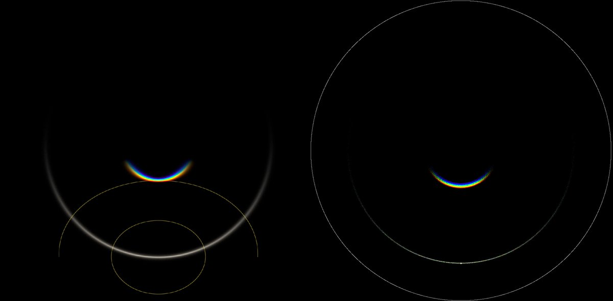
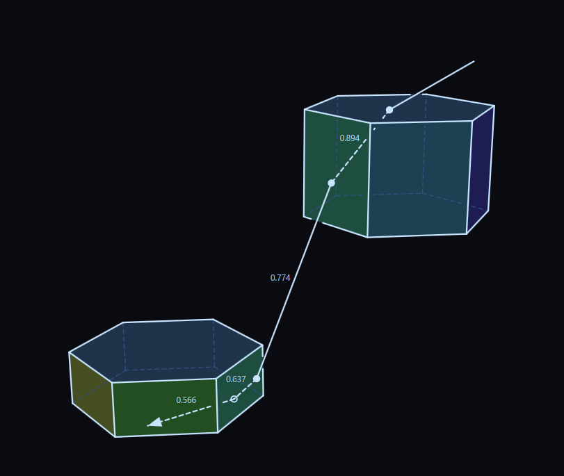

# Thread - 2026-08-25

**Original:** https://x.com/RiikonenMarko/status/2092164178895106360

---

### 1/1 - 2026-08-25 08:16 UTC

One of the hidden plate-plate multiscat halos in spotlight: horizon arc of the zenith arc. Colors get canceled and in practice the result is parhelic circle. In the first image are Lumice and HaloPoint3 simulations side by side, sun elev 22.4°. The raypath illustration is from the latter. The third image shows zenith arc of the horizon arc, sun elev 70.4° (Lumice).

---

